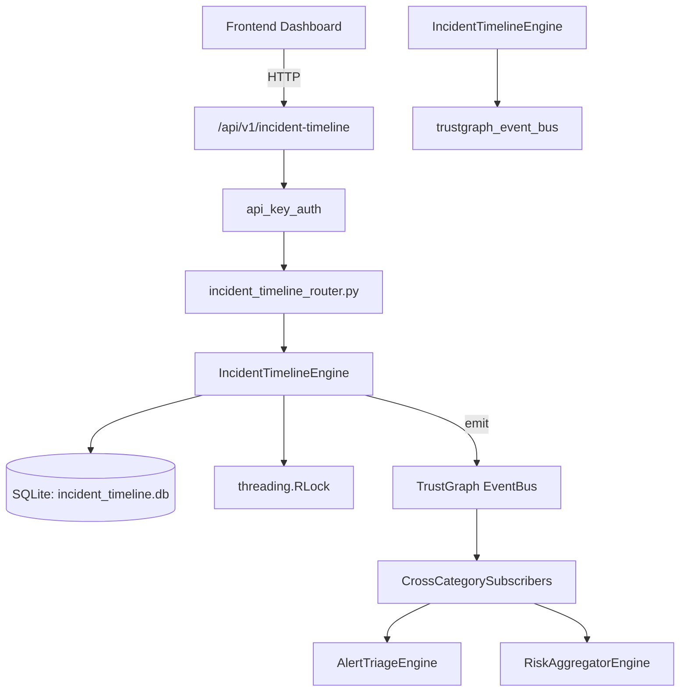

# US-0137: Incident Timeline

## Sub-Epic: SOC
**Master Goal**: ALDECI — $35/mo enterprise security intelligence platform replacing $50K-500K/yr tools

## User Story
As a **Karen Taylor (IR Lead)**, I need to manage incident response lifecycle
so that the platform delivers enterprise-grade soc capabilities at 1/1000th the cost of legacy tools.

## Why This Matters
Incident Timeline replaces functionality found in enterprise tools like CrowdStrike, Wiz, Snyk, and Rapid7.
By building this into ALDECI's $35/mo stack, customers save $50K+/yr on standalone SOC tooling.

## Architecture

## Current State: 95% Complete
- ✅ `create_timeline()` — Create a new incident timeline. Returns the created record. (line 178)
- ✅ `list_timelines()` — List timelines with optional status/incident_type filters. (line 235)
- ✅ `get_timeline()` — Get a single timeline by ID, scoped to org_id. (line 256)
- ✅ `update_timeline_status()` — Update timeline status and optionally set contained_at/resolved_at. (line 265)
- ✅ `add_event()` — Add an event to a timeline. Returns the created event record. (line 309)
- ✅ `list_events()` — List events for a timeline ordered by event_time ascending. (line 365)
- ❌ TrustGraph event emission — not yet verified

## Key Functions (from `suite-core/core/incident_timeline_engine.py` — 575 lines)
- `IncidentTimelineEngine.create_timeline()` — Create a new incident timeline. Returns the created record. (line 178)
- `IncidentTimelineEngine.list_timelines()` — List timelines with optional status/incident_type filters. (line 235)
- `IncidentTimelineEngine.get_timeline()` — Get a single timeline by ID, scoped to org_id. (line 256)
- `IncidentTimelineEngine.update_timeline_status()` — Update timeline status and optionally set contained_at/resolved_at. (line 265)
- `IncidentTimelineEngine.add_event()` — Add an event to a timeline. Returns the created event record. (line 309)
- `IncidentTimelineEngine.list_events()` — List events for a timeline ordered by event_time ascending. (line 365)
- `IncidentTimelineEngine.add_affected_system()` — Add an affected system record to a timeline. (line 396)
- `IncidentTimelineEngine.list_affected_systems()` — List affected systems for a timeline. (line 433)

## Dependencies
- **Depends on**: trustgraph_event_bus
- **Depended by**: Routers, TrustGraph EventBus, CrossCategorySubscribers
- **TrustGraph**: Event emission wired via ResponseInterceptorMiddleware
- **Source file**: `suite-core/core/incident_timeline_engine.py` (575 lines)
- **Router file**: `suite-api/apps/api/incident_timeline_router.py`

## API Endpoints
| Method | Path | Description |
|--------|------|-------------|
| POST | `/api/v1/incident-timeline` | create timeline |
| GET | `/api/v1/incident-timeline` | list timelines |
| GET | `/api/v1/incident-timeline/stats` | get stats |
| GET | `/api/v1/incident-timeline/{timeline_id}` | get timeline |
| PATCH | `/api/v1/incident-timeline/{timeline_id}/status` | update status |
| POST | `/api/v1/incident-timeline/{timeline_id}/events` | add event |
| GET | `/api/v1/incident-timeline/{timeline_id}/events` | list events |
| POST | `/api/v1/incident-timeline/{timeline_id}/systems` | add affected system |
| GET | `/api/v1/incident-timeline/{timeline_id}/systems` | list affected systems |
| POST | `/api/v1/incident-timeline/{timeline_id}/metrics` | calculate metrics |

## Tasks Remaining
1. Verify TrustGraph event emission works end-to-end (2h)
2. Add integration test with real persona workflow (2h)
3. Wire CrossCategorySubscriber consumer chain (1h)
4. Validate with 30-persona walkthrough (1h)
5. Optimize query performance for large datasets (2h)
6. Expand test coverage to edge cases (2h)

## Definition of Done
- [ ] Karen Taylor (IR Lead) can access /api/v1/incident-timeline and get meaningful data
- [ ] All CRUD operations return correct HTTP status codes
- [ ] TrustGraph receives events from this engine
- [ ] 32+ tests passing in `tests/test_incident_timeline_engine.py`
- [ ] 30-persona walkthrough includes this endpoint at 100%
- [ ] No hardcoded org_id — all queries are org-scoped

## Sprint: Wave 46 (est. April 22-24, 2026)

## Test Coverage
- **Test file**: `tests/test_incident_timeline_engine.py`
- **Tests**: 32 tests
- **Status**: Passing
