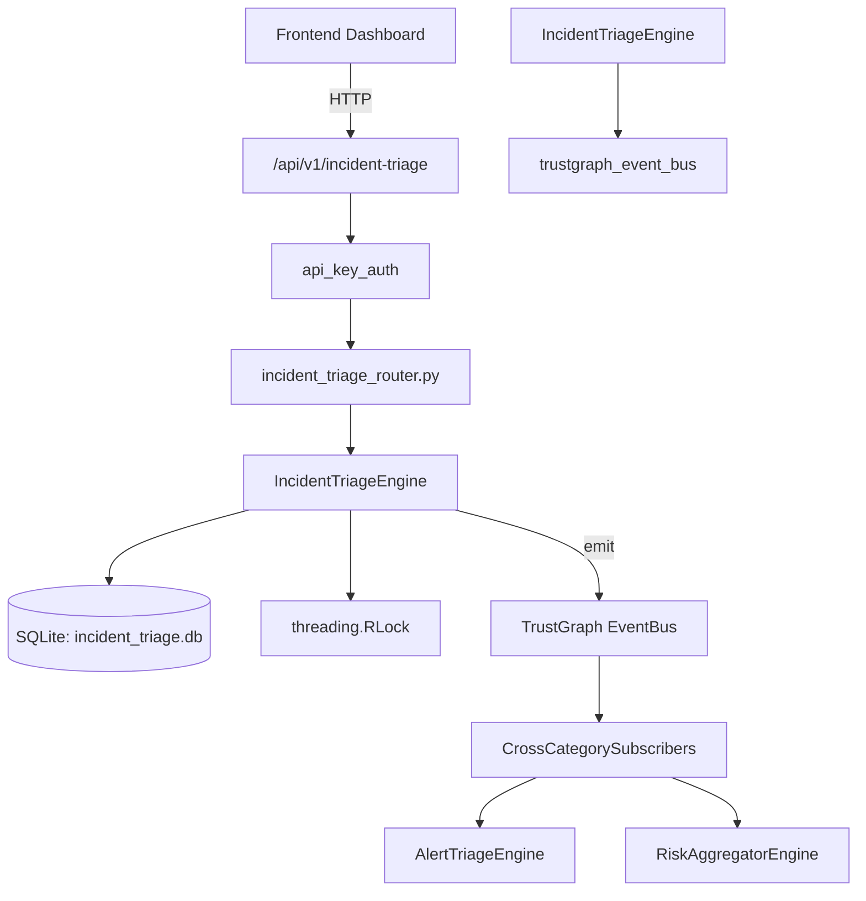

# US-0138: Incident Triage

## Sub-Epic: SOC
**Master Goal**: ALDECI — $35/mo enterprise security intelligence platform replacing $50K-500K/yr tools

## User Story
As a **Karen Taylor (IR Lead)**, I need to manage incident response lifecycle
so that the platform delivers enterprise-grade soc capabilities at 1/1000th the cost of legacy tools.

## Why This Matters
Incident Triage replaces functionality found in enterprise tools like CrowdStrike, Wiz, Snyk, and Rapid7.
By building this into ALDECI's $35/mo stack, customers save $50K+/yr on standalone SOC tooling.

## Architecture

## Current State: 95% Complete
- ✅ `submit_for_triage()` — Submit a new incident for triage. (line 121)
- ✅ `triage_incident()` — Triage an incident: score, classify, assign. (line 195)
- ✅ `list_incidents()` — List incidents with optional filters. (line 261)
- ✅ `get_incident()` — Retrieve a single incident by ID. Returns None if not found. (line 285)
- ✅ `escalate_incident()` — Escalate an incident. Returns None if not found. (line 298)
- ✅ `resolve_triage()` — Resolve a triaged incident. Returns None if not found. (line 324)
- ❌ TrustGraph event emission — not yet verified

## Key Functions (from `suite-core/core/incident_triage_engine.py` — 421 lines)
- `IncidentTriageEngine.submit_for_triage()` — Submit a new incident for triage. (line 121)
- `IncidentTriageEngine.triage_incident()` — Triage an incident: score, classify, assign. (line 195)
- `IncidentTriageEngine.list_incidents()` — List incidents with optional filters. (line 261)
- `IncidentTriageEngine.get_incident()` — Retrieve a single incident by ID. Returns None if not found. (line 285)
- `IncidentTriageEngine.escalate_incident()` — Escalate an incident. Returns None if not found. (line 298)
- `IncidentTriageEngine.resolve_triage()` — Resolve a triaged incident. Returns None if not found. (line 324)
- `IncidentTriageEngine.get_triage_stats()` — Return aggregated triage stats for an org. (line 349)

## Dependencies
- **Depends on**: trustgraph_event_bus
- **Depended by**: Routers, TrustGraph EventBus, CrossCategorySubscribers
- **TrustGraph**: Event emission wired via ResponseInterceptorMiddleware
- **Source file**: `suite-core/core/incident_triage_engine.py` (421 lines)
- **Router file**: `suite-api/apps/api/incident_triage_router.py`

## API Endpoints
| Method | Path | Description |
|--------|------|-------------|
| POST | `/api/v1/incident-triage/incidents` | submit for triage |
| GET | `/api/v1/incident-triage/incidents` | list incidents |
| GET | `/api/v1/incident-triage/incidents/{incident_id}` | get incident |
| POST | `/api/v1/incident-triage/incidents/{incident_id}/triage` | triage incident |
| POST | `/api/v1/incident-triage/incidents/{incident_id}/escalate` | escalate incident |
| POST | `/api/v1/incident-triage/incidents/{incident_id}/resolve` | resolve triage |
| GET | `/api/v1/incident-triage/stats` | get triage stats |

## Tasks Remaining
1. Verify TrustGraph event emission works end-to-end (2h)
2. Add integration test with real persona workflow (2h)
3. Wire CrossCategorySubscriber consumer chain (1h)
4. Validate with 30-persona walkthrough (1h)
5. Optimize query performance for large datasets (2h)
6. Expand test coverage to edge cases (2h)

## Definition of Done
- [ ] Karen Taylor (IR Lead) can access /api/v1/incident-triage and get meaningful data
- [ ] All CRUD operations return correct HTTP status codes
- [ ] TrustGraph receives events from this engine
- [ ] 40+ tests passing in `tests/test_incident_triage_engine.py`
- [ ] 30-persona walkthrough includes this endpoint at 100%
- [ ] No hardcoded org_id — all queries are org-scoped

## Sprint: Wave 46 (est. April 22-24, 2026)

## Test Coverage
- **Test file**: `tests/test_incident_triage_engine.py`
- **Tests**: 40 tests
- **Status**: Passing
