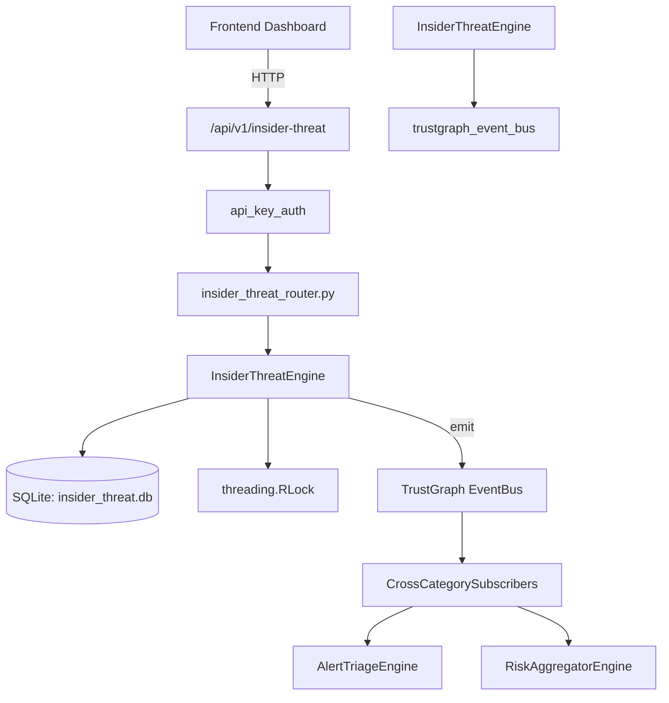

# US-0139: Insider Threat

## Sub-Epic: Advanced
**Master Goal**: ALDECI — $35/mo enterprise security intelligence platform replacing $50K-500K/yr tools

## User Story
As a **Priya Sharma (SOC T2 Analyst)**, I need to detect insider threats via behavior
so that the platform delivers enterprise-grade advanced capabilities at 1/1000th the cost of legacy tools.

## Why This Matters
Insider Threat replaces functionality found in enterprise tools like CrowdStrike, Wiz, Snyk, and Rapid7.
By building this into ALDECI's $35/mo stack, customers save $50K+/yr on standalone Advanced tooling.

## Architecture

## Current State: 95% Complete
- ✅ `record_user_event()` — Log a user activity event. Returns event_id. (line 127)
- ✅ `analyze_user_risk()` — Analyze a user's recent activity for insider threat indicators. (line 153)
- ✅ `get_high_risk_users()` — List users above risk threshold, ordered by risk score descending. (line 331)
- ✅ `create_alert()` — Create an insider threat alert for a user. Returns alert record. (line 358)
- ✅ `get_alerts()` — Return alerts, optionally filtered by user_id and/or severity. (line 393)
- ✅ `resolve_alert()` — Resolve an alert. resolution: 'false_positive'|'confirmed'|'escalated'. (line 421)
- ❌ TrustGraph event emission — not yet verified

## Key Functions (from `suite-core/core/insider_threat_engine.py` — 585 lines)
- `InsiderThreatEngine.record_user_event()` — Log a user activity event. Returns event_id. (line 127)
- `InsiderThreatEngine.analyze_user_risk()` — Analyze a user's recent activity for insider threat indicators. (line 153)
- `InsiderThreatEngine.get_high_risk_users()` — List users above risk threshold, ordered by risk score descending. (line 331)
- `InsiderThreatEngine.create_alert()` — Create an insider threat alert for a user. Returns alert record. (line 358)
- `InsiderThreatEngine.get_alerts()` — Return alerts, optionally filtered by user_id and/or severity. (line 393)
- `InsiderThreatEngine.resolve_alert()` — Resolve an alert. resolution: 'false_positive'|'confirmed'|'escalated'. (line 421)
- `InsiderThreatEngine.get_user_timeline()` — Get chronological event history for a user. (line 452)
- `InsiderThreatEngine.get_trustgraph_context()` — Query TrustGraph for cross-domain context about an insider threat entity. (line 478)

## Dependencies
- **Depends on**: trustgraph_event_bus
- **Depended by**: Routers, TrustGraph EventBus, CrossCategorySubscribers
- **TrustGraph**: Event emission wired via ResponseInterceptorMiddleware
- **Source file**: `suite-core/core/insider_threat_engine.py` (585 lines)
- **Router file**: `suite-api/apps/api/insider_threat_router.py`

## API Endpoints
| Method | Path | Description |
|--------|------|-------------|
| POST | `/api/v1/insider-threat/activities` | record activity |
| POST | `/api/v1/insider-threat/assess/{user_email}` | assess user risk |
| POST | `/api/v1/insider-threat/detect` | detect anomalies |
| GET | `/api/v1/insider-threat/high-risk` | get high risk users |
| GET | `/api/v1/insider-threat/timeline/{user_email}` | get user timeline |
| GET | `/api/v1/insider-threat/distribution` | get risk distribution |
| POST | `/api/v1/insider-threat/acknowledge/{user_email}` | acknowledge alert |
| GET | `/api/v1/insider-threat/stats` | get detection stats |
| GET | `/api/v1/insider-threat/context/{entity_id}` | get trustgraph context |

## Tasks Remaining
1. Verify TrustGraph event emission works end-to-end (2h)
2. Add integration test with real persona workflow (2h)
3. Wire CrossCategorySubscriber consumer chain (1h)
4. Validate with 30-persona walkthrough (1h)
5. Optimize query performance for large datasets (2h)
6. Expand test coverage to edge cases (2h)

## Definition of Done
- [ ] Priya Sharma (SOC T2 Analyst) can access /api/v1/insider-threat and get meaningful data
- [ ] All CRUD operations return correct HTTP status codes
- [ ] TrustGraph receives events from this engine
- [ ] 36+ tests passing in `tests/test_insider_threat_engine.py`
- [ ] 30-persona walkthrough includes this endpoint at 100%
- [ ] No hardcoded org_id — all queries are org-scoped

## Sprint: Wave 46 (est. April 22-24, 2026)

## Test Coverage
- **Test file**: `tests/test_insider_threat_engine.py`
- **Tests**: 36 tests
- **Status**: Passing
