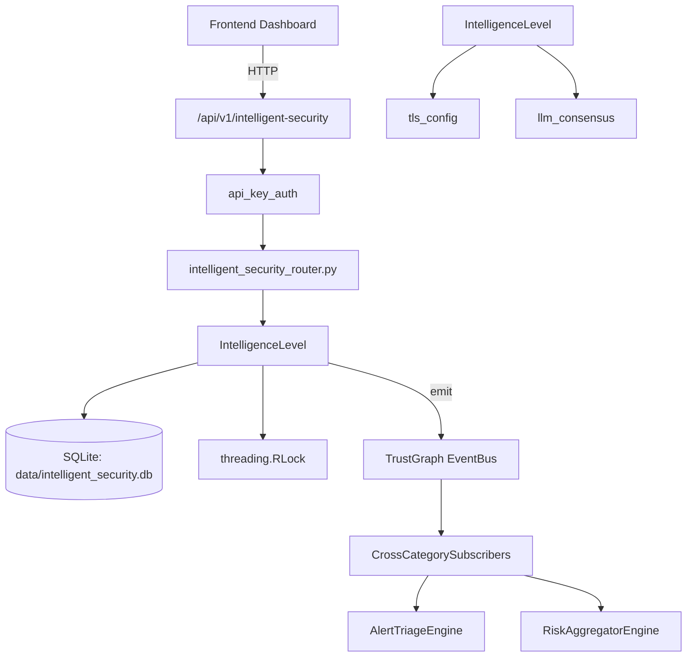

# US-0140: Intelligent Security

## Sub-Epic: Advanced
**Master Goal**: ALDECI — $35/mo enterprise security intelligence platform replacing $50K-500K/yr tools

## User Story
As a **Chris Lee (Security Data Scientist)**, I need to apply ML to security decisions
so that the platform delivers enterprise-grade advanced capabilities at 1/1000th the cost of legacy tools.

## Why This Matters
Intelligent Security replaces functionality found in enterprise tools like CrowdStrike, Wiz, Snyk, and Rapid7.
By building this into ALDECI's $35/mo stack, customers save $50K+/yr on standalone Advanced tooling.

## Architecture

## Current State: 85% Complete
- ✅ `from_env()` — Load configuration from environment variables. (line 147)
- ✅ `risk_score()` — Calculate aggregate risk score. (line 175)
- ✅ `to_dict()` — implemented (line 204)
- ✅ `create_predictor()` — Create an ML predictor in MindsDB. (line 280)
- ✅ `predict()` — Make a prediction using a MindsDB model. (line 294)
- ✅ `create_knowledge_base()` — Create a knowledge base for RAG. (line 314)
- ❌ No dedicated router — endpoint may be in gap_router.py
- ❌ TrustGraph event emission — not yet verified

## Key Functions (from `suite-core/core/intelligent_security_engine.py` — 1296 lines)
- `EngineConfig.from_env()` — Load configuration from environment variables. (line 147)
- `ThreatIntelligence.risk_score()` — Calculate aggregate risk score. (line 175)
- `AttackPlan.to_dict()` — Handle to dict (line 204)
- `MindsDBClient.create_predictor()` — Create an ML predictor in MindsDB. (line 280)
- `MindsDBClient.predict()` — Make a prediction using a MindsDB model. (line 294)
- `MindsDBClient.create_knowledge_base()` — Create a knowledge base for RAG. (line 314)
- `MindsDBClient.insert_knowledge()` — Insert knowledge into a knowledge base. (line 331)
- `MindsDBClient.query_knowledge()` — Query a knowledge base. (line 348)

## Dependencies
- **Depends on**: tls_config, llm_consensus
- **Depended by**: Routers, TrustGraph EventBus, CrossCategorySubscribers
- **TrustGraph**: Event emission wired via ResponseInterceptorMiddleware
- **Source file**: `suite-core/core/intelligent_security_engine.py` (1296 lines)
- **Router file**: `suite-api/apps/api/N/A`

## API Endpoints
| Method | Path | Description |
|--------|------|-------------|
| GET | `/api/v1/intelligent-security` | List resources |

## Tasks Remaining
1. Verify TrustGraph event emission works end-to-end (2h)
2. Add integration test with real persona workflow (2h)
3. Wire CrossCategorySubscriber consumer chain (1h)
4. Validate with 30-persona walkthrough (1h)
5. Create dedicated router (needs wiring in app.py) (3h)
6. Expand test coverage to edge cases (2h)

## Definition of Done
- [ ] Chris Lee (Security Data Scientist) can access /api/v1/intelligent-security and get meaningful data
- [ ] All CRUD operations return correct HTTP status codes
- [ ] TrustGraph receives events from this engine
- [ ] 34+ tests passing in `tests/test_intelligent_security_engine.py`
- [ ] 30-persona walkthrough includes this endpoint at 100%
- [ ] No hardcoded org_id — all queries are org-scoped

## Sprint: Wave 46 (est. April 22-24, 2026)

## Test Coverage
- **Test file**: `tests/test_intelligent_security_engine.py`
- **Tests**: 34 tests
- **Status**: Passing
