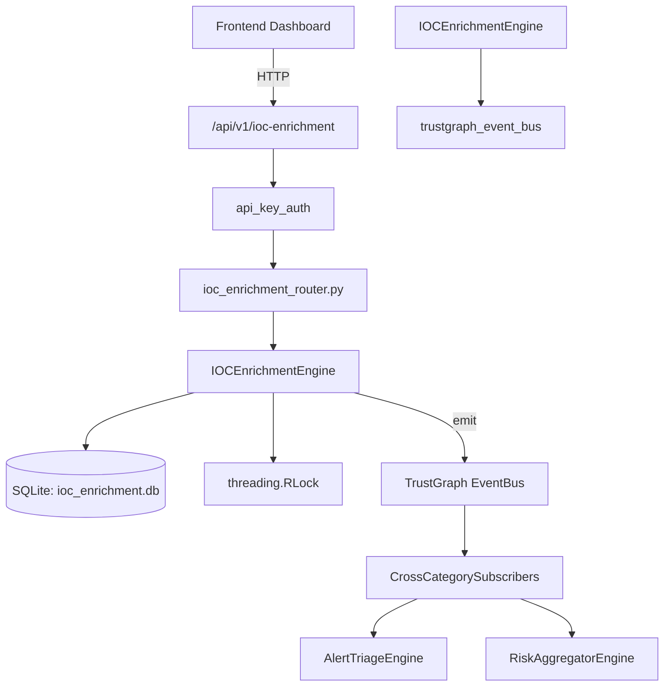

# US-0141: Ioc Enrichment

## Sub-Epic: AI Intelligence
**Master Goal**: ALDECI — $35/mo enterprise security intelligence platform replacing $50K-500K/yr tools

## User Story
As a **Nina Patel (Threat Intel Analyst)**, I need to enrich indicators of compromise
so that the platform delivers enterprise-grade ai intelligence capabilities at 1/1000th the cost of legacy tools.

## Why This Matters
Ioc Enrichment replaces functionality found in enterprise tools like CrowdStrike, Wiz, Snyk, and Rapid7.
By building this into ALDECI's $35/mo stack, customers save $50K+/yr on standalone AI Intelligence tooling.

## Architecture

## Current State: 95% Complete
- ✅ `add_ioc()` — Add an IOC indicator. Returns the created IOC dict. (line 162)
- ✅ `list_iocs()` — List IOCs for an org, optionally filtered by type or severity. (line 220)
- ✅ `enrich_ioc()` — Simulate enrichment for an IOC: reputation, geo, campaigns, verdict. (line 247)
- ✅ `get_enrichment()` — Fetch stored enrichment for an IOC, or empty dict if not yet enriched. (line 326)
- ✅ `add_to_watchlist()` — Add an IOC to a named watchlist. Returns True on success. (line 341)
- ✅ `get_watchlist()` — Return all IOC records on a named watchlist for an org. (line 362)
- ❌ TrustGraph event emission — not yet verified

## Key Functions (from `suite-core/core/ioc_enrichment_engine.py` — 432 lines)
- `IOCEnrichmentEngine.add_ioc()` — Add an IOC indicator. Returns the created IOC dict. (line 162)
- `IOCEnrichmentEngine.list_iocs()` — List IOCs for an org, optionally filtered by type or severity. (line 220)
- `IOCEnrichmentEngine.enrich_ioc()` — Simulate enrichment for an IOC: reputation, geo, campaigns, verdict. (line 247)
- `IOCEnrichmentEngine.get_enrichment()` — Fetch stored enrichment for an IOC, or empty dict if not yet enriched. (line 326)
- `IOCEnrichmentEngine.add_to_watchlist()` — Add an IOC to a named watchlist. Returns True on success. (line 341)
- `IOCEnrichmentEngine.get_watchlist()` — Return all IOC records on a named watchlist for an org. (line 362)
- `IOCEnrichmentEngine.bulk_import()` — Import a list of IOC dicts. Returns {"imported": N, "failed": M}. (line 380)
- `IOCEnrichmentEngine.get_ioc_stats()` — Return summary statistics for an org's IOC inventory. (line 397)

## Dependencies
- **Depends on**: trustgraph_event_bus
- **Depended by**: Routers, TrustGraph EventBus, CrossCategorySubscribers
- **TrustGraph**: Event emission wired via ResponseInterceptorMiddleware
- **Source file**: `suite-core/core/ioc_enrichment_engine.py` (432 lines)
- **Router file**: `suite-api/apps/api/ioc_enrichment_router.py`

## API Endpoints
| Method | Path | Description |
|--------|------|-------------|
| GET | `/api/v1/ioc-enrichment/iocs` | list iocs |
| POST | `/api/v1/ioc-enrichment/iocs` | add ioc |
| POST | `/api/v1/ioc-enrichment/iocs/{ioc_id}/enrich` | enrich ioc |
| GET | `/api/v1/ioc-enrichment/iocs/{ioc_id}/enrichment` | get enrichment |
| POST | `/api/v1/ioc-enrichment/watchlist/{watchlist_name}` | add to watchlist |
| GET | `/api/v1/ioc-enrichment/watchlist/{watchlist_name}` | get watchlist |
| POST | `/api/v1/ioc-enrichment/bulk-import` | bulk import |
| GET | `/api/v1/ioc-enrichment/stats` | get ioc stats |

## Tasks Remaining
1. Verify TrustGraph event emission works end-to-end (2h)
2. Add integration test with real persona workflow (2h)
3. Wire CrossCategorySubscriber consumer chain (1h)
4. Validate with 30-persona walkthrough (1h)
5. Optimize query performance for large datasets (2h)
6. Expand test coverage to edge cases (2h)

## Definition of Done
- [ ] Nina Patel (Threat Intel Analyst) can access /api/v1/ioc-enrichment and get meaningful data
- [ ] All CRUD operations return correct HTTP status codes
- [ ] TrustGraph receives events from this engine
- [ ] 30+ tests passing in `tests/test_ioc_enrichment_engine.py`
- [ ] 30-persona walkthrough includes this endpoint at 100%
- [ ] No hardcoded org_id — all queries are org-scoped

## Sprint: Wave 46 (est. April 22-24, 2026)

## Test Coverage
- **Test file**: `tests/test_ioc_enrichment_engine.py`
- **Tests**: 30 tests
- **Status**: Passing
