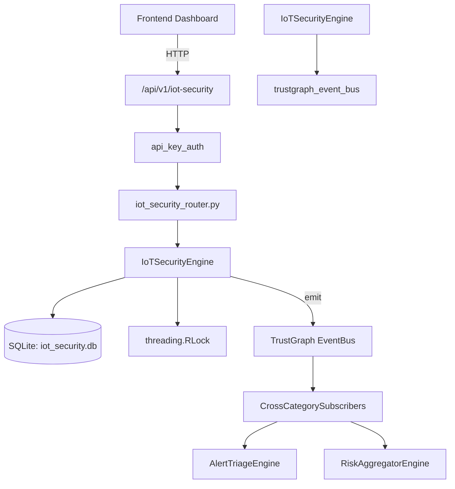

# US-0142: Iot Security

## Sub-Epic: Advanced
**Master Goal**: ALDECI — $35/mo enterprise security intelligence platform replacing $50K-500K/yr tools

## User Story
As a **James Wilson (Security Engineer)**, I need to secure IoT devices and networks
so that the platform delivers enterprise-grade advanced capabilities at 1/1000th the cost of legacy tools.

## Why This Matters
Iot Security replaces functionality found in enterprise tools like CrowdStrike, Wiz, Snyk, and Rapid7.
By building this into ALDECI's $35/mo stack, customers save $50K+/yr on standalone Advanced tooling.

## Architecture

## Current State: 95% Complete
- ✅ `register_device()` — Register a new IoT device. Returns the created record. (line 157)
- ✅ `list_devices()` — List devices for an org, with optional filters. (line 208)
- ✅ `get_device()` — Get a single device by ID with org isolation. (line 228)
- ✅ `update_device_status()` — Update device status. Returns updated record or None if not found. (line 237)
- ✅ `record_anomaly()` — Record an IoT anomaly. Returns the created record. (line 259)
- ✅ `list_anomalies()` — List anomalies for an org, with optional filters. (line 297)
- ❌ TrustGraph event emission — not yet verified

## Key Functions (from `suite-core/core/iot_security_engine.py` — 463 lines)
- `IoTSecurityEngine.register_device()` — Register a new IoT device. Returns the created record. (line 157)
- `IoTSecurityEngine.list_devices()` — List devices for an org, with optional filters. (line 208)
- `IoTSecurityEngine.get_device()` — Get a single device by ID with org isolation. (line 228)
- `IoTSecurityEngine.update_device_status()` — Update device status. Returns updated record or None if not found. (line 237)
- `IoTSecurityEngine.record_anomaly()` — Record an IoT anomaly. Returns the created record. (line 259)
- `IoTSecurityEngine.list_anomalies()` — List anomalies for an org, with optional filters. (line 297)
- `IoTSecurityEngine.resolve_anomaly()` — Update anomaly resolution status. Returns updated record or None. (line 321)
- `IoTSecurityEngine.create_policy()` — Create an IoT security policy. Returns the created record. (line 347)

## Dependencies
- **Depends on**: trustgraph_event_bus
- **Depended by**: Routers, TrustGraph EventBus, CrossCategorySubscribers
- **TrustGraph**: Event emission wired via ResponseInterceptorMiddleware
- **Source file**: `suite-core/core/iot_security_engine.py` (463 lines)
- **Router file**: `suite-api/apps/api/iot_security_router.py`

## API Endpoints
| Method | Path | Description |
|--------|------|-------------|
| POST | `/api/v1/iot-security/devices` | register device |
| GET | `/api/v1/iot-security/devices` | list devices |
| GET | `/api/v1/iot-security/devices/{device_id}` | get device |
| PUT | `/api/v1/iot-security/devices/{device_id}/status` | update device status |
| POST | `/api/v1/iot-security/anomalies` | record anomaly |
| GET | `/api/v1/iot-security/anomalies` | list anomalies |
| PUT | `/api/v1/iot-security/anomalies/{anomaly_id}/resolve` | resolve anomaly |
| POST | `/api/v1/iot-security/policies` | create policy |
| GET | `/api/v1/iot-security/policies` | list policies |
| GET | `/api/v1/iot-security/stats` | get iot stats |

## Tasks Remaining
1. Verify TrustGraph event emission works end-to-end (2h)
2. Add integration test with real persona workflow (2h)
3. Wire CrossCategorySubscriber consumer chain (1h)
4. Validate with 30-persona walkthrough (1h)
5. Optimize query performance for large datasets (2h)
6. Expand test coverage to edge cases (2h)

## Definition of Done
- [ ] James Wilson (Security Engineer) can access /api/v1/iot-security and get meaningful data
- [ ] All CRUD operations return correct HTTP status codes
- [ ] TrustGraph receives events from this engine
- [ ] 50+ tests passing in `tests/test_iot_security_engine.py`
- [ ] 30-persona walkthrough includes this endpoint at 100%
- [ ] No hardcoded org_id — all queries are org-scoped

## Sprint: Wave 46 (est. April 22-24, 2026)

## Test Coverage
- **Test file**: `tests/test_iot_security_engine.py`
- **Tests**: 50 tests
- **Status**: Passing
