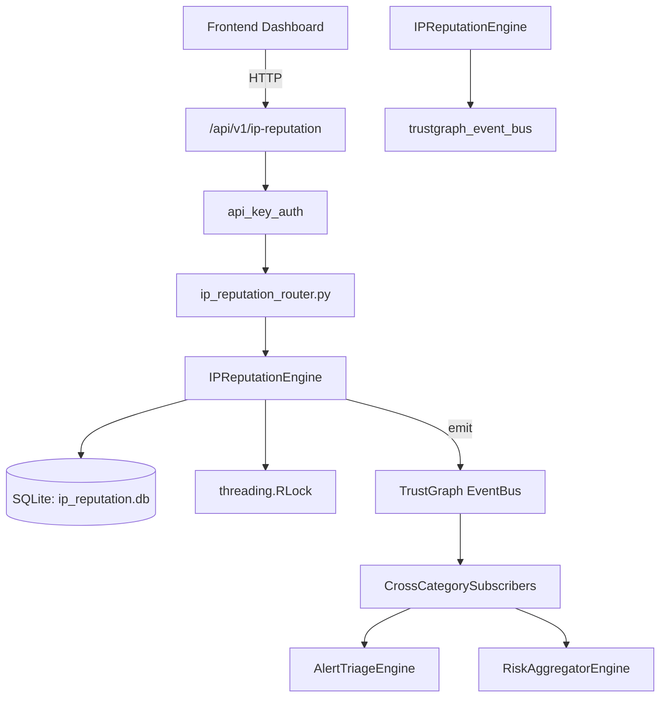

# US-0143: Ip Reputation

## Sub-Epic: AI Intelligence
**Master Goal**: ALDECI — $35/mo enterprise security intelligence platform replacing $50K-500K/yr tools

## User Story
As a **Nina Patel (Threat Intel Analyst)**, I need to score and block malicious IPs
so that the platform delivers enterprise-grade ai intelligence capabilities at 1/1000th the cost of legacy tools.

## Why This Matters
Ip Reputation replaces functionality found in enterprise tools like CrowdStrike, Wiz, Snyk, and Rapid7.
By building this into ALDECI's $35/mo stack, customers save $50K+/yr on standalone AI Intelligence tooling.

## Architecture

## Current State: 95% Complete
- ✅ `submit_reputation()` — Submit or update an IP reputation entry. (line 123)
- ✅ `get_reputation()` — Retrieve reputation info for a single IP. (line 190)
- ✅ `bulk_check()` — Check reputation for multiple IPs at once. (line 217)
- ✅ `add_to_blocklist()` — Add an IP to the org blocklist. Returns the blocklist entry. (line 246)
- ✅ `remove_from_blocklist()` — Remove an IP from the org blocklist. Returns {removed: bool, ip: str}. (line 280)
- ✅ `is_blocked()` — Return True if the IP is on the org blocklist. (line 292)
- ❌ TrustGraph event emission — not yet verified

## Key Functions (from `suite-core/core/ip_reputation_engine.py` — 356 lines)
- `IPReputationEngine.submit_reputation()` — Submit or update an IP reputation entry. (line 123)
- `IPReputationEngine.get_reputation()` — Retrieve reputation info for a single IP. (line 190)
- `IPReputationEngine.bulk_check()` — Check reputation for multiple IPs at once. (line 217)
- `IPReputationEngine.add_to_blocklist()` — Add an IP to the org blocklist. Returns the blocklist entry. (line 246)
- `IPReputationEngine.remove_from_blocklist()` — Remove an IP from the org blocklist. Returns {removed: bool, ip: str}. (line 280)
- `IPReputationEngine.is_blocked()` — Return True if the IP is on the org blocklist. (line 292)
- `IPReputationEngine.get_blocklist()` — Return the org blocklist, most recently added first. (line 302)
- `IPReputationEngine.get_reputation_stats()` — Return aggregate reputation statistics for the org. (line 316)

## Dependencies
- **Depends on**: trustgraph_event_bus
- **Depended by**: Routers, TrustGraph EventBus, CrossCategorySubscribers
- **TrustGraph**: Event emission wired via ResponseInterceptorMiddleware
- **Source file**: `suite-core/core/ip_reputation_engine.py` (356 lines)
- **Router file**: `suite-api/apps/api/ip_reputation_router.py`

## API Endpoints
| Method | Path | Description |
|--------|------|-------------|
| POST | `/api/v1/ip-reputation/submit` | submit reputation |
| GET | `/api/v1/ip-reputation/stats` | get reputation stats |
| GET | `/api/v1/ip-reputation/blocklist` | get blocklist |
| POST | `/api/v1/ip-reputation/bulk-check` | bulk check |
| POST | `/api/v1/ip-reputation/blocklist` | add to blocklist |
| DELETE | `/api/v1/ip-reputation/blocklist/{ip}` | remove from blocklist |
| GET | `/api/v1/ip-reputation/blocked/{ip}` | is blocked |
| GET | `/api/v1/ip-reputation/{ip}` | get reputation |

## Tasks Remaining
1. Verify TrustGraph event emission works end-to-end (2h)
2. Add integration test with real persona workflow (2h)
3. Wire CrossCategorySubscriber consumer chain (1h)
4. Validate with 30-persona walkthrough (1h)
5. Optimize query performance for large datasets (2h)
6. Expand test coverage to edge cases (2h)

## Definition of Done
- [ ] Nina Patel (Threat Intel Analyst) can access /api/v1/ip-reputation and get meaningful data
- [ ] All CRUD operations return correct HTTP status codes
- [ ] TrustGraph receives events from this engine
- [ ] 42+ tests passing in `tests/test_ip_reputation_engine.py`
- [ ] 30-persona walkthrough includes this endpoint at 100%
- [ ] No hardcoded org_id — all queries are org-scoped

## Sprint: Wave 46 (est. April 22-24, 2026)

## Test Coverage
- **Test file**: `tests/test_ip_reputation_engine.py`
- **Tests**: 42 tests
- **Status**: Passing
