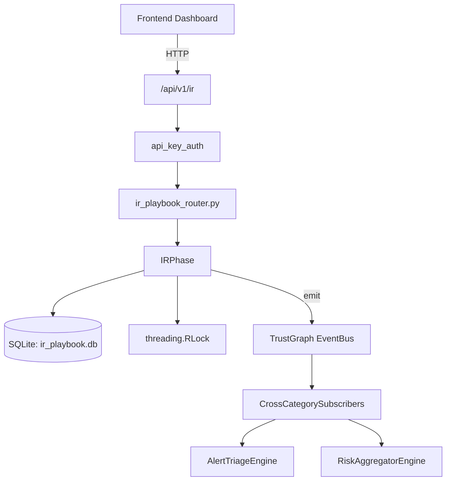

# US-0144: Ir Playbook

## Sub-Epic: SOC
**Master Goal**: ALDECI — $35/mo enterprise security intelligence platform replacing $50K-500K/yr tools

## User Story
As a **Karen Taylor (IR Lead)**, I need to execute incident response playbooks
so that the platform delivers enterprise-grade soc capabilities at 1/1000th the cost of legacy tools.

## Why This Matters
Ir Playbook replaces functionality found in enterprise tools like CrowdStrike, Wiz, Snyk, and Rapid7.
By building this into ALDECI's $35/mo stack, customers save $50K+/yr on standalone SOC tooling.

## Architecture

## Current State: 95% Complete
- ✅ `compute_hash()` — Compute SHA-256 of raw_content if hash not provided. (line 266)
- ✅ `list_playbooks()` — Return all built-in IR playbooks. (line 1123)
- ✅ `get_playbook()` — Return a playbook by ID. (line 1127)
- ✅ `get_playbook_for_type()` — Return the playbook for a given incident type. (line 1134)
- ✅ `create_incident()` — Create a new incident. Auto-selects playbook based on incident_type. (line 1142)
- ✅ `get_incident()` — Retrieve an incident by ID. (line 1236)
- ❌ TrustGraph event emission — not yet verified

## Key Functions (from `suite-core/core/ir_playbook_engine.py` — 1735 lines)
- `EvidenceItem.compute_hash()` — Compute SHA-256 of raw_content if hash not provided. (line 266)
- `IRPlaybookEngine.list_playbooks()` — Return all built-in IR playbooks. (line 1123)
- `IRPlaybookEngine.get_playbook()` — Return a playbook by ID. (line 1127)
- `IRPlaybookEngine.get_playbook_for_type()` — Return the playbook for a given incident type. (line 1134)
- `IRPlaybookEngine.create_incident()` — Create a new incident. Auto-selects playbook based on incident_type. (line 1142)
- `IRPlaybookEngine.get_incident()` — Retrieve an incident by ID. (line 1236)
- `IRPlaybookEngine.list_incidents()` — List incidents for an org with optional filters. (line 1245)
- `IRPlaybookEngine.advance_phase()` — Advance incident to the next NIST 800-61 phase. (line 1268)

## Dependencies
- **Depends on**: standalone
- **Depended by**: Routers, TrustGraph EventBus, CrossCategorySubscribers
- **TrustGraph**: Event emission wired via ResponseInterceptorMiddleware
- **Source file**: `suite-core/core/ir_playbook_engine.py` (1735 lines)
- **Router file**: `suite-api/apps/api/ir_playbook_router.py`

## API Endpoints
| Method | Path | Description |
|--------|------|-------------|
| GET | `/api/v1/ir/playbooks` | list playbooks |
| POST | `/api/v1/ir/incidents` | create incident |
| GET | `/api/v1/ir/incidents/{incident_id}` | get incident |
| POST | `/api/v1/ir/incidents/{incident_id}/advance` | advance phase |
| GET | `/api/v1/ir/incidents/{incident_id}/timeline` | get timeline |
| GET | `/api/v1/ir/incidents/{incident_id}/evidence` | get evidence chain |
| POST | `/api/v1/ir/incidents/{incident_id}/evidence` | add evidence |
| GET | `/api/v1/ir/metrics` | get metrics |
| GET | `/api/v1/ir/notifications` | get notifications |
| POST | `/api/v1/ir/notifications/{notification_id}/mark-sent` | mark notification sent |

## Tasks Remaining
1. Verify TrustGraph event emission works end-to-end (2h)
2. Add integration test with real persona workflow (2h)
3. Wire CrossCategorySubscriber consumer chain (1h)
4. Validate with 30-persona walkthrough (1h)
5. Optimize query performance for large datasets (2h)
6. Expand test coverage to edge cases (2h)

## Definition of Done
- [ ] Karen Taylor (IR Lead) can access /api/v1/ir and get meaningful data
- [ ] All CRUD operations return correct HTTP status codes
- [ ] TrustGraph receives events from this engine
- [ ] 38+ tests passing in `tests/test_ir_playbook_engine.py`
- [ ] 30-persona walkthrough includes this endpoint at 100%
- [ ] No hardcoded org_id — all queries are org-scoped

## Sprint: Wave 46 (est. April 22-24, 2026)

## Test Coverage
- **Test file**: `tests/test_ir_playbook_engine.py`
- **Tests**: 38 tests
- **Status**: Passing
