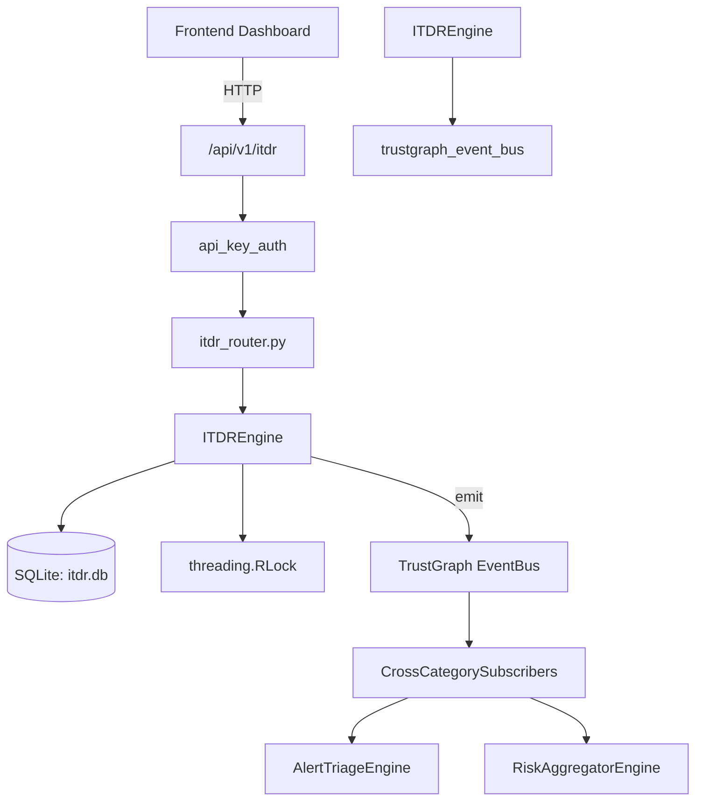

# US-0145: Itdr

## Sub-Epic: SOC
**Master Goal**: ALDECI — $35/mo enterprise security intelligence platform replacing $50K-500K/yr tools

## User Story
As a **Priya Sharma (SOC T2 Analyst)**, I need to detect identity-based threats
so that the platform delivers enterprise-grade soc capabilities at 1/1000th the cost of legacy tools.

## Why This Matters
Itdr replaces functionality found in enterprise tools like CrowdStrike, Wiz, Snyk, and Rapid7.
By building this into ALDECI's $35/mo stack, customers save $50K+/yr on standalone SOC tooling.

## Architecture

## Current State: 95% Complete
- ✅ `detect_threat()` — Record a new identity threat detection. (line 177)
- ✅ `list_threats()` — List identity threats with optional filters. (line 235)
- ✅ `get_threat()` — Retrieve a single threat by ID. Returns None if not found or wrong org. (line 259)
- ✅ `update_threat_status()` — Update the status of a threat. Raises KeyError if not found. (line 268)
- ✅ `record_behavior()` — Record an identity behavior event. (line 297)
- ✅ `list_behaviors()` — List identity behaviors with optional filters. (line 350)
- ❌ TrustGraph event emission — not yet verified

## Key Functions (from `suite-core/core/itdr_engine.py` — 513 lines)
- `ITDREngine.detect_threat()` — Record a new identity threat detection. (line 177)
- `ITDREngine.list_threats()` — List identity threats with optional filters. (line 235)
- `ITDREngine.get_threat()` — Retrieve a single threat by ID. Returns None if not found or wrong org. (line 259)
- `ITDREngine.update_threat_status()` — Update the status of a threat. Raises KeyError if not found. (line 268)
- `ITDREngine.record_behavior()` — Record an identity behavior event. (line 297)
- `ITDREngine.list_behaviors()` — List identity behaviors with optional filters. (line 350)
- `ITDREngine.create_response_action()` — Create a response action for a threat. (line 376)
- `ITDREngine.execute_response_action()` — Mark a response action as executed. Raises KeyError if not found or wrong org. (line 416)

## Dependencies
- **Depends on**: trustgraph_event_bus
- **Depended by**: Routers, TrustGraph EventBus, CrossCategorySubscribers
- **TrustGraph**: Event emission wired via ResponseInterceptorMiddleware
- **Source file**: `suite-core/core/itdr_engine.py` (513 lines)
- **Router file**: `suite-api/apps/api/itdr_router.py`

## API Endpoints
| Method | Path | Description |
|--------|------|-------------|
| POST | `/api/v1/itdr/threats` | detect threat |
| GET | `/api/v1/itdr/threats` | list threats |
| GET | `/api/v1/itdr/threats/{threat_id}` | get threat |
| PUT | `/api/v1/itdr/threats/{threat_id}/status` | update threat status |
| POST | `/api/v1/itdr/behaviors` | record behavior |
| GET | `/api/v1/itdr/behaviors` | list behaviors |
| POST | `/api/v1/itdr/response-actions` | create response action |
| PUT | `/api/v1/itdr/response-actions/{action_id}/execute` | execute response action |
| GET | `/api/v1/itdr/response-actions` | list response actions |
| GET | `/api/v1/itdr/stats` | get itdr stats |

## Tasks Remaining
1. Verify TrustGraph event emission works end-to-end (2h)
2. Add integration test with real persona workflow (2h)
3. Wire CrossCategorySubscriber consumer chain (1h)
4. Validate with 30-persona walkthrough (1h)
5. Optimize query performance for large datasets (2h)
6. Expand test coverage to edge cases (2h)

## Definition of Done
- [ ] Priya Sharma (SOC T2 Analyst) can access /api/v1/itdr and get meaningful data
- [ ] All CRUD operations return correct HTTP status codes
- [ ] TrustGraph receives events from this engine
- [ ] 42+ tests passing in `tests/test_itdr_engine.py`
- [ ] 30-persona walkthrough includes this endpoint at 100%
- [ ] No hardcoded org_id — all queries are org-scoped

## Sprint: Wave 46 (est. April 22-24, 2026)

## Test Coverage
- **Test file**: `tests/test_itdr_engine.py`
- **Tests**: 42 tests
- **Status**: Passing
