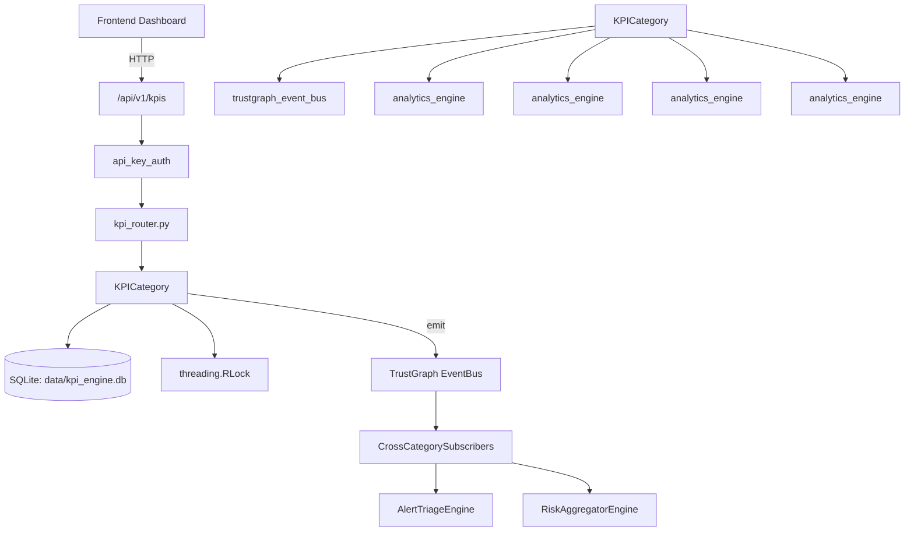

# US-0146: Kpi

## Sub-Epic: Executive
**Master Goal**: ALDECI — $35/mo enterprise security intelligence platform replacing $50K-500K/yr tools

## User Story
As a **Sarah Chen (CISO)**, I need to track security KPIs and performance
so that the platform delivers enterprise-grade executive capabilities at 1/1000th the cost of legacy tools.

## Why This Matters
Kpi replaces functionality found in enterprise tools like CrowdStrike, Wiz, Snyk, and Rapid7.
By building this into ALDECI's $35/mo stack, customers save $50K+/yr on standalone Executive tooling.

## Architecture

## Current State: 95% Complete
- ✅ `record_kpi()` — Store a KPI data point. (line 406)
- ✅ `get_current_kpis()` — Return the most-recent value for every KPI recorded for this org, (line 472)
- ✅ `get_kpi_trend()` — Return KPI values over time for trend charting. (line 521)
- ✅ `set_target()` — Configure thresholds for a KPI. (line 555)
- ✅ `get_kpi_health()` — Return RAG health status for all KPIs for this org. (line 604)
- ✅ `get_executive_kpis()` — Return top 10 KPIs for the CISO executive dashboard. (line 640)
- ❌ TrustGraph event emission — not yet verified

## Key Functions (from `suite-core/core/kpi_engine.py` — 907 lines)
- `KPIEngine.record_kpi()` — Store a KPI data point. (line 406)
- `KPIEngine.get_current_kpis()` — Return the most-recent value for every KPI recorded for this org, (line 472)
- `KPIEngine.get_kpi_trend()` — Return KPI values over time for trend charting. (line 521)
- `KPIEngine.set_target()` — Configure thresholds for a KPI. (line 555)
- `KPIEngine.get_kpi_health()` — Return RAG health status for all KPIs for this org. (line 604)
- `KPIEngine.get_executive_kpis()` — Return top 10 KPIs for the CISO executive dashboard. (line 640)
- `KPIEngine.auto_calculate_kpis()` — Compute all KPIs that can be derived from platform data. (line 706)
- `KPIEngine.list_kpi_definitions()` — Return all built-in KPI definitions with their metadata. (line 830)

## Dependencies
- **Depends on**: trustgraph_event_bus, analytics_engine, analytics_engine, analytics_engine, analytics_engine
- **Depended by**: Routers, TrustGraph EventBus, CrossCategorySubscribers
- **TrustGraph**: Event emission wired via ResponseInterceptorMiddleware
- **Source file**: `suite-core/core/kpi_engine.py` (907 lines)
- **Router file**: `suite-api/apps/api/kpi_router.py`

## API Endpoints
| Method | Path | Description |
|--------|------|-------------|
| POST | `/api/v1/kpis/record` | record kpi |
| GET | `/api/v1/kpis/current` | get current kpis |
| GET | `/api/v1/kpis/trend/{name}` | get kpi trend |
| PUT | `/api/v1/kpis/targets` | set target |
| GET | `/api/v1/kpis/health` | get kpi health |
| GET | `/api/v1/kpis/executive` | get executive kpis |
| POST | `/api/v1/kpis/calculate` | auto calculate kpis |
| GET | `/api/v1/kpis/definitions` | list kpi definitions |

## Tasks Remaining
1. Verify TrustGraph event emission works end-to-end (2h)
2. Add integration test with real persona workflow (2h)
3. Wire CrossCategorySubscriber consumer chain (1h)
4. Validate with 30-persona walkthrough (1h)
5. Optimize query performance for large datasets (2h)
6. Expand test coverage to edge cases (2h)

## Definition of Done
- [ ] Sarah Chen (CISO) can access /api/v1/kpis and get meaningful data
- [ ] All CRUD operations return correct HTTP status codes
- [ ] TrustGraph receives events from this engine
- [ ] 52+ tests passing in `tests/test_kpi_engine.py`
- [ ] 30-persona walkthrough includes this endpoint at 100%
- [ ] No hardcoded org_id — all queries are org-scoped

## Sprint: Wave 46 (est. April 22-24, 2026)

## Test Coverage
- **Test file**: `tests/test_kpi_engine.py`
- **Tests**: 52 tests
- **Status**: Passing
