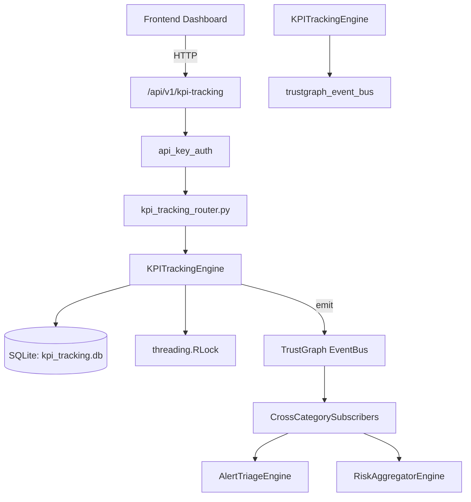

# US-0147: Kpi Tracking

## Sub-Epic: Executive
**Master Goal**: ALDECI — $35/mo enterprise security intelligence platform replacing $50K-500K/yr tools

## User Story
As a **Sarah Chen (CISO)**, I need to track security KPIs and performance
so that the platform delivers enterprise-grade executive capabilities at 1/1000th the cost of legacy tools.

## Why This Matters
Kpi Tracking replaces functionality found in enterprise tools like CrowdStrike, Wiz, Snyk, and Rapid7.
By building this into ALDECI's $35/mo stack, customers save $50K+/yr on standalone Executive tooling.

## Architecture

## Current State: 95% Complete
- ✅ `create_kpi()` — Create a new KPI. (line 139)
- ✅ `list_kpis()` — List KPIs with optional category and status filters. (line 208)
- ✅ `get_kpi()` — Retrieve a single KPI by ID. (line 228)
- ✅ `record_measurement()` — Record a measurement for a KPI. Returns None if KPI not found. (line 241)
- ✅ `list_measurements()` — List measurements for a KPI ordered by measured_at DESC. (line 285)
- ✅ `get_kpi_performance()` — Return performance summary for a KPI. (line 300)
- ❌ TrustGraph event emission — not yet verified

## Key Functions (from `suite-core/core/kpi_tracking_engine.py` — 420 lines)
- `KPITrackingEngine.create_kpi()` — Create a new KPI. (line 139)
- `KPITrackingEngine.list_kpis()` — List KPIs with optional category and status filters. (line 208)
- `KPITrackingEngine.get_kpi()` — Retrieve a single KPI by ID. (line 228)
- `KPITrackingEngine.record_measurement()` — Record a measurement for a KPI. Returns None if KPI not found. (line 241)
- `KPITrackingEngine.list_measurements()` — List measurements for a KPI ordered by measured_at DESC. (line 285)
- `KPITrackingEngine.get_kpi_performance()` — Return performance summary for a KPI. (line 300)
- `KPITrackingEngine.get_kpi_stats()` — Return aggregated KPI statistics for an org. (line 359)

## Dependencies
- **Depends on**: trustgraph_event_bus
- **Depended by**: Routers, TrustGraph EventBus, CrossCategorySubscribers
- **TrustGraph**: Event emission wired via ResponseInterceptorMiddleware
- **Source file**: `suite-core/core/kpi_tracking_engine.py` (420 lines)
- **Router file**: `suite-api/apps/api/kpi_tracking_router.py`

## API Endpoints
| Method | Path | Description |
|--------|------|-------------|
| POST | `/api/v1/kpi-tracking/kpis` | create kpi |
| GET | `/api/v1/kpi-tracking/kpis` | list kpis |
| GET | `/api/v1/kpi-tracking/kpis/{kpi_id}` | get kpi |
| POST | `/api/v1/kpi-tracking/kpis/{kpi_id}/measurements` | record measurement |
| GET | `/api/v1/kpi-tracking/kpis/{kpi_id}/measurements` | list measurements |
| GET | `/api/v1/kpi-tracking/kpis/{kpi_id}/performance` | get kpi performance |
| GET | `/api/v1/kpi-tracking/stats` | get kpi stats |

## Tasks Remaining
1. Verify TrustGraph event emission works end-to-end (2h)
2. Add integration test with real persona workflow (2h)
3. Wire CrossCategorySubscriber consumer chain (1h)
4. Validate with 30-persona walkthrough (1h)
5. Optimize query performance for large datasets (2h)
6. Expand test coverage to edge cases (2h)

## Definition of Done
- [ ] Sarah Chen (CISO) can access /api/v1/kpi-tracking and get meaningful data
- [ ] All CRUD operations return correct HTTP status codes
- [ ] TrustGraph receives events from this engine
- [ ] 47+ tests passing in `tests/test_kpi_tracking_engine.py`
- [ ] 30-persona walkthrough includes this endpoint at 100%
- [ ] No hardcoded org_id — all queries are org-scoped

## Sprint: Wave 46 (est. April 22-24, 2026)

## Test Coverage
- **Test file**: `tests/test_kpi_tracking_engine.py`
- **Tests**: 47 tests
- **Status**: Passing
