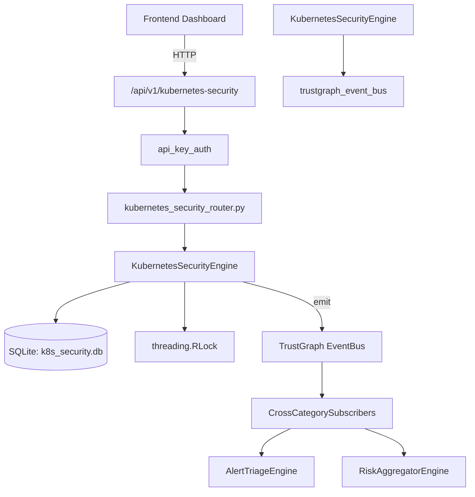

# US-0148: Kubernetes Security

## Sub-Epic: CSPM
**Master Goal**: ALDECI — $35/mo enterprise security intelligence platform replacing $50K-500K/yr tools

## User Story
As a **Jennifer Wu (Cloud Security Architect)**, I need to secure Kubernetes clusters
so that the platform delivers enterprise-grade cspm capabilities at 1/1000th the cost of legacy tools.

## Why This Matters
Kubernetes Security replaces functionality found in enterprise tools like CrowdStrike, Wiz, Snyk, and Rapid7.
By building this into ALDECI's $35/mo stack, customers save $50K+/yr on standalone CSPM tooling.

## Architecture

## Current State: 95% Complete
- ✅ `register_cluster()` — Register a Kubernetes cluster for an org. (line 128)
- ✅ `list_clusters()` — List all clusters for an org. (line 168)
- ✅ `record_finding()` — Record a security finding for a cluster. (line 182)
- ✅ `list_findings()` — List findings with optional filters. (line 224)
- ✅ `resolve_finding()` — Mark a finding as resolved. (line 253)
- ✅ `run_cis_benchmark()` — Simulate CIS Kubernetes Benchmark v1.8 for a cluster. (line 286)
- ❌ TrustGraph event emission — not yet verified

## Key Functions (from `suite-core/core/kubernetes_security_engine.py` — 442 lines)
- `KubernetesSecurityEngine.register_cluster()` — Register a Kubernetes cluster for an org. (line 128)
- `KubernetesSecurityEngine.list_clusters()` — List all clusters for an org. (line 168)
- `KubernetesSecurityEngine.record_finding()` — Record a security finding for a cluster. (line 182)
- `KubernetesSecurityEngine.list_findings()` — List findings with optional filters. (line 224)
- `KubernetesSecurityEngine.resolve_finding()` — Mark a finding as resolved. (line 253)
- `KubernetesSecurityEngine.run_cis_benchmark()` — Simulate CIS Kubernetes Benchmark v1.8 for a cluster. (line 286)
- `KubernetesSecurityEngine.get_rbac_analysis()` — Return RBAC analysis for a cluster. (line 339)
- `KubernetesSecurityEngine.get_cluster_stats()` — Aggregate stats across all clusters for an org. (line 388)

## Dependencies
- **Depends on**: trustgraph_event_bus
- **Depended by**: Routers, TrustGraph EventBus, CrossCategorySubscribers
- **TrustGraph**: Event emission wired via ResponseInterceptorMiddleware
- **Source file**: `suite-core/core/kubernetes_security_engine.py` (442 lines)
- **Router file**: `suite-api/apps/api/kubernetes_security_router.py`

## API Endpoints
| Method | Path | Description |
|--------|------|-------------|
| GET | `/api/v1/kubernetes-security/clusters` | list clusters |
| POST | `/api/v1/kubernetes-security/clusters` | register cluster |
| POST | `/api/v1/kubernetes-security/clusters/{cluster_id}/cis-benchmark` | run cis benchmark |
| GET | `/api/v1/kubernetes-security/clusters/{cluster_id}/rbac-analysis` | get rbac analysis |
| GET | `/api/v1/kubernetes-security/findings` | list findings |
| POST | `/api/v1/kubernetes-security/findings` | record finding |
| POST | `/api/v1/kubernetes-security/findings/{finding_id}/resolve` | resolve finding |
| GET | `/api/v1/kubernetes-security/stats` | get stats |

## Tasks Remaining
1. Verify TrustGraph event emission works end-to-end (2h)
2. Add integration test with real persona workflow (2h)
3. Wire CrossCategorySubscriber consumer chain (1h)
4. Validate with 30-persona walkthrough (1h)
5. Optimize query performance for large datasets (2h)
6. Expand test coverage to edge cases (2h)

## Definition of Done
- [ ] Jennifer Wu (Cloud Security Architect) can access /api/v1/kubernetes-security and get meaningful data
- [ ] All CRUD operations return correct HTTP status codes
- [ ] TrustGraph receives events from this engine
- [ ] 56+ tests passing in `tests/test_kubernetes_security_engine.py`
- [ ] 30-persona walkthrough includes this endpoint at 100%
- [ ] No hardcoded org_id — all queries are org-scoped

## Sprint: Wave 46 (est. April 22-24, 2026)

## Test Coverage
- **Test file**: `tests/test_kubernetes_security_engine.py`
- **Tests**: 56 tests
- **Status**: Passing
