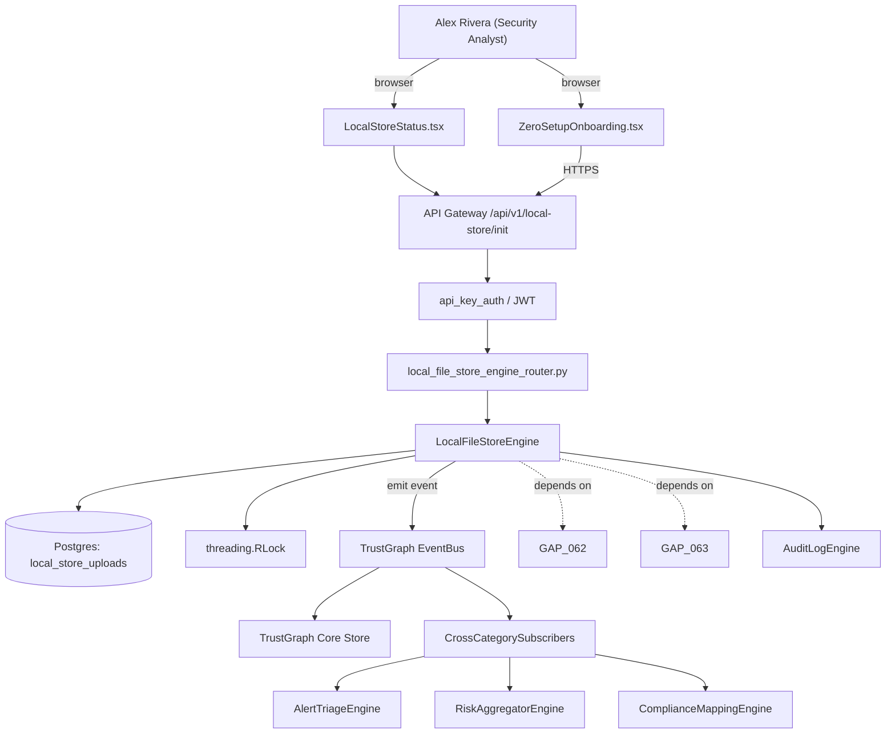

# US-0064: Zero-infra file-based store option: .fixops/ per-repo JSON store enabling npx fixops analyze

## Sub-Epic: UX
**Master Goal**: ALDECI — tiered $199-$1,499/mo enterprise security intelligence platform replacing $50K-$500K/yr tools

## User Story
As a **Alex Rivera (Security Analyst)**, I need the ability to zero-infra file-based store option: .fixops/ per-repo JSON store enabling npx fixops analyze so that ALDECI keeps parity with $50K-$500K/yr incumbents at $199-$1,499/mo.

## Why This Matters
Per /tmp/truecourse-analysis.md §4 (File-based store) + §9 takeaway 4 and competitor-truecourse.md, TrueCourse stores analyses in a per-repo `.truecourse/` directory with LATEST.json materialized view, atomic write-tmp-rename, O_EXCL lock, append-only history.json, committable config.json — enabling `npx truecourse analyze` with zero setup. Fixops today presumes a running PG + Redis server. Add an optional local file-store mode so developers can run `npx fixops analyze` on their laptop without any server, then optionally sync results up to a Fixops tenant later. Files: `.fixops/analyses/<iso>_<uuid>.json`, `.fixops/LATEST.json`, `.fixops/history.json`, `.fixops/diff.json`, `.fixops/config.json`, `.fixops/ui-state.json`, `.fixops/.analyze.lock`, `.fixops/logs/`. Auto-seed .gitignore for logs and lock; config.json is committable.

This work is called out as a P1 gap in `competitor-truecourse.md`. Shipping it is load-bearing for ALDECI's tiered $199-$1,499/mo positioning against $50K-$500K/yr incumbents: every delayed gap becomes a displacement deal we lose.

## Architecture

## Current State: 0% — MISSING (new engine)
- [ ] Engine module `suite-core/core/local_file_store_engine.py` does not exist yet
- [ ] Router `suite-api/apps/api/local_file_store_engine_router.py` does not exist yet
- [ ] DB tables listed under Data Model do not exist yet
- [ ] Frontend screens listed under Key Functions do not exist yet
- [ ] No TrustGraph events emitted yet

## Key Functions
**Backend (engine methods):**
- `create_init()` — backs `POST /api/v1/local-store/init`
- `get_latest()` — backs `GET /api/v1/local-store/latest`
- `create_upload()` — backs `POST /api/v1/local-store/upload`
- `get_history()` — backs `GET /api/v1/local-store/history`

**Frontend screens:**
- `ZeroSetupOnboarding.tsx` — operator-facing UI surface for this gap
- `LocalStoreStatus.tsx` — operator-facing UI surface for this gap

## API Endpoints
| Method | Path | Auth | Purpose |
|--------|------|------|---------|
| POST | `/api/v1/local-store/init` | api_key_auth | local store init |
| GET | `/api/v1/local-store/latest` | api_key_auth | local store latest |
| POST | `/api/v1/local-store/upload` | api_key_auth | local store upload |
| GET | `/api/v1/local-store/history` | api_key_auth | local store history |

## Data Model
- no server-side schema changes for the local file format (files are the schema); add local_store_uploads table server-side: id, org_id, repo_id, uploaded_at, uploaded_by, snapshot_hash, snapshot_size_bytes, reconciled_finding_count

## Dependencies
**Depends on**: GAP-062, GAP-063
**Depended by**: Router layer, TrustGraph EventBus, CrossCategorySubscribers, CrossCategoryEvidenceBuilder, AuditLogEngine
**New engine module**: `suite-core/core/local_file_store_engine.py`
**New router module**: `suite-api/apps/api/local_file_store_engine_router.py`
**Master gap id**: `GAP-064` (priority P1, effort M)

## Tasks Remaining
1. Schema migration: no server-side schema changes for the local file format (files are the schema);  (3h)
2. Implement endpoint POST /api/v1/local-store/init (5h)
3. Implement endpoint GET /api/v1/local-store/latest (5h)
4. Implement endpoint POST /api/v1/local-store/upload (5h)
5. Implement endpoint GET /api/v1/local-store/history (5h)
6. Wire frontend screen ZeroSetupOnboarding.tsx (4h)
7. Wire frontend screen LocalStoreStatus.tsx (4h)
8. Write 8 pytest cases: test_npx_fixops_analyze_no_server_required, test_concurrent_invocations_blocked_by_o_excl… (5h)
9. Wire TrustGraph event emission + CrossCategorySubscriber consumers (3h)
10. Persona walkthrough + integration test (3h)
11. Docs + API reference update (2h)

## Definition of Done
- [ ] Given a fresh repo with no Fixops server reachable, When `npx fixops analyze` runs, Then the CLI creates .fixops/ with config.json, runs analysis fully locally, writes LATEST.json atomically, and exits 0 with a summary printed.
- [ ] Given two concurrent `fixops analyze` invocations on the same repo, When the second one starts while the first is running, Then the second exits with error_code=ANALYZE_LOCK_HELD due to O_EXCL on .fixops/.analyze.lock.
- [ ] Given an analysis in progress, When writing LATEST.json, Then the writer writes to LATEST.json.tmp first and renames atomically — a concurrent reader never sees a partial file.
- [ ] Given a committed .fixops/config.json, When another developer clones the repo and runs `fixops analyze`, Then the same enabled rules and settings apply without additional setup.
- [ ] Given .fixops/.analyze.lock and .fixops/logs/ paths, When `fixops analyze` runs for the first time, Then .gitignore is auto-seeded to exclude them (but not config.json or LATEST.json).
- [ ] Given local-store-mode results, When the user later runs `fixops push --tenant=<id>`, Then the latest snapshot is uploaded to the Fixops server via POST /api/v1/local-store/upload and the server reconciles findings into its DB.
- [ ] Given a LATEST.json read during dashboard display, When the file hasn't changed, Then mtime-caching returns the cached parse without re-reading the disk.
- [ ] Given a corrupted LATEST.json (invalid JSON), When the CLI opens the repo, Then the corruption is detected, a warning is emitted, and the most recent valid snapshot from analyses/ is restored.
- [ ] All endpoints are org-scoped (no hardcoded org_id) and gated by `api_key_auth`.
- [ ] TrustGraph emits at least one event type for this engine and a CrossCategorySubscriber consumes it.
- [ ] `Alex Rivera (Security Analyst)` can execute the full workflow in the 30-persona walkthrough.

## Tests Required
- `test_npx_fixops_analyze_no_server_required`
- `test_concurrent_invocations_blocked_by_o_excl`
- `test_atomic_write_tmp_rename_never_partial`
- `test_committed_config_applies_on_another_clone`
- `test_gitignore_auto_seeded_correctly`
- `test_push_uploads_latest_and_server_reconciles`
- `test_mtime_cache_skips_redundant_reads`
- `test_corrupted_latest_recovers_from_analyses_dir`

## Sprint: Wave 46 (est. May 13-May 19, 2026)

## Citation
Source research: `competitor-truecourse.md` (gap `GAP-064`, priority `P1`, effort `M`)
