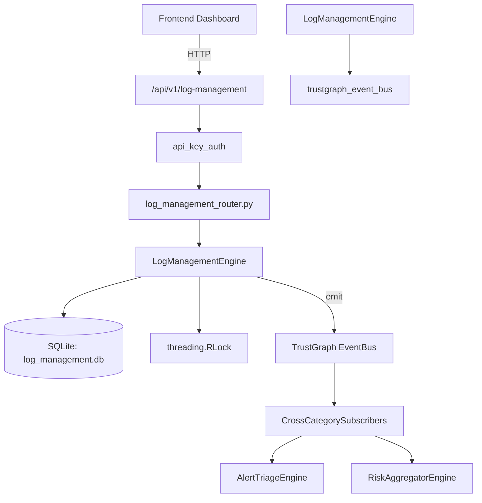

# US-0149: Log Management

## Sub-Epic: Advanced
**Master Goal**: ALDECI — $35/mo enterprise security intelligence platform replacing $50K-500K/yr tools

## User Story
As a **Ryan Murphy (Platform Engineer)**, I need to manage security log retention
so that the platform delivers enterprise-grade advanced capabilities at 1/1000th the cost of legacy tools.

## Why This Matters
Log Management replaces functionality found in enterprise tools like CrowdStrike, Wiz, Snyk, and Rapid7.
By building this into ALDECI's $35/mo stack, customers save $50K+/yr on standalone Advanced tooling.

## Architecture

## Current State: 95% Complete
- ✅ `create_log_source()` — Register a new log source. Validates name and log_type. (line 123)
- ✅ `list_log_sources()` — List log sources for org, optionally filtered by log_type. (line 158)
- ✅ `store_log_entry()` — Store a log entry. source_id, level, and message are required. (line 186)
- ✅ `query_logs()` — Query log entries with optional filters. Uses LIKE for search on message. (line 217)
- ✅ `create_retention_policy()` — Create a log retention policy. retention_days is clamped to 1-3650. (line 257)
- ✅ `list_retention_policies()` — List all retention policies for org_id. (line 284)
- ❌ TrustGraph event emission — not yet verified

## Key Functions (from `suite-core/core/log_management_engine.py` — 379 lines)
- `LogManagementEngine.create_log_source()` — Register a new log source. Validates name and log_type. (line 123)
- `LogManagementEngine.list_log_sources()` — List log sources for org, optionally filtered by log_type. (line 158)
- `LogManagementEngine.store_log_entry()` — Store a log entry. source_id, level, and message are required. (line 186)
- `LogManagementEngine.query_logs()` — Query log entries with optional filters. Uses LIKE for search on message. (line 217)
- `LogManagementEngine.create_retention_policy()` — Create a log retention policy. retention_days is clamped to 1-3650. (line 257)
- `LogManagementEngine.list_retention_policies()` — List all retention policies for org_id. (line 284)
- `LogManagementEngine.apply_retention_policy()` — Apply retention policy: delete log entries older than retention_days for matchin (line 293)
- `LogManagementEngine.get_log_stats()` — Return log management stats for org_id. (line 345)

## Dependencies
- **Depends on**: trustgraph_event_bus
- **Depended by**: Routers, TrustGraph EventBus, CrossCategorySubscribers
- **TrustGraph**: Event emission wired via ResponseInterceptorMiddleware
- **Source file**: `suite-core/core/log_management_engine.py` (379 lines)
- **Router file**: `suite-api/apps/api/log_management_router.py`

## API Endpoints
| Method | Path | Description |
|--------|------|-------------|
| POST | `/api/v1/log-management/sources` | create source |
| GET | `/api/v1/log-management/sources` | list sources |
| POST | `/api/v1/log-management/entries` | store entry |
| GET | `/api/v1/log-management/entries` | query entries |
| POST | `/api/v1/log-management/retention-policies` | create retention policy |
| GET | `/api/v1/log-management/retention-policies` | list retention policies |
| POST | `/api/v1/log-management/retention-policies/{policy_id}/apply` | apply retention policy |
| GET | `/api/v1/log-management/stats` | get stats |

## Tasks Remaining
1. Verify TrustGraph event emission works end-to-end (2h)
2. Add integration test with real persona workflow (2h)
3. Wire CrossCategorySubscriber consumer chain (1h)
4. Validate with 30-persona walkthrough (1h)
5. Optimize query performance for large datasets (2h)
6. Expand test coverage to edge cases (2h)

## Definition of Done
- [ ] Ryan Murphy (Platform Engineer) can access /api/v1/log-management and get meaningful data
- [ ] All CRUD operations return correct HTTP status codes
- [ ] TrustGraph receives events from this engine
- [ ] 40+ tests passing in `tests/test_log_management_engine.py`
- [ ] 30-persona walkthrough includes this endpoint at 100%
- [ ] No hardcoded org_id — all queries are org-scoped

## Sprint: Wave 46 (est. April 22-24, 2026)

## Test Coverage
- **Test file**: `tests/test_log_management_engine.py`
- **Tests**: 40 tests
- **Status**: Passing
