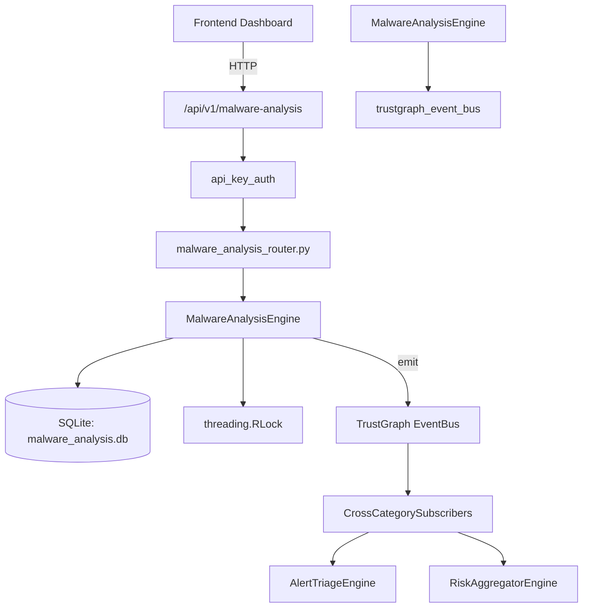

# US-0150: Malware Analysis

## Sub-Epic: CTEM
**Master Goal**: ALDECI — $35/mo enterprise security intelligence platform replacing $50K-500K/yr tools

## User Story
As a **Priya Sharma (SOC T2 Analyst)**, I need to analyze malware samples and IOCs
so that the platform delivers enterprise-grade ctem capabilities at 1/1000th the cost of legacy tools.

## Why This Matters
Malware Analysis replaces functionality found in enterprise tools like CrowdStrike, Wiz, Snyk, and Rapid7.
By building this into ALDECI's $35/mo stack, customers save $50K+/yr on standalone CTEM tooling.

## Architecture

## Current State: 95% Complete
- ✅ `submit_sample()` — Submit a malware sample for analysis. Requires 'sha256' in data. (line 95)
- ✅ `list_samples()` — List samples for org. Optionally filter by verdict and/or family. (line 136)
- ✅ `get_sample()` — Fetch a single sample by id, scoped to org_id. (line 157)
- ✅ `record_analysis()` — Record analysis result for a sample. verdict must be in _VALID_VERDICTS. (line 167)
- ✅ `add_ioc()` — Add an IOC linked to a sample. ioc_type must be in _VALID_IOC_TYPES. (line 201)
- ✅ `list_iocs()` — List all IOCs for org. Optionally filter by ioc_type. (line 228)
- ❌ TrustGraph event emission — not yet verified

## Key Functions (from `suite-core/core/malware_analysis_engine.py` — 279 lines)
- `MalwareAnalysisEngine.submit_sample()` — Submit a malware sample for analysis. Requires 'sha256' in data. (line 95)
- `MalwareAnalysisEngine.list_samples()` — List samples for org. Optionally filter by verdict and/or family. (line 136)
- `MalwareAnalysisEngine.get_sample()` — Fetch a single sample by id, scoped to org_id. (line 157)
- `MalwareAnalysisEngine.record_analysis()` — Record analysis result for a sample. verdict must be in _VALID_VERDICTS. (line 167)
- `MalwareAnalysisEngine.add_ioc()` — Add an IOC linked to a sample. ioc_type must be in _VALID_IOC_TYPES. (line 201)
- `MalwareAnalysisEngine.list_iocs()` — List all IOCs for org. Optionally filter by ioc_type. (line 228)
- `MalwareAnalysisEngine.get_malware_stats()` — Return aggregate stats for org. (line 248)

## Dependencies
- **Depends on**: trustgraph_event_bus
- **Depended by**: Routers, TrustGraph EventBus, CrossCategorySubscribers
- **TrustGraph**: Event emission wired via ResponseInterceptorMiddleware
- **Source file**: `suite-core/core/malware_analysis_engine.py` (279 lines)
- **Router file**: `suite-api/apps/api/malware_analysis_router.py`

## API Endpoints
| Method | Path | Description |
|--------|------|-------------|
| POST | `/api/v1/malware-analysis/samples` | submit sample |
| GET | `/api/v1/malware-analysis/samples` | list samples |
| GET | `/api/v1/malware-analysis/samples/{sample_id}` | get sample |
| POST | `/api/v1/malware-analysis/samples/{sample_id}/analyze` | record analysis |
| POST | `/api/v1/malware-analysis/samples/{sample_id}/iocs` | add ioc |
| GET | `/api/v1/malware-analysis/iocs` | list iocs |
| GET | `/api/v1/malware-analysis/stats` | get stats |

## Tasks Remaining
1. Verify TrustGraph event emission works end-to-end (2h)
2. Add integration test with real persona workflow (2h)
3. Wire CrossCategorySubscriber consumer chain (1h)
4. Validate with 30-persona walkthrough (1h)
5. Optimize query performance for large datasets (2h)
6. Expand test coverage to edge cases (2h)

## Definition of Done
- [ ] Priya Sharma (SOC T2 Analyst) can access /api/v1/malware-analysis and get meaningful data
- [ ] All CRUD operations return correct HTTP status codes
- [ ] TrustGraph receives events from this engine
- [ ] 42+ tests passing in `tests/test_malware_analysis_engine.py`
- [ ] 30-persona walkthrough includes this endpoint at 100%
- [ ] No hardcoded org_id — all queries are org-scoped

## Sprint: Wave 47 (est. April 23-25, 2026)

## Test Coverage
- **Test file**: `tests/test_malware_analysis_engine.py`
- **Tests**: 42 tests
- **Status**: Passing
