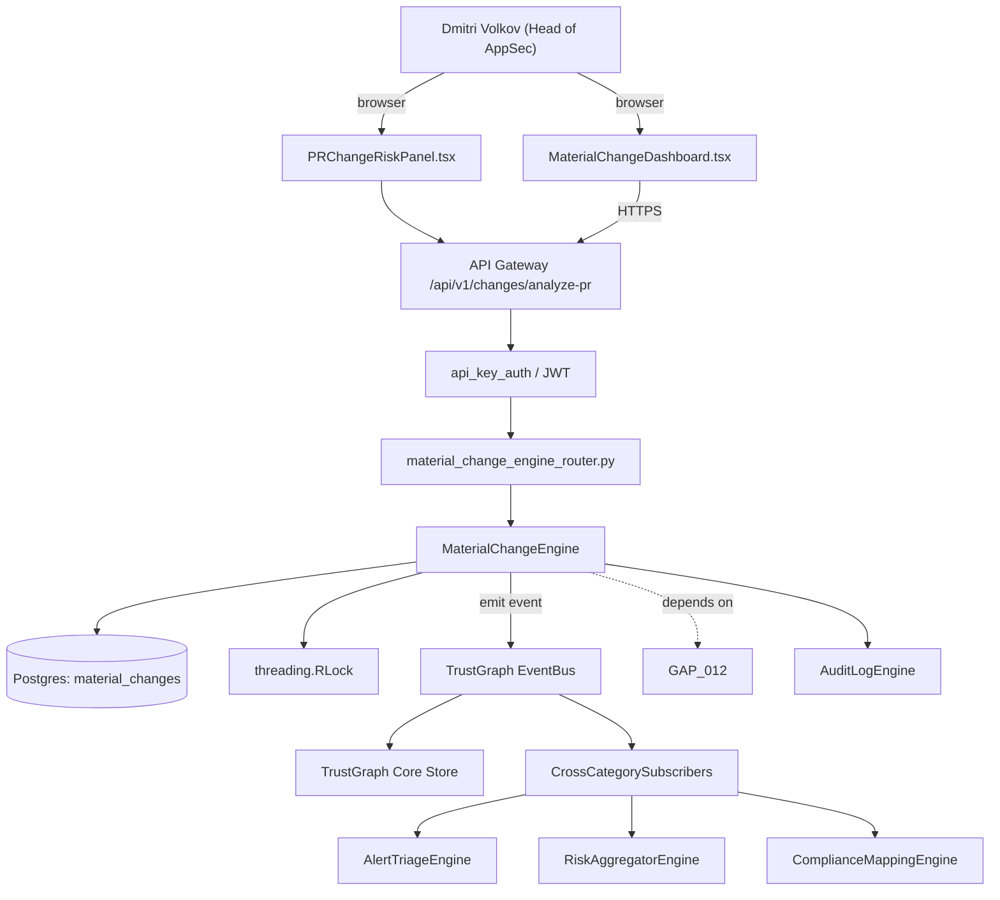

# US-0011: Add Material Change detection: risk-surface diff per pull request (new API, new data model, new secret, new CVE dep)

## Sub-Epic: ASPM
**Master Goal**: ALDECI — tiered $199-$1,499/mo enterprise security intelligence platform replacing $50K-$500K/yr tools

## User Story
As a **Dmitri Volkov (Head of AppSec)**, I need to add Material Change detection: risk-surface diff per pull request so that Fixops matches Apiiro/Cycode ASPM depth and wins replacement deals.

## Why This Matters
Per competitor-aspm.md §4 and competitor-emerging.md §1, Apiiro's hallmark workflow is flagging only PRs that materially change the risk surface. Fixops has `change_management_router` but no diff-of-risk-surface logic. Build the engine that computes: new exposed APIs, new sensitive-data fields, new secrets, new OSS deps with CVEs, new privilege expansions.

This work is called out as a P1 gap in `competitor-aspm.md, competitor-emerging.md`. Shipping it is load-bearing for ALDECI's tiered $199-$1,499/mo positioning against $50K-$500K/yr incumbents: every delayed gap becomes a displacement deal we lose.

## Architecture

## Current State: 0% — MISSING (new engine)
- [ ] Engine module `suite-core/core/material_change_engine.py` does not exist yet
- [ ] Router `suite-api/apps/api/material_change_engine_router.py` does not exist yet
- [ ] DB tables listed under Data Model do not exist yet
- [ ] Frontend screens listed under Key Functions do not exist yet
- [ ] No TrustGraph events emitted yet

## Key Functions
**Backend (engine methods):**
- `create_analyze_pr()` — backs `POST /api/v1/changes/analyze-pr`
- `get_pr_id()` — backs `GET /api/v1/changes/material/{pr_id}`
- `get_material()` — backs `GET /api/v1/changes/material?kind=&severity=`

**Frontend screens:**
- `MaterialChangeDashboard.tsx` — operator-facing UI surface for this gap
- `PRChangeRiskPanel.tsx` — operator-facing UI surface for this gap

## API Endpoints
| Method | Path | Auth | Purpose |
|--------|------|------|---------|
| POST | `/api/v1/changes/analyze-pr` | api_key_auth | changes analyze pr |
| GET | `/api/v1/changes/material/{pr_id}` | api_key_auth | material {pr id} |
| GET | `/api/v1/changes/material?kind=&severity=` | api_key_auth | changes material?kind=&severity= |

## Data Model
- add material_changes table: id, pr_id, repo, kind, severity, file, line, evidence (JSONB), created_at

## Dependencies
**Depends on**: GAP-012
**Depended by**: Router layer, TrustGraph EventBus, CrossCategorySubscribers, CrossCategoryEvidenceBuilder, AuditLogEngine
**New engine module**: `suite-core/core/material_change_engine.py`
**New router module**: `suite-api/apps/api/material_change_engine_router.py`
**Master gap id**: `GAP-011` (priority P1, effort M)

## Tasks Remaining
1. Schema migration: add material_changes table (4h)
2. Implement endpoint POST /api/v1/changes/analyze-pr (6h)
3. Implement endpoint GET /api/v1/changes/material/{pr_id} (6h)
4. Implement endpoint GET /api/v1/changes/material?kind=&severity= (6h)
5. Wire frontend screen MaterialChangeDashboard.tsx (5h)
6. Wire frontend screen PRChangeRiskPanel.tsx (5h)
7. Write 5 pytest cases: test_new_exposed_api_detected, test_variable_rename_ignored… (6h)
8. Wire TrustGraph event emission + CrossCategorySubscriber consumers (4h)
9. Persona walkthrough + integration test (3h)
10. Docs + API reference update (2h)

## Definition of Done
- [ ] Given a PR that adds a new public HTTP endpoint, When the engine analyzes, Then it emits a material_change record with kind=new_exposed_api and posts a PR comment linking to the endpoint file/line.
- [ ] Given a PR that only renames a variable, When analyzed, Then no material change is emitted.
- [ ] Given a PR that introduces a new dep with an open HIGH CVE, When analyzed, Then a material_change record with kind=new_vulnerable_dep is emitted.
- [ ] Given MaterialChangeDashboard.tsx, When a user filters by `kind=new_secret`, Then only material changes of that kind across all repos are shown.
- [ ] Given the PR gate, When material changes with severity>=HIGH exist and org policy=block, Then the PR check fails with a link to the review queue.
- [ ] Given PRChangeRiskPanel.tsx opened on a PR, When the analysis is complete, Then the panel shows a diff summary (kind counts + per-file chips) within 10 seconds on a repo <=500 files.
- [ ] All endpoints are org-scoped (no hardcoded org_id) and gated by `api_key_auth`.
- [ ] TrustGraph emits at least one event type for this engine and a CrossCategorySubscriber consumes it.
- [ ] `Dmitri Volkov (Head of AppSec)` can execute the full workflow in the 30-persona walkthrough.

## Tests Required
- `test_new_exposed_api_detected`
- `test_variable_rename_ignored`
- `test_new_vulnerable_dep_detected`
- `test_pr_gate_blocks_high_material_change`
- `test_analysis_latency_on_500_file_repo`

## Sprint: Wave 47 (est. May 20-May 26, 2026)

## Citation
Source research: `competitor-aspm.md, competitor-emerging.md` (gap `GAP-011`, priority `P1`, effort `M`)
