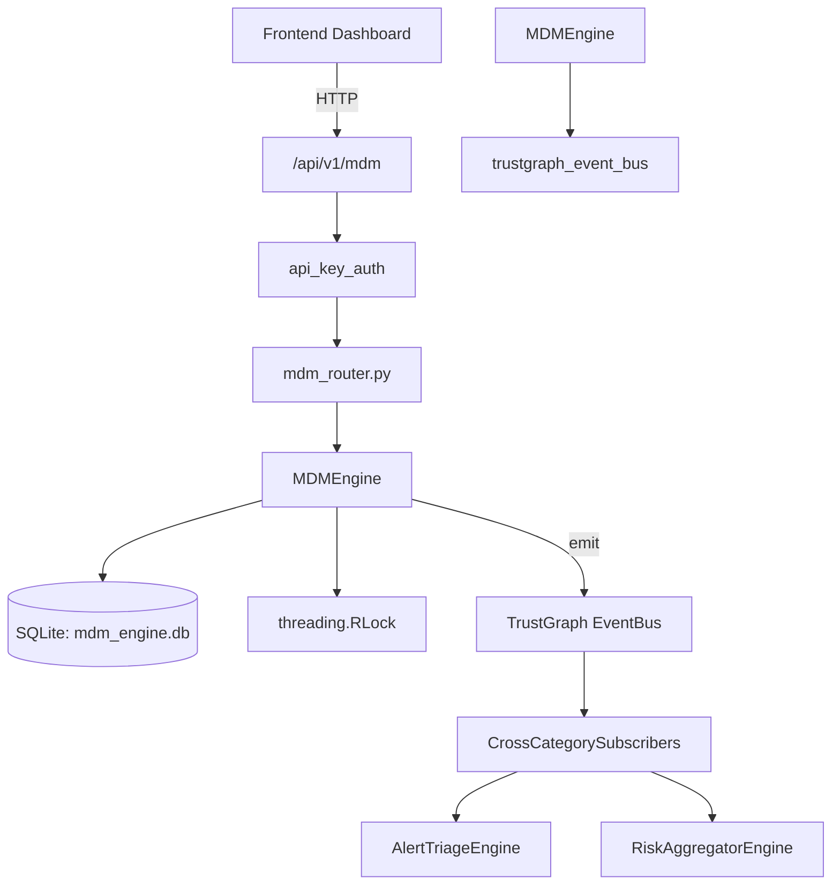

# US-0151: Mdm

## Sub-Epic: Advanced
**Master Goal**: ALDECI — $35/mo enterprise security intelligence platform replacing $50K-500K/yr tools

## User Story
As a **James Wilson (Security Engineer)**, I need to manage mobile device security
so that the platform delivers enterprise-grade advanced capabilities at 1/1000th the cost of legacy tools.

## Why This Matters
Mdm replaces functionality found in enterprise tools like CrowdStrike, Wiz, Snyk, and Rapid7.
By building this into ALDECI's $35/mo stack, customers save $50K+/yr on standalone Advanced tooling.

## Architecture

## Current State: 95% Complete
- ✅ `enroll_device()` — Enroll a new device. Returns the created record. (line 172)
- ✅ `list_devices()` — List devices with optional filters. (line 219)
- ✅ `get_device()` — Retrieve a single device by ID. (line 245)
- ✅ `update_compliance()` — Update compliance status and issues on a device. Returns True if found. (line 262)
- ✅ `run_compliance_check()` — Evaluate device compliance against MDM policies. (line 287)
- ✅ `create_policy()` — Create an MDM policy. Returns the created record. (line 424)
- ❌ TrustGraph event emission — not yet verified

## Key Functions (from `suite-core/core/mdm_engine.py` — 661 lines)
- `MDMEngine.enroll_device()` — Enroll a new device. Returns the created record. (line 172)
- `MDMEngine.list_devices()` — List devices with optional filters. (line 219)
- `MDMEngine.get_device()` — Retrieve a single device by ID. (line 245)
- `MDMEngine.update_compliance()` — Update compliance status and issues on a device. Returns True if found. (line 262)
- `MDMEngine.run_compliance_check()` — Evaluate device compliance against MDM policies. (line 287)
- `MDMEngine.create_policy()` — Create an MDM policy. Returns the created record. (line 424)
- `MDMEngine.list_policies()` — List MDM policies, optionally filtered by platform. (line 475)
- `MDMEngine.wipe_device()` — Mark device for remote wipe. Returns the wipe request record. (line 502)

## Dependencies
- **Depends on**: trustgraph_event_bus
- **Depended by**: Routers, TrustGraph EventBus, CrossCategorySubscribers
- **TrustGraph**: Event emission wired via ResponseInterceptorMiddleware
- **Source file**: `suite-core/core/mdm_engine.py` (661 lines)
- **Router file**: `suite-api/apps/api/mdm_router.py`

## API Endpoints
| Method | Path | Description |
|--------|------|-------------|
| POST | `/api/v1/mdm/devices` | enroll device |
| GET | `/api/v1/mdm/devices` | list devices |
| GET | `/api/v1/mdm/devices/{device_id}` | get device |
| POST | `/api/v1/mdm/devices/{device_id}/compliance-check` | run compliance check |
| PUT | `/api/v1/mdm/devices/{device_id}/compliance` | update compliance |
| POST | `/api/v1/mdm/devices/{device_id}/wipe` | wipe device |
| GET | `/api/v1/mdm/devices/{device_id}/apps` | list device apps |
| POST | `/api/v1/mdm/devices/{device_id}/apps` | record app install |
| GET | `/api/v1/mdm/policies` | list policies |
| POST | `/api/v1/mdm/policies` | create policy |
| GET | `/api/v1/mdm/wipe-requests` | list wipe requests |
| GET | `/api/v1/mdm/stats` | get mdm stats |

## Tasks Remaining
1. Verify TrustGraph event emission works end-to-end (2h)
2. Add integration test with real persona workflow (2h)
3. Wire CrossCategorySubscriber consumer chain (1h)
4. Validate with 30-persona walkthrough (1h)
5. Optimize query performance for large datasets (2h)
6. Expand test coverage to edge cases (2h)

## Definition of Done
- [ ] James Wilson (Security Engineer) can access /api/v1/mdm and get meaningful data
- [ ] All CRUD operations return correct HTTP status codes
- [ ] TrustGraph receives events from this engine
- [ ] 49+ tests passing in `tests/test_mdm_engine.py`
- [ ] 30-persona walkthrough includes this endpoint at 100%
- [ ] No hardcoded org_id — all queries are org-scoped

## Sprint: Wave 47 (est. April 23-25, 2026)

## Test Coverage
- **Test file**: `tests/test_mdm_engine.py`
- **Tests**: 49 tests
- **Status**: Passing
