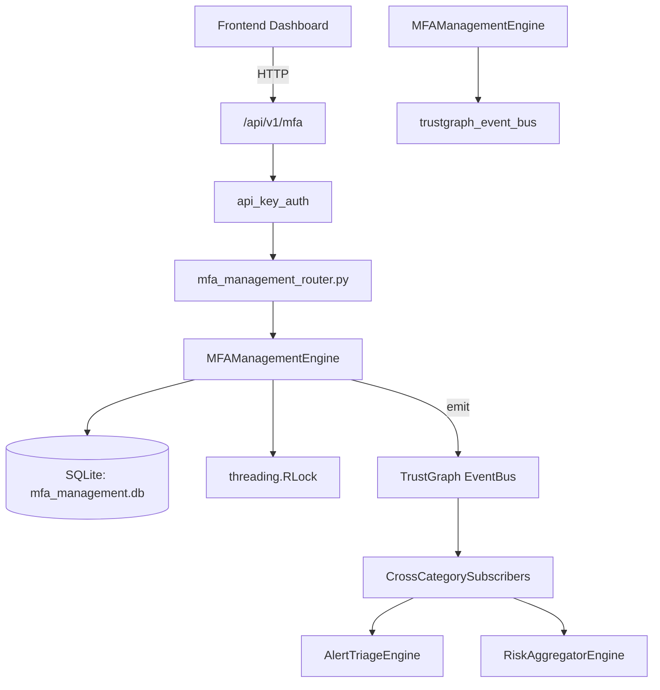

# US-0152: Mfa Management

## Sub-Epic: Identity
**Master Goal**: ALDECI — $35/mo enterprise security intelligence platform replacing $50K-500K/yr tools

## User Story
As a **Maria Lopez (IT Director)**, I need to manage multi-factor authentication
so that the platform delivers enterprise-grade identity capabilities at 1/1000th the cost of legacy tools.

## Why This Matters
Mfa Management replaces functionality found in enterprise tools like CrowdStrike, Wiz, Snyk, and Rapid7.
By building this into ALDECI's $35/mo stack, customers save $50K+/yr on standalone Identity tooling.

## Architecture

## Current State: 95% Complete
- ✅ `enroll_user()` — Create a new MFA enrollment in pending state. (line 121)
- ✅ `activate_enrollment()` — Set enrollment status to active and record enrolled_at timestamp. (line 155)
- ✅ `list_enrollments()` — List enrollments with optional filters. (line 170)
- ✅ `get_enrollment()` — Fetch a single enrollment, returns None if not found or wrong org. (line 194)
- ✅ `disable_enrollment()` — Set enrollment status to disabled. (line 203)
- ✅ `record_mfa_event()` — Record an MFA authentication event. (line 221)
- ❌ TrustGraph event emission — not yet verified

## Key Functions (from `suite-core/core/mfa_management_engine.py` — 399 lines)
- `MFAManagementEngine.enroll_user()` — Create a new MFA enrollment in pending state. (line 121)
- `MFAManagementEngine.activate_enrollment()` — Set enrollment status to active and record enrolled_at timestamp. (line 155)
- `MFAManagementEngine.list_enrollments()` — List enrollments with optional filters. (line 170)
- `MFAManagementEngine.get_enrollment()` — Fetch a single enrollment, returns None if not found or wrong org. (line 194)
- `MFAManagementEngine.disable_enrollment()` — Set enrollment status to disabled. (line 203)
- `MFAManagementEngine.record_mfa_event()` — Record an MFA authentication event. (line 221)
- `MFAManagementEngine.get_mfa_events()` — List MFA events with optional filters. (line 269)
- `MFAManagementEngine.create_policy()` — Create an MFA enforcement policy. (line 295)

## Dependencies
- **Depends on**: trustgraph_event_bus
- **Depended by**: Routers, TrustGraph EventBus, CrossCategorySubscribers
- **TrustGraph**: Event emission wired via ResponseInterceptorMiddleware
- **Source file**: `suite-core/core/mfa_management_engine.py` (399 lines)
- **Router file**: `suite-api/apps/api/mfa_management_router.py`

## API Endpoints
| Method | Path | Description |
|--------|------|-------------|
| POST | `/api/v1/mfa/enrollments` | enroll user |
| GET | `/api/v1/mfa/enrollments` | list enrollments |
| GET | `/api/v1/mfa/enrollments/{enrollment_id}` | get enrollment |
| PUT | `/api/v1/mfa/enrollments/{enrollment_id}/activate` | activate enrollment |
| PUT | `/api/v1/mfa/enrollments/{enrollment_id}/disable` | disable enrollment |
| POST | `/api/v1/mfa/events` | record mfa event |
| GET | `/api/v1/mfa/events` | get mfa events |
| POST | `/api/v1/mfa/policies` | create policy |
| GET | `/api/v1/mfa/policies` | list policies |
| GET | `/api/v1/mfa/stats` | get mfa stats |

## Tasks Remaining
1. Verify TrustGraph event emission works end-to-end (2h)
2. Add integration test with real persona workflow (2h)
3. Wire CrossCategorySubscriber consumer chain (1h)
4. Validate with 30-persona walkthrough (1h)
5. Optimize query performance for large datasets (2h)
6. Expand test coverage to edge cases (2h)

## Definition of Done
- [ ] Maria Lopez (IT Director) can access /api/v1/mfa and get meaningful data
- [ ] All CRUD operations return correct HTTP status codes
- [ ] TrustGraph receives events from this engine
- [ ] 34+ tests passing in `tests/test_mfa_management_engine.py`
- [ ] 30-persona walkthrough includes this endpoint at 100%
- [ ] No hardcoded org_id — all queries are org-scoped

## Sprint: Wave 47 (est. April 23-25, 2026)

## Test Coverage
- **Test file**: `tests/test_mfa_management_engine.py`
- **Tests**: 34 tests
- **Status**: Passing
