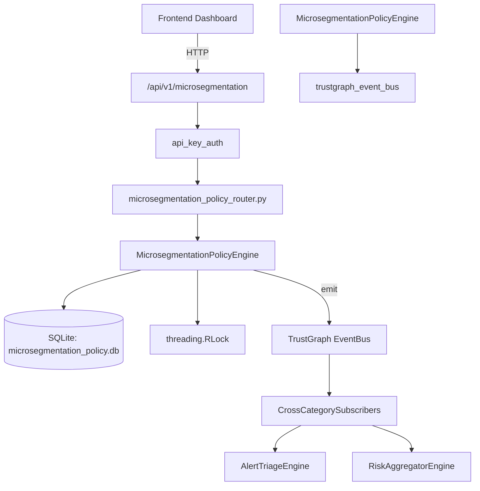

# US-0153: Microsegmentation Policy

## Sub-Epic: Network
**Master Goal**: ALDECI — $35/mo enterprise security intelligence platform replacing $50K-500K/yr tools

## User Story
As a **James Wilson (Security Engineer)**, I need to enforce microsegmentation policies
so that the platform delivers enterprise-grade network capabilities at 1/1000th the cost of legacy tools.

## Why This Matters
Microsegmentation Policy replaces functionality found in enterprise tools like CrowdStrike, Wiz, Snyk, and Rapid7.
By building this into ALDECI's $35/mo stack, customers save $50K+/yr on standalone Network tooling.

## Architecture

## Current State: 95% Complete
- ✅ `create_segment()` — Create a microsegment. (line 129)
- ✅ `list_segments()` — List segments with optional filters. (line 175)
- ✅ `get_segment()` — Get a single segment by ID. (line 196)
- ✅ `create_policy()` — Create a microsegmentation policy between two segments. (line 210)
- ✅ `list_policies()` — List policies with optional filters. (line 261)
- ✅ `record_violation()` — Record a microsegmentation policy violation. (line 290)
- ❌ TrustGraph event emission — not yet verified

## Key Functions (from `suite-core/core/microsegmentation_policy_engine.py` — 397 lines)
- `MicrosegmentationPolicyEngine.create_segment()` — Create a microsegment. (line 129)
- `MicrosegmentationPolicyEngine.list_segments()` — List segments with optional filters. (line 175)
- `MicrosegmentationPolicyEngine.get_segment()` — Get a single segment by ID. (line 196)
- `MicrosegmentationPolicyEngine.create_policy()` — Create a microsegmentation policy between two segments. (line 210)
- `MicrosegmentationPolicyEngine.list_policies()` — List policies with optional filters. (line 261)
- `MicrosegmentationPolicyEngine.record_violation()` — Record a microsegmentation policy violation. (line 290)
- `MicrosegmentationPolicyEngine.list_violations()` — List violations with optional filters. (line 331)
- `MicrosegmentationPolicyEngine.get_segmentation_stats()` — Return aggregated microsegmentation statistics for the org. (line 356)

## Dependencies
- **Depends on**: trustgraph_event_bus
- **Depended by**: Routers, TrustGraph EventBus, CrossCategorySubscribers
- **TrustGraph**: Event emission wired via ResponseInterceptorMiddleware
- **Source file**: `suite-core/core/microsegmentation_policy_engine.py` (397 lines)
- **Router file**: `suite-api/apps/api/microsegmentation_policy_router.py`

## API Endpoints
| Method | Path | Description |
|--------|------|-------------|
| POST | `/api/v1/microsegmentation/segments` | create segment |
| GET | `/api/v1/microsegmentation/segments` | list segments |
| GET | `/api/v1/microsegmentation/segments/{segment_id}` | get segment |
| POST | `/api/v1/microsegmentation/policies` | create policy |
| GET | `/api/v1/microsegmentation/policies` | list policies |
| POST | `/api/v1/microsegmentation/violations` | record violation |
| GET | `/api/v1/microsegmentation/violations` | list violations |
| GET | `/api/v1/microsegmentation/stats` | get segmentation stats |

## Tasks Remaining
1. Verify TrustGraph event emission works end-to-end (2h)
2. Add integration test with real persona workflow (2h)
3. Wire CrossCategorySubscriber consumer chain (1h)
4. Validate with 30-persona walkthrough (1h)
5. Optimize query performance for large datasets (2h)
6. Expand test coverage to edge cases (2h)

## Definition of Done
- [ ] James Wilson (Security Engineer) can access /api/v1/microsegmentation and get meaningful data
- [ ] All CRUD operations return correct HTTP status codes
- [ ] TrustGraph receives events from this engine
- [ ] 36+ tests passing in `tests/test_microsegmentation_policy_engine.py`
- [ ] 30-persona walkthrough includes this endpoint at 100%
- [ ] No hardcoded org_id — all queries are org-scoped

## Sprint: Wave 47 (est. April 23-25, 2026)

## Test Coverage
- **Test file**: `tests/test_microsegmentation_policy_engine.py`
- **Tests**: 36 tests
- **Status**: Passing
