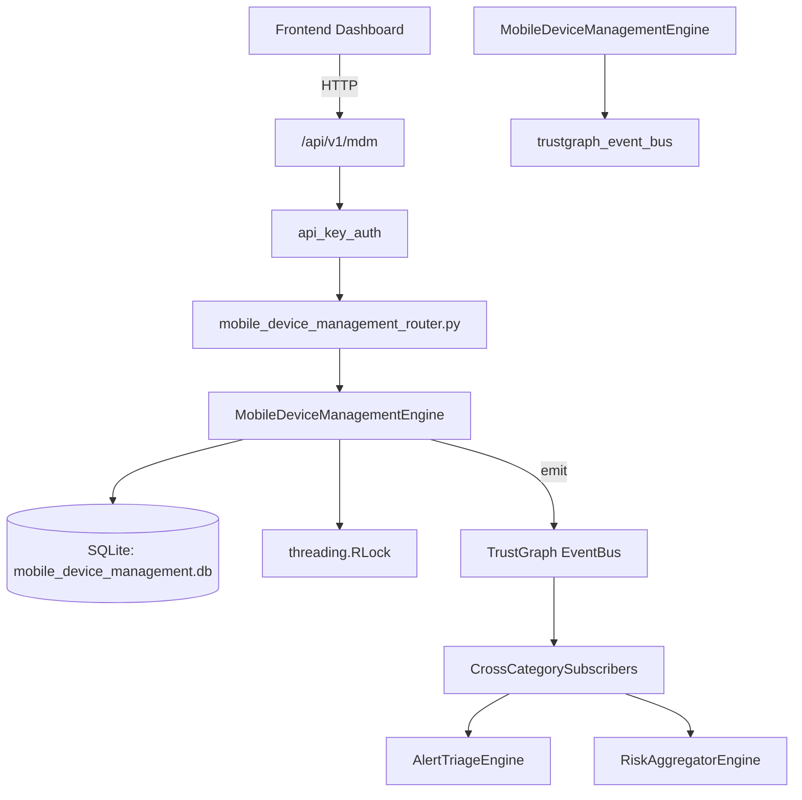

# US-0156: Mobile Device Management

## Sub-Epic: Advanced
**Master Goal**: ALDECI — $35/mo enterprise security intelligence platform replacing $50K-500K/yr tools

## User Story
As a **James Wilson (Security Engineer)**, I need to secure mobile applications
so that the platform delivers enterprise-grade advanced capabilities at 1/1000th the cost of legacy tools.

## Why This Matters
Mobile Device Management replaces functionality found in enterprise tools like CrowdStrike, Wiz, Snyk, and Rapid7.
By building this into ALDECI's $35/mo stack, customers save $50K+/yr on standalone Advanced tooling.

## Architecture

## Current State: 95% Complete
- ✅ `enroll_device()` — Enroll a new device. (line 113)
- ✅ `list_devices()` — List devices for an org with optional platform/status filters. (line 170)
- ✅ `get_device()` — Return a single device by ID, scoped to org. (line 190)
- ✅ `update_compliance()` — Update compliance score and derive new status. (line 201)
- ✅ `wipe_device()` — Initiate a remote wipe — sets status=wiped. (line 238)
- ✅ `get_compliance_summary()` — Return compliance summary: total, by_platform, by_status, avg_score. (line 267)
- ❌ TrustGraph event emission — not yet verified

## Key Functions (from `suite-core/core/mobile_device_management_engine.py` — 298 lines)
- `MobileDeviceManagementEngine.enroll_device()` — Enroll a new device. (line 113)
- `MobileDeviceManagementEngine.list_devices()` — List devices for an org with optional platform/status filters. (line 170)
- `MobileDeviceManagementEngine.get_device()` — Return a single device by ID, scoped to org. (line 190)
- `MobileDeviceManagementEngine.update_compliance()` — Update compliance score and derive new status. (line 201)
- `MobileDeviceManagementEngine.wipe_device()` — Initiate a remote wipe — sets status=wiped. (line 238)
- `MobileDeviceManagementEngine.get_compliance_summary()` — Return compliance summary: total, by_platform, by_status, avg_score. (line 267)

## Dependencies
- **Depends on**: trustgraph_event_bus
- **Depended by**: Routers, TrustGraph EventBus, CrossCategorySubscribers
- **TrustGraph**: Event emission wired via ResponseInterceptorMiddleware
- **Source file**: `suite-core/core/mobile_device_management_engine.py` (298 lines)
- **Router file**: `suite-api/apps/api/mobile_device_management_router.py`

## API Endpoints
| Method | Path | Description |
|--------|------|-------------|
| POST | `/api/v1/mdm/devices` | enroll device |
| GET | `/api/v1/mdm/devices` | list devices |
| GET | `/api/v1/mdm/devices/{device_id}` | get device |
| PUT | `/api/v1/mdm/devices/{device_id}/compliance` | update compliance |
| POST | `/api/v1/mdm/devices/{device_id}/wipe` | wipe device |
| GET | `/api/v1/mdm/summary` | get compliance summary |

## Tasks Remaining
1. Verify TrustGraph event emission works end-to-end (2h)
2. Add integration test with real persona workflow (2h)
3. Wire CrossCategorySubscriber consumer chain (1h)
4. Validate with 30-persona walkthrough (1h)
5. Optimize query performance for large datasets (2h)
6. Expand test coverage to edge cases (2h)

## Definition of Done
- [ ] James Wilson (Security Engineer) can access /api/v1/mdm and get meaningful data
- [ ] All CRUD operations return correct HTTP status codes
- [ ] TrustGraph receives events from this engine
- [ ] 35+ tests passing in `tests/test_mobile_device_management_engine.py`
- [ ] 30-persona walkthrough includes this endpoint at 100%
- [ ] No hardcoded org_id — all queries are org-scoped

## Sprint: Wave 47 (est. April 23-25, 2026)

## Test Coverage
- **Test file**: `tests/test_mobile_device_management_engine.py`
- **Tests**: 35 tests
- **Status**: Passing
