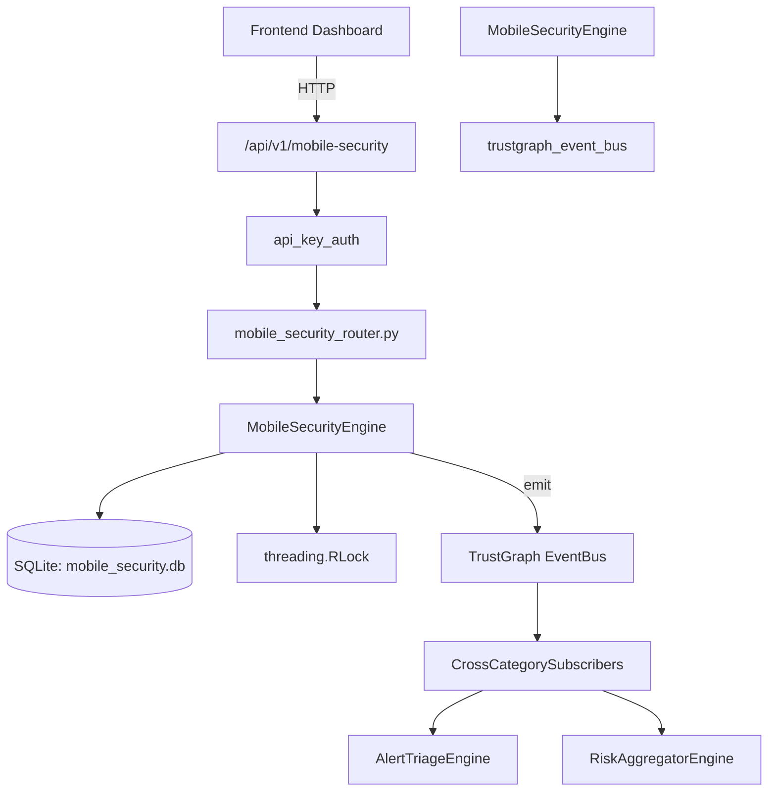

# US-0157: Mobile Security

## Sub-Epic: Advanced
**Master Goal**: ALDECI — $35/mo enterprise security intelligence platform replacing $50K-500K/yr tools

## User Story
As a **James Wilson (Security Engineer)**, I need to secure mobile applications
so that the platform delivers enterprise-grade advanced capabilities at 1/1000th the cost of legacy tools.

## Why This Matters
Mobile Security replaces functionality found in enterprise tools like CrowdStrike, Wiz, Snyk, and Rapid7.
By building this into ALDECI's $35/mo stack, customers save $50K+/yr on standalone Advanced tooling.

## Architecture

## Current State: 95% Complete
- ✅ `register_device()` — Register a mobile device. Returns the created device dict. (line 145)
- ✅ `list_devices()` — List devices for an org, optionally filtered by platform and/or compliance_statu (line 213)
- ✅ `update_device_compliance()` — Update compliance-related fields on a device. Returns True if updated. (line 238)
- ✅ `create_threat()` — Record a mobile threat. Returns the created threat dict. (line 269)
- ✅ `list_threats()` — List threats for an org, optionally filtered by severity. (line 316)
- ✅ `create_mdm_policy()` — Create an MDM policy. Returns the created policy dict. (line 338)
- ❌ TrustGraph event emission — not yet verified

## Key Functions (from `suite-core/core/mobile_security_engine.py` — 444 lines)
- `MobileSecurityEngine.register_device()` — Register a mobile device. Returns the created device dict. (line 145)
- `MobileSecurityEngine.list_devices()` — List devices for an org, optionally filtered by platform and/or compliance_statu (line 213)
- `MobileSecurityEngine.update_device_compliance()` — Update compliance-related fields on a device. Returns True if updated. (line 238)
- `MobileSecurityEngine.create_threat()` — Record a mobile threat. Returns the created threat dict. (line 269)
- `MobileSecurityEngine.list_threats()` — List threats for an org, optionally filtered by severity. (line 316)
- `MobileSecurityEngine.create_mdm_policy()` — Create an MDM policy. Returns the created policy dict. (line 338)
- `MobileSecurityEngine.list_mdm_policies()` — Return all MDM policies for the given org. (line 379)
- `MobileSecurityEngine.get_mobile_stats()` — Return summary statistics for the org's mobile device posture. (line 392)

## Dependencies
- **Depends on**: trustgraph_event_bus
- **Depended by**: Routers, TrustGraph EventBus, CrossCategorySubscribers
- **TrustGraph**: Event emission wired via ResponseInterceptorMiddleware
- **Source file**: `suite-core/core/mobile_security_engine.py` (444 lines)
- **Router file**: `suite-api/apps/api/mobile_security_router.py`

## API Endpoints
| Method | Path | Description |
|--------|------|-------------|
| GET | `/api/v1/mobile-security/devices` | list devices |
| POST | `/api/v1/mobile-security/devices` | register device |
| PATCH | `/api/v1/mobile-security/devices/{device_id}/compliance` | update device compliance |
| GET | `/api/v1/mobile-security/threats` | list threats |
| POST | `/api/v1/mobile-security/threats` | create threat |
| GET | `/api/v1/mobile-security/policies` | list mdm policies |
| POST | `/api/v1/mobile-security/policies` | create mdm policy |
| GET | `/api/v1/mobile-security/stats` | get stats |

## Tasks Remaining
1. Verify TrustGraph event emission works end-to-end (2h)
2. Add integration test with real persona workflow (2h)
3. Wire CrossCategorySubscriber consumer chain (1h)
4. Validate with 30-persona walkthrough (1h)
5. Optimize query performance for large datasets (2h)
6. Expand test coverage to edge cases (2h)

## Definition of Done
- [ ] James Wilson (Security Engineer) can access /api/v1/mobile-security and get meaningful data
- [ ] All CRUD operations return correct HTTP status codes
- [ ] TrustGraph receives events from this engine
- [ ] 29+ tests passing in `tests/test_mobile_security_engine.py`
- [ ] 30-persona walkthrough includes this endpoint at 100%
- [ ] No hardcoded org_id — all queries are org-scoped

## Sprint: Wave 47 (est. April 23-25, 2026)

## Test Coverage
- **Test file**: `tests/test_mobile_security_engine.py`
- **Tests**: 29 tests
- **Status**: Passing
