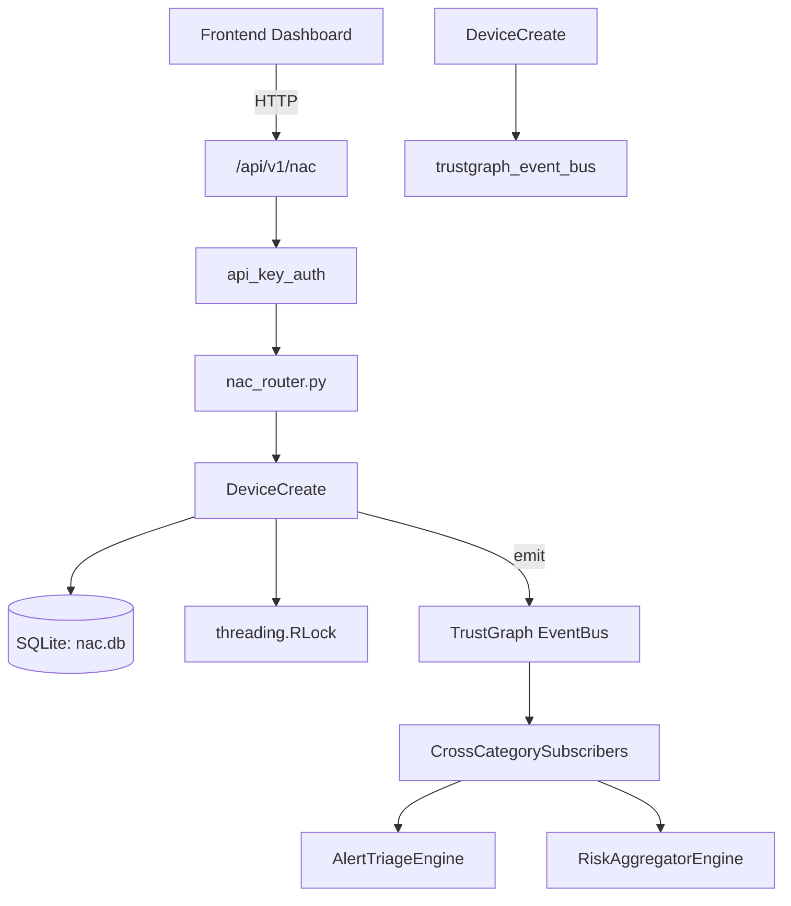

# US-0158: Nac

## Sub-Epic: Network
**Master Goal**: ALDECI — $35/mo enterprise security intelligence platform replacing $50K-500K/yr tools

## User Story
As a **James Wilson (Security Engineer)**, I need to enforce network access control
so that the platform delivers enterprise-grade network capabilities at 1/1000th the cost of legacy tools.

## Why This Matters
Nac replaces functionality found in enterprise tools like CrowdStrike, Wiz, Snyk, and Rapid7.
By building this into ALDECI's $35/mo stack, customers save $50K+/yr on standalone Network tooling.

## Architecture

## Current State: 95% Complete
- ✅ `register_device()` — Register a new device under org_id. Returns the device record. (line 177)
- ✅ `list_devices()` — List devices for org, optionally filtered by device_type or status. (line 204)
- ✅ `get_device()` — Fetch a single device, scoped to org_id. (line 224)
- ✅ `run_posture_check()` — Evaluate device posture. Returns {device_id, passed, score, checks, recommended_ (line 246)
- ✅ `update_device_status()` — Update device status and write history record. (line 344)
- ✅ `create_policy()` — Create a NAC policy for org_id. (line 381)
- ❌ TrustGraph event emission — not yet verified

## Key Functions (from `suite-core/core/nac_engine.py` — 592 lines)
- `NACEngine.register_device()` — Register a new device under org_id. Returns the device record. (line 177)
- `NACEngine.list_devices()` — List devices for org, optionally filtered by device_type or status. (line 204)
- `NACEngine.get_device()` — Fetch a single device, scoped to org_id. (line 224)
- `NACEngine.run_posture_check()` — Evaluate device posture. Returns {device_id, passed, score, checks, recommended_ (line 246)
- `NACEngine.update_device_status()` — Update device status and write history record. (line 344)
- `NACEngine.create_policy()` — Create a NAC policy for org_id. (line 381)
- `NACEngine.list_policies()` — List all NAC policies for org_id. (line 402)
- `NACEngine.apply_policy()` — Evaluate device against policy. Returns {device_id, policy_id, decision, vlan, r (line 432)

## Dependencies
- **Depends on**: trustgraph_event_bus
- **Depended by**: Routers, TrustGraph EventBus, CrossCategorySubscribers
- **TrustGraph**: Event emission wired via ResponseInterceptorMiddleware
- **Source file**: `suite-core/core/nac_engine.py` (592 lines)
- **Router file**: `suite-api/apps/api/nac_router.py`

## API Endpoints
| Method | Path | Description |
|--------|------|-------------|
| GET | `/api/v1/nac/devices` | list devices |
| POST | `/api/v1/nac/devices` | register device |
| GET | `/api/v1/nac/devices/{device_id}` | get device |
| POST | `/api/v1/nac/devices/{device_id}/posture-check` | run posture check |
| PUT | `/api/v1/nac/devices/{device_id}/status` | update device status |
| POST | `/api/v1/nac/devices/{device_id}/apply-policy` | apply policy |
| GET | `/api/v1/nac/policies` | list policies |
| POST | `/api/v1/nac/policies` | create policy |
| GET | `/api/v1/nac/events` | list access events |
| POST | `/api/v1/nac/events` | record access event |
| GET | `/api/v1/nac/stats` | get nac stats |

## Tasks Remaining
1. Verify TrustGraph event emission works end-to-end (2h)
2. Add integration test with real persona workflow (2h)
3. Wire CrossCategorySubscriber consumer chain (1h)
4. Validate with 30-persona walkthrough (1h)
5. Optimize query performance for large datasets (2h)
6. Expand test coverage to edge cases (2h)

## Definition of Done
- [ ] James Wilson (Security Engineer) can access /api/v1/nac and get meaningful data
- [ ] All CRUD operations return correct HTTP status codes
- [ ] TrustGraph receives events from this engine
- [ ] 47+ tests passing in `tests/test_nac_engine.py`
- [ ] 30-persona walkthrough includes this endpoint at 100%
- [ ] No hardcoded org_id — all queries are org-scoped

## Sprint: Wave 47 (est. April 23-25, 2026)

## Test Coverage
- **Test file**: `tests/test_nac_engine.py`
- **Tests**: 47 tests
- **Status**: Passing
