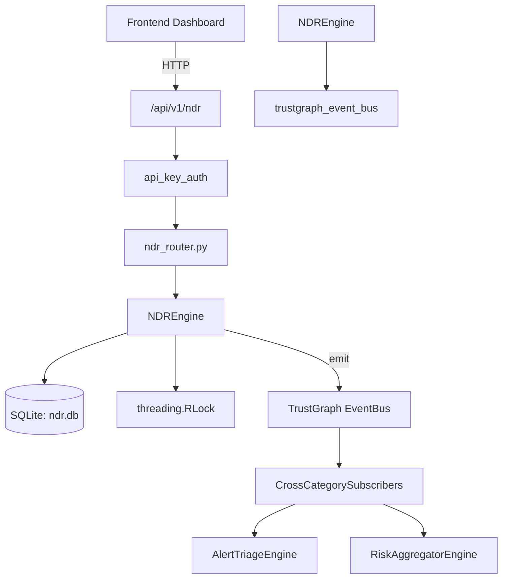

# US-0159: Ndr

## Sub-Epic: SOC
**Master Goal**: ALDECI — $35/mo enterprise security intelligence platform replacing $50K-500K/yr tools

## User Story
As a **Alex Rivera (SOC T1 Analyst)**, I need to detect network-based threats
so that the platform delivers enterprise-grade soc capabilities at 1/1000th the cost of legacy tools.

## Why This Matters
Ndr replaces functionality found in enterprise tools like CrowdStrike, Wiz, Snyk, and Rapid7.
By building this into ALDECI's $35/mo stack, customers save $50K+/yr on standalone SOC tooling.

## Architecture

## Current State: 95% Complete
- ✅ `ingest_flow()` — Ingest a network flow, score it, and auto-alert if risky. (line 236)
- ✅ `list_flows()` — List flows for an org with optional filters. (line 290)
- ✅ `list_alerts()` — implemented (line 317)
- ✅ `update_alert_status()` — implemented (line 341)
- ✅ `set_baseline()` — Upsert a baseline for an asset IP. (line 356)
- ✅ `get_baseline()` — implemented (line 416)
- ❌ TrustGraph event emission — not yet verified

## Key Functions (from `suite-core/core/ndr_engine.py` — 614 lines)
- `NDREngine.ingest_flow()` — Ingest a network flow, score it, and auto-alert if risky. (line 236)
- `NDREngine.list_flows()` — List flows for an org with optional filters. (line 290)
- `NDREngine.list_alerts()` — Handle list alerts (line 317)
- `NDREngine.update_alert_status()` — Handle update alert status (line 341)
- `NDREngine.set_baseline()` — Upsert a baseline for an asset IP. (line 356)
- `NDREngine.get_baseline()` — Handle get baseline (line 416)
- `NDREngine.add_segment()` — Handle add segment (line 433)
- `NDREngine.list_segments()` — Handle list segments (line 465)

## Dependencies
- **Depends on**: trustgraph_event_bus
- **Depended by**: Routers, TrustGraph EventBus, CrossCategorySubscribers
- **TrustGraph**: Event emission wired via ResponseInterceptorMiddleware
- **Source file**: `suite-core/core/ndr_engine.py` (614 lines)
- **Router file**: `suite-api/apps/api/ndr_router.py`

## API Endpoints
| Method | Path | Description |
|--------|------|-------------|
| POST | `/api/v1/ndr/flows` | ingest flow |
| GET | `/api/v1/ndr/flows` | list flows |
| GET | `/api/v1/ndr/alerts` | list alerts |
| PATCH | `/api/v1/ndr/alerts/{alert_id}/status` | update alert status |
| PUT | `/api/v1/ndr/baselines/{asset_ip}` | set baseline |
| GET | `/api/v1/ndr/baselines/{asset_ip}` | get baseline |
| POST | `/api/v1/ndr/segments` | add segment |
| GET | `/api/v1/ndr/segments` | list segments |
| POST | `/api/v1/ndr/anomalies/detect` | detect anomalies |
| GET | `/api/v1/ndr/stats` | get ndr stats |

## Tasks Remaining
1. Verify TrustGraph event emission works end-to-end (2h)
2. Add integration test with real persona workflow (2h)
3. Wire CrossCategorySubscriber consumer chain (1h)
4. Validate with 30-persona walkthrough (1h)
5. Optimize query performance for large datasets (2h)
6. Expand test coverage to edge cases (2h)

## Definition of Done
- [ ] Alex Rivera (SOC T1 Analyst) can access /api/v1/ndr and get meaningful data
- [ ] All CRUD operations return correct HTTP status codes
- [ ] TrustGraph receives events from this engine
- [ ] 30+ tests passing in `tests/test_ndr_engine.py`
- [ ] 30-persona walkthrough includes this endpoint at 100%
- [ ] No hardcoded org_id — all queries are org-scoped

## Sprint: Wave 47 (est. April 23-25, 2026)

## Test Coverage
- **Test file**: `tests/test_ndr_engine.py`
- **Tests**: 30 tests
- **Status**: Passing
