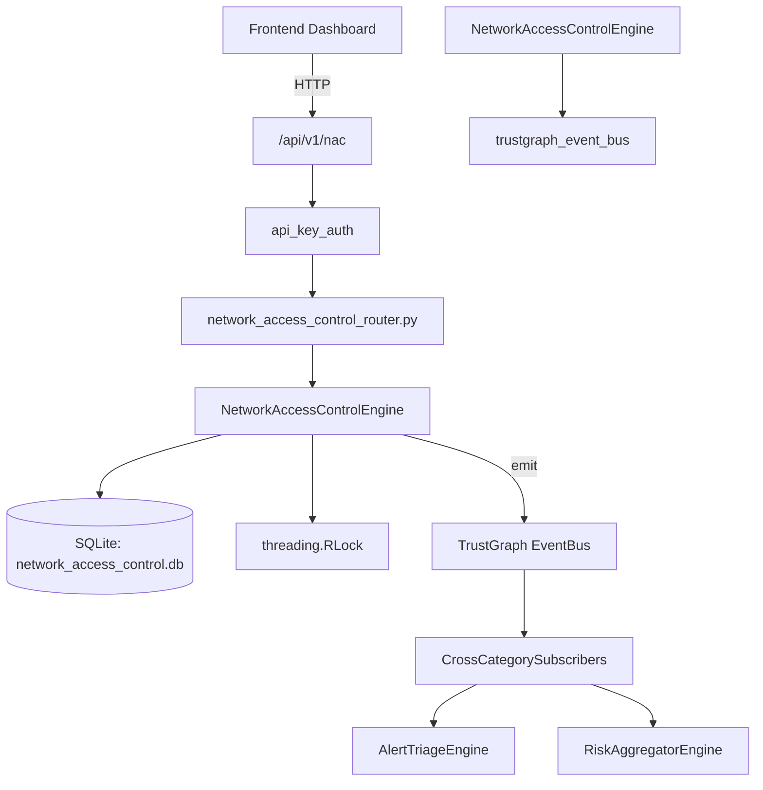

# US-0160: Network Access Control

## Sub-Epic: Network
**Master Goal**: ALDECI — $35/mo enterprise security intelligence platform replacing $50K-500K/yr tools

## User Story
As a **James Wilson (Security Engineer)**, I need to monitor and secure network traffic
so that the platform delivers enterprise-grade network capabilities at 1/1000th the cost of legacy tools.

## Why This Matters
Network Access Control replaces functionality found in enterprise tools like CrowdStrike, Wiz, Snyk, and Rapid7.
By building this into ALDECI's $35/mo stack, customers save $50K+/yr on standalone Network tooling.

## Architecture

## Current State: 95% Complete
- ✅ `register_endpoint()` — Register a new network endpoint. Returns the endpoint record. (line 112)
- ✅ `list_endpoints()` — List endpoints for org, optionally filtered by device_type or nac_status. (line 152)
- ✅ `get_endpoint()` — Fetch a single endpoint scoped to org_id. (line 172)
- ✅ `assess_posture()` — Assess endpoint posture from 5 boolean checks. (line 187)
- ✅ `update_nac_status()` — Manually update NAC status for an endpoint. (line 236)
- ✅ `create_nac_policy()` — Create a NAC policy. Returns the policy record. (line 266)
- ❌ TrustGraph event emission — not yet verified

## Key Functions (from `suite-core/core/network_access_control_engine.py` — 363 lines)
- `NetworkAccessControlEngine.register_endpoint()` — Register a new network endpoint. Returns the endpoint record. (line 112)
- `NetworkAccessControlEngine.list_endpoints()` — List endpoints for org, optionally filtered by device_type or nac_status. (line 152)
- `NetworkAccessControlEngine.get_endpoint()` — Fetch a single endpoint scoped to org_id. (line 172)
- `NetworkAccessControlEngine.assess_posture()` — Assess endpoint posture from 5 boolean checks. (line 187)
- `NetworkAccessControlEngine.update_nac_status()` — Manually update NAC status for an endpoint. (line 236)
- `NetworkAccessControlEngine.create_nac_policy()` — Create a NAC policy. Returns the policy record. (line 266)
- `NetworkAccessControlEngine.list_nac_policies()` — List all NAC policies for org_id. (line 296)
- `NetworkAccessControlEngine.get_nac_stats()` — Return NAC overview stats for org_id. (line 319)

## Dependencies
- **Depends on**: trustgraph_event_bus
- **Depended by**: Routers, TrustGraph EventBus, CrossCategorySubscribers
- **TrustGraph**: Event emission wired via ResponseInterceptorMiddleware
- **Source file**: `suite-core/core/network_access_control_engine.py` (363 lines)
- **Router file**: `suite-api/apps/api/network_access_control_router.py`

## API Endpoints
| Method | Path | Description |
|--------|------|-------------|
| POST | `/api/v1/nac/endpoints` | register endpoint |
| GET | `/api/v1/nac/endpoints` | list endpoints |
| GET | `/api/v1/nac/endpoints/{endpoint_id}` | get endpoint |
| POST | `/api/v1/nac/endpoints/{endpoint_id}/assess-posture` | assess posture |
| PUT | `/api/v1/nac/endpoints/{endpoint_id}/nac-status` | update nac status |
| POST | `/api/v1/nac/policies` | create nac policy |
| GET | `/api/v1/nac/policies` | list nac policies |
| GET | `/api/v1/nac/stats` | get nac stats |

## Tasks Remaining
1. Verify TrustGraph event emission works end-to-end (2h)
2. Add integration test with real persona workflow (2h)
3. Wire CrossCategorySubscriber consumer chain (1h)
4. Validate with 30-persona walkthrough (1h)
5. Optimize query performance for large datasets (2h)
6. Expand test coverage to edge cases (2h)

## Definition of Done
- [ ] James Wilson (Security Engineer) can access /api/v1/nac and get meaningful data
- [ ] All CRUD operations return correct HTTP status codes
- [ ] TrustGraph receives events from this engine
- [ ] 52+ tests passing in `tests/test_network_access_control_engine.py`
- [ ] 30-persona walkthrough includes this endpoint at 100%
- [ ] No hardcoded org_id — all queries are org-scoped

## Sprint: Wave 47 (est. April 23-25, 2026)

## Test Coverage
- **Test file**: `tests/test_network_access_control_engine.py`
- **Tests**: 52 tests
- **Status**: Passing
