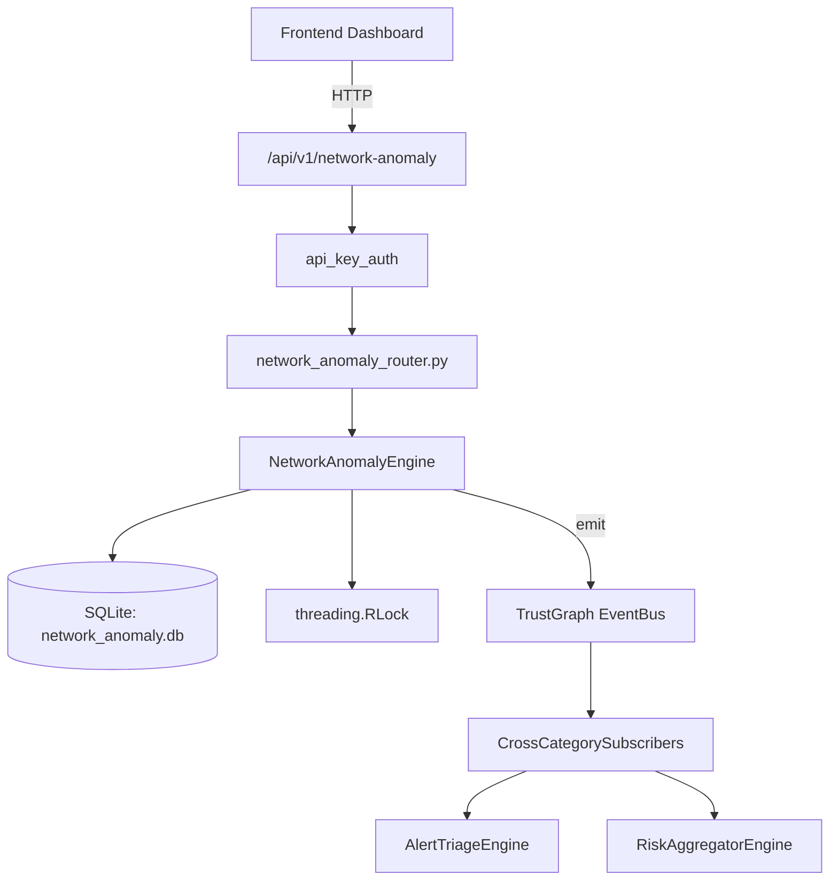

# US-0161: Network Anomaly

## Sub-Epic: Network
**Master Goal**: ALDECI — $35/mo enterprise security intelligence platform replacing $50K-500K/yr tools

## User Story
As a **James Wilson (Security Engineer)**, I need to monitor and secure network traffic
so that the platform delivers enterprise-grade network capabilities at 1/1000th the cost of legacy tools.

## Why This Matters
Network Anomaly replaces functionality found in enterprise tools like CrowdStrike, Wiz, Snyk, and Rapid7.
By building this into ALDECI's $35/mo stack, customers save $50K+/yr on standalone Network tooling.

## Architecture

## Current State: 95% Complete
- ✅ `record_sample()` — Record a traffic sample. (line 149)
- ✅ `update_baseline()` — Recompute baseline from last 100 samples for this (line 188)
- ✅ `detect_anomalies()` — Compare observed traffic to baseline. Insert anomaly if deviation > 50%. (line 277)
- ✅ `resolve_anomaly()` — Resolve an anomaly: status=resolved, resolved_at=now. (line 358)
- ✅ `get_anomaly_summary()` — Return total, active, by_severity, by_segment, recent_anomalies (last 10). (line 379)
- ✅ `get_baseline_health()` — Return all baselines with sample_count, std_dev_bytes, baseline_date. (line 419)
- ❌ TrustGraph event emission — not yet verified

## Key Functions (from `suite-core/core/network_anomaly_engine.py` — 450 lines)
- `NetworkAnomalyEngine.record_sample()` — Record a traffic sample. (line 149)
- `NetworkAnomalyEngine.update_baseline()` — Recompute baseline from last 100 samples for this (line 188)
- `NetworkAnomalyEngine.detect_anomalies()` — Compare observed traffic to baseline. Insert anomaly if deviation > 50%. (line 277)
- `NetworkAnomalyEngine.resolve_anomaly()` — Resolve an anomaly: status=resolved, resolved_at=now. (line 358)
- `NetworkAnomalyEngine.get_anomaly_summary()` — Return total, active, by_severity, by_segment, recent_anomalies (last 10). (line 379)
- `NetworkAnomalyEngine.get_baseline_health()` — Return all baselines with sample_count, std_dev_bytes, baseline_date. (line 419)
- `NetworkAnomalyEngine.get_traffic_trend()` — Return samples from last N hours ordered by sampled_at. (line 429)

## Dependencies
- **Depends on**: standalone
- **Depended by**: Routers, TrustGraph EventBus, CrossCategorySubscribers
- **TrustGraph**: Event emission wired via ResponseInterceptorMiddleware
- **Source file**: `suite-core/core/network_anomaly_engine.py` (450 lines)
- **Router file**: `suite-api/apps/api/network_anomaly_router.py`

## API Endpoints
| Method | Path | Description |
|--------|------|-------------|
| POST | `/api/v1/network-anomaly/samples` | record sample |
| POST | `/api/v1/network-anomaly/baselines/update` | update baseline |
| POST | `/api/v1/network-anomaly/detect` | detect anomalies |
| PUT | `/api/v1/network-anomaly/anomalies/{anomaly_id}/resolve` | resolve anomaly |
| GET | `/api/v1/network-anomaly/summary` | get anomaly summary |
| GET | `/api/v1/network-anomaly/baselines` | get baseline health |
| GET | `/api/v1/network-anomaly/traffic-trend` | get traffic trend |

## Tasks Remaining
1. Verify TrustGraph event emission works end-to-end (2h)
2. Add integration test with real persona workflow (2h)
3. Wire CrossCategorySubscriber consumer chain (1h)
4. Validate with 30-persona walkthrough (1h)
5. Optimize query performance for large datasets (2h)
6. Expand test coverage to edge cases (2h)

## Definition of Done
- [ ] James Wilson (Security Engineer) can access /api/v1/network-anomaly and get meaningful data
- [ ] All CRUD operations return correct HTTP status codes
- [ ] TrustGraph receives events from this engine
- [ ] 39+ tests passing in `tests/test_network_anomaly_engine.py`
- [ ] 30-persona walkthrough includes this endpoint at 100%
- [ ] No hardcoded org_id — all queries are org-scoped

## Sprint: Wave 47 (est. April 23-25, 2026)

## Test Coverage
- **Test file**: `tests/test_network_anomaly_engine.py`
- **Tests**: 39 tests
- **Status**: Passing
