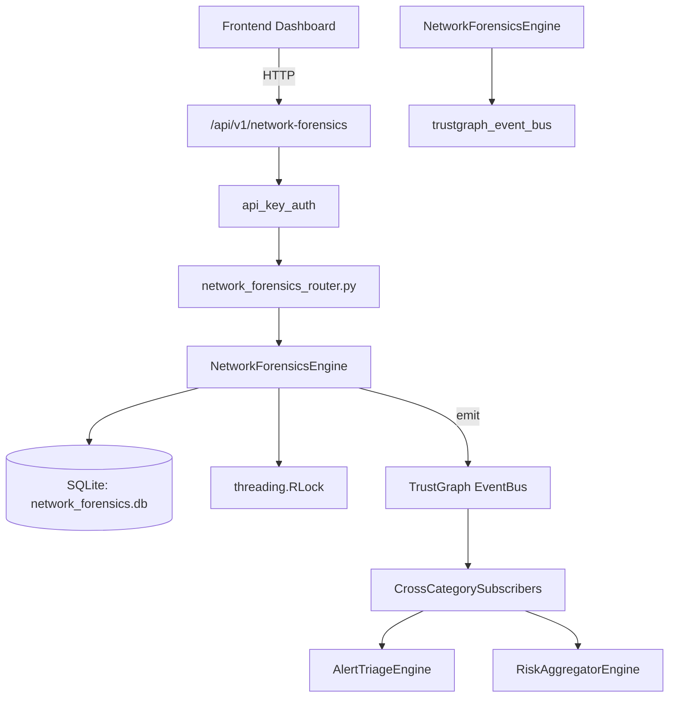

# US-0162: Network Forensics

## Sub-Epic: Network
**Master Goal**: ALDECI — $35/mo enterprise security intelligence platform replacing $50K-500K/yr tools

## User Story
As a **James Wilson (Security Engineer)**, I need to monitor and secure network traffic
so that the platform delivers enterprise-grade network capabilities at 1/1000th the cost of legacy tools.

## Why This Matters
Network Forensics replaces functionality found in enterprise tools like CrowdStrike, Wiz, Snyk, and Rapid7.
By building this into ALDECI's $35/mo stack, customers save $50K+/yr on standalone Network tooling.

## Architecture

## Current State: 95% Complete
- ✅ `create_capture()` — Create a new packet capture record. Requires 'interface' in data. (line 91)
- ✅ `list_captures()` — List captures for org. Optionally filter by status. (line 125)
- ✅ `get_capture()` — Fetch a single capture by id, scoped to org_id. (line 141)
- ✅ `update_capture_status()` — Update capture status. Returns True if updated. (line 151)
- ✅ `add_artifact()` — Add an artifact to a capture. artifact_type must be in _VALID_ARTIFACT_TYPES. (line 168)
- ✅ `analyze_capture()` — Store analysis result on the first artifact of a capture (or create a note). (line 196)
- ❌ TrustGraph event emission — not yet verified

## Key Functions (from `suite-core/core/network_forensics_engine.py` — 276 lines)
- `NetworkForensicsEngine.create_capture()` — Create a new packet capture record. Requires 'interface' in data. (line 91)
- `NetworkForensicsEngine.list_captures()` — List captures for org. Optionally filter by status. (line 125)
- `NetworkForensicsEngine.get_capture()` — Fetch a single capture by id, scoped to org_id. (line 141)
- `NetworkForensicsEngine.update_capture_status()` — Update capture status. Returns True if updated. (line 151)
- `NetworkForensicsEngine.add_artifact()` — Add an artifact to a capture. artifact_type must be in _VALID_ARTIFACT_TYPES. (line 168)
- `NetworkForensicsEngine.analyze_capture()` — Store analysis result on the first artifact of a capture (or create a note). (line 196)
- `NetworkForensicsEngine.list_artifacts()` — List all artifacts for org, optionally filtered by capture_id. (line 232)
- `NetworkForensicsEngine.get_forensics_stats()` — Return aggregate stats for org. (line 252)

## Dependencies
- **Depends on**: trustgraph_event_bus
- **Depended by**: Routers, TrustGraph EventBus, CrossCategorySubscribers
- **TrustGraph**: Event emission wired via ResponseInterceptorMiddleware
- **Source file**: `suite-core/core/network_forensics_engine.py` (276 lines)
- **Router file**: `suite-api/apps/api/network_forensics_router.py`

## API Endpoints
| Method | Path | Description |
|--------|------|-------------|
| POST | `/api/v1/network-forensics/captures` | create capture |
| GET | `/api/v1/network-forensics/captures` | list captures |
| GET | `/api/v1/network-forensics/captures/{capture_id}` | get capture |
| POST | `/api/v1/network-forensics/captures/{capture_id}/artifacts` | add artifact |
| POST | `/api/v1/network-forensics/captures/{capture_id}/analyze` | analyze capture |
| GET | `/api/v1/network-forensics/artifacts` | list artifacts |
| GET | `/api/v1/network-forensics/stats` | get stats |

## Tasks Remaining
1. Verify TrustGraph event emission works end-to-end (2h)
2. Add integration test with real persona workflow (2h)
3. Wire CrossCategorySubscriber consumer chain (1h)
4. Validate with 30-persona walkthrough (1h)
5. Optimize query performance for large datasets (2h)
6. Expand test coverage to edge cases (2h)

## Definition of Done
- [ ] James Wilson (Security Engineer) can access /api/v1/network-forensics and get meaningful data
- [ ] All CRUD operations return correct HTTP status codes
- [ ] TrustGraph receives events from this engine
- [ ] 34+ tests passing in `tests/test_network_forensics_engine.py`
- [ ] 30-persona walkthrough includes this endpoint at 100%
- [ ] No hardcoded org_id — all queries are org-scoped

## Sprint: Wave 47 (est. April 23-25, 2026)

## Test Coverage
- **Test file**: `tests/test_network_forensics_engine.py`
- **Tests**: 34 tests
- **Status**: Passing
