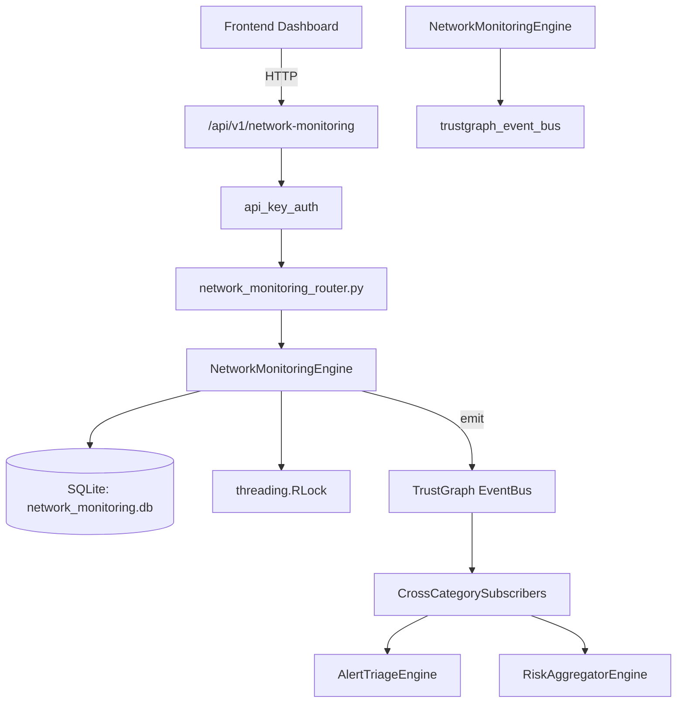

# US-0163: Network Monitoring

## Sub-Epic: Network
**Master Goal**: ALDECI — $35/mo enterprise security intelligence platform replacing $50K-500K/yr tools

## User Story
As a **James Wilson (Security Engineer)**, I need to monitor and secure network traffic
so that the platform delivers enterprise-grade network capabilities at 1/1000th the cost of legacy tools.

## Why This Matters
Network Monitoring replaces functionality found in enterprise tools like CrowdStrike, Wiz, Snyk, and Rapid7.
By building this into ALDECI's $35/mo stack, customers save $50K+/yr on standalone Network tooling.

## Architecture

## Current State: 95% Complete
- ✅ `register_interface()` — Register a new network interface for monitoring. (line 121)
- ✅ `list_interfaces()` — List interfaces for an org with optional type filter. (line 163)
- ✅ `record_traffic_sample()` — Record a traffic sample for a given interface. (line 182)
- ✅ `get_traffic_stats()` — Return avg_bps, peak_bps, and total_bytes over the last N hours. (line 219)
- ✅ `create_alert_rule()` — Create an alert rule for an interface metric threshold. (line 258)
- ✅ `list_alert_rules()` — List all alert rules for an org. (line 292)
- ❌ TrustGraph event emission — not yet verified

## Key Functions (from `suite-core/core/network_monitoring_engine.py` — 415 lines)
- `NetworkMonitoringEngine.register_interface()` — Register a new network interface for monitoring. (line 121)
- `NetworkMonitoringEngine.list_interfaces()` — List interfaces for an org with optional type filter. (line 163)
- `NetworkMonitoringEngine.record_traffic_sample()` — Record a traffic sample for a given interface. (line 182)
- `NetworkMonitoringEngine.get_traffic_stats()` — Return avg_bps, peak_bps, and total_bytes over the last N hours. (line 219)
- `NetworkMonitoringEngine.create_alert_rule()` — Create an alert rule for an interface metric threshold. (line 258)
- `NetworkMonitoringEngine.list_alert_rules()` — List all alert rules for an org. (line 292)
- `NetworkMonitoringEngine.trigger_alert()` — Trigger an alert for a rule when the observed value exceeds threshold. (line 305)
- `NetworkMonitoringEngine.list_alerts()` — List triggered alerts for an org with optional severity filter. (line 360)

## Dependencies
- **Depends on**: trustgraph_event_bus
- **Depended by**: Routers, TrustGraph EventBus, CrossCategorySubscribers
- **TrustGraph**: Event emission wired via ResponseInterceptorMiddleware
- **Source file**: `suite-core/core/network_monitoring_engine.py` (415 lines)
- **Router file**: `suite-api/apps/api/network_monitoring_router.py`

## API Endpoints
| Method | Path | Description |
|--------|------|-------------|
| POST | `/api/v1/network-monitoring/interfaces` | register interface |
| GET | `/api/v1/network-monitoring/interfaces` | list interfaces |
| POST | `/api/v1/network-monitoring/interfaces/{interface_id}/samples` | record traffic sample |
| GET | `/api/v1/network-monitoring/interfaces/{interface_id}/stats` | get traffic stats |
| POST | `/api/v1/network-monitoring/alert-rules` | create alert rule |
| GET | `/api/v1/network-monitoring/alert-rules` | list alert rules |
| POST | `/api/v1/network-monitoring/alert-rules/{rule_id}/trigger` | trigger alert |
| GET | `/api/v1/network-monitoring/alerts` | list alerts |
| GET | `/api/v1/network-monitoring/stats` | get monitoring stats |

## Tasks Remaining
1. Verify TrustGraph event emission works end-to-end (2h)
2. Add integration test with real persona workflow (2h)
3. Wire CrossCategorySubscriber consumer chain (1h)
4. Validate with 30-persona walkthrough (1h)
5. Optimize query performance for large datasets (2h)
6. Expand test coverage to edge cases (2h)

## Definition of Done
- [ ] James Wilson (Security Engineer) can access /api/v1/network-monitoring and get meaningful data
- [ ] All CRUD operations return correct HTTP status codes
- [ ] TrustGraph receives events from this engine
- [ ] 30+ tests passing in `tests/test_network_monitoring_engine.py`
- [ ] 30-persona walkthrough includes this endpoint at 100%
- [ ] No hardcoded org_id — all queries are org-scoped

## Sprint: Wave 47 (est. April 23-25, 2026)

## Test Coverage
- **Test file**: `tests/test_network_monitoring_engine.py`
- **Tests**: 30 tests
- **Status**: Passing
