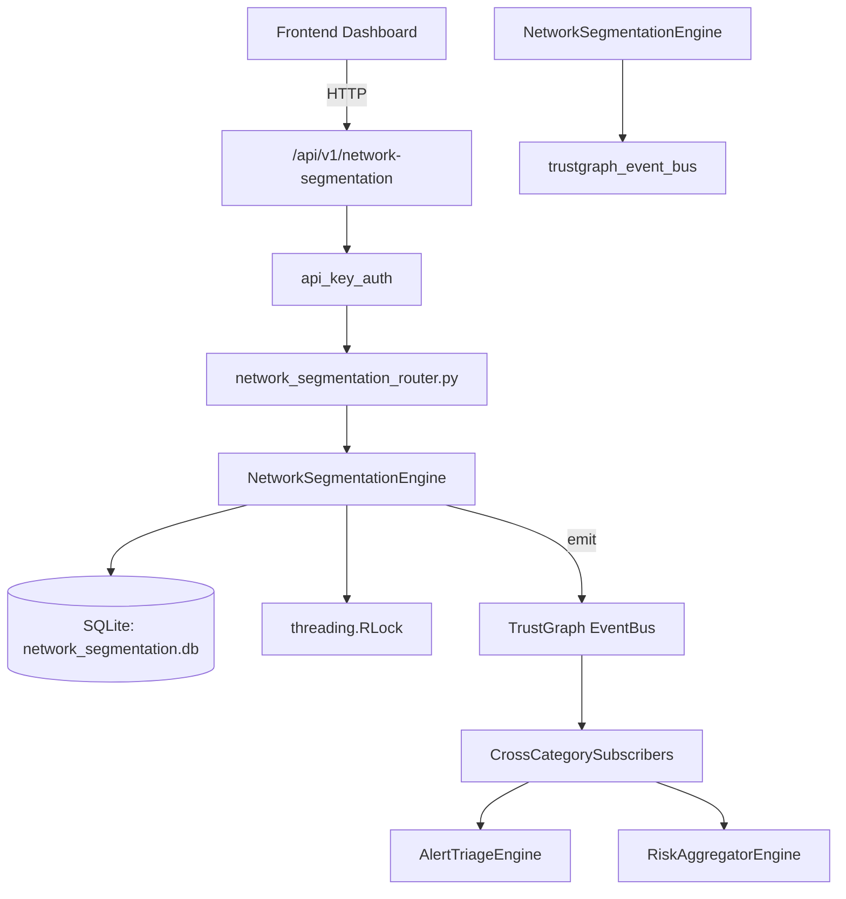

# US-0164: Network Segmentation

## Sub-Epic: Network
**Master Goal**: ALDECI — $35/mo enterprise security intelligence platform replacing $50K-500K/yr tools

## User Story
As a **James Wilson (Security Engineer)**, I need to monitor and secure network traffic
so that the platform delivers enterprise-grade network capabilities at 1/1000th the cost of legacy tools.

## Why This Matters
Network Segmentation replaces functionality found in enterprise tools like CrowdStrike, Wiz, Snyk, and Rapid7.
By building this into ALDECI's $35/mo stack, customers save $50K+/yr on standalone Network tooling.

## Architecture

## Current State: 95% Complete
- ✅ `create_segment()` — Create a network segment. (line 122)
- ✅ `list_segments()` — List segments, optionally filtered by type. (line 165)
- ✅ `add_flow_policy()` — Add a flow policy between two segments. (line 195)
- ✅ `list_flow_policies()` — List all flow policies for the org. (line 239)
- ✅ `check_flow_allowed()` — Check whether traffic from src to dst on the given port is allowed. (line 253)
- ✅ `detect_lateral_movement_risk()` — Detect segment pairs with risky allow-all between different trust levels. (line 304)
- ❌ TrustGraph event emission — not yet verified

## Key Functions (from `suite-core/core/network_segmentation_engine.py` — 466 lines)
- `NetworkSegmentationEngine.create_segment()` — Create a network segment. (line 122)
- `NetworkSegmentationEngine.list_segments()` — List segments, optionally filtered by type. (line 165)
- `NetworkSegmentationEngine.add_flow_policy()` — Add a flow policy between two segments. (line 195)
- `NetworkSegmentationEngine.list_flow_policies()` — List all flow policies for the org. (line 239)
- `NetworkSegmentationEngine.check_flow_allowed()` — Check whether traffic from src to dst on the given port is allowed. (line 253)
- `NetworkSegmentationEngine.detect_lateral_movement_risk()` — Detect segment pairs with risky allow-all between different trust levels. (line 304)
- `NetworkSegmentationEngine.get_segmentation_score()` — Compute a segmentation score (0-100) with grade and findings. (line 354)
- `NetworkSegmentationEngine.get_segmentation_stats()` — Return segmentation stats for the org. (line 441)

## Dependencies
- **Depends on**: trustgraph_event_bus
- **Depended by**: Routers, TrustGraph EventBus, CrossCategorySubscribers
- **TrustGraph**: Event emission wired via ResponseInterceptorMiddleware
- **Source file**: `suite-core/core/network_segmentation_engine.py` (466 lines)
- **Router file**: `suite-api/apps/api/network_segmentation_router.py`

## API Endpoints
| Method | Path | Description |
|--------|------|-------------|
| POST | `/api/v1/network-segmentation/segments` | create segment |
| GET | `/api/v1/network-segmentation/segments` | list segments |
| POST | `/api/v1/network-segmentation/flow-policies` | add flow policy |
| GET | `/api/v1/network-segmentation/flow-policies` | list flow policies |
| POST | `/api/v1/network-segmentation/check-flow` | check flow allowed |
| GET | `/api/v1/network-segmentation/lateral-movement-risk` | detect lateral movement risk |
| GET | `/api/v1/network-segmentation/score` | get segmentation score |
| GET | `/api/v1/network-segmentation/stats` | get segmentation stats |

## Tasks Remaining
1. Verify TrustGraph event emission works end-to-end (2h)
2. Add integration test with real persona workflow (2h)
3. Wire CrossCategorySubscriber consumer chain (1h)
4. Validate with 30-persona walkthrough (1h)
5. Optimize query performance for large datasets (2h)
6. Expand test coverage to edge cases (2h)

## Definition of Done
- [ ] James Wilson (Security Engineer) can access /api/v1/network-segmentation and get meaningful data
- [ ] All CRUD operations return correct HTTP status codes
- [ ] TrustGraph receives events from this engine
- [ ] 34+ tests passing in `tests/test_network_segmentation_engine.py`
- [ ] 30-persona walkthrough includes this endpoint at 100%
- [ ] No hardcoded org_id — all queries are org-scoped

## Sprint: Wave 47 (est. April 23-25, 2026)

## Test Coverage
- **Test file**: `tests/test_network_segmentation_engine.py`
- **Tests**: 34 tests
- **Status**: Passing
