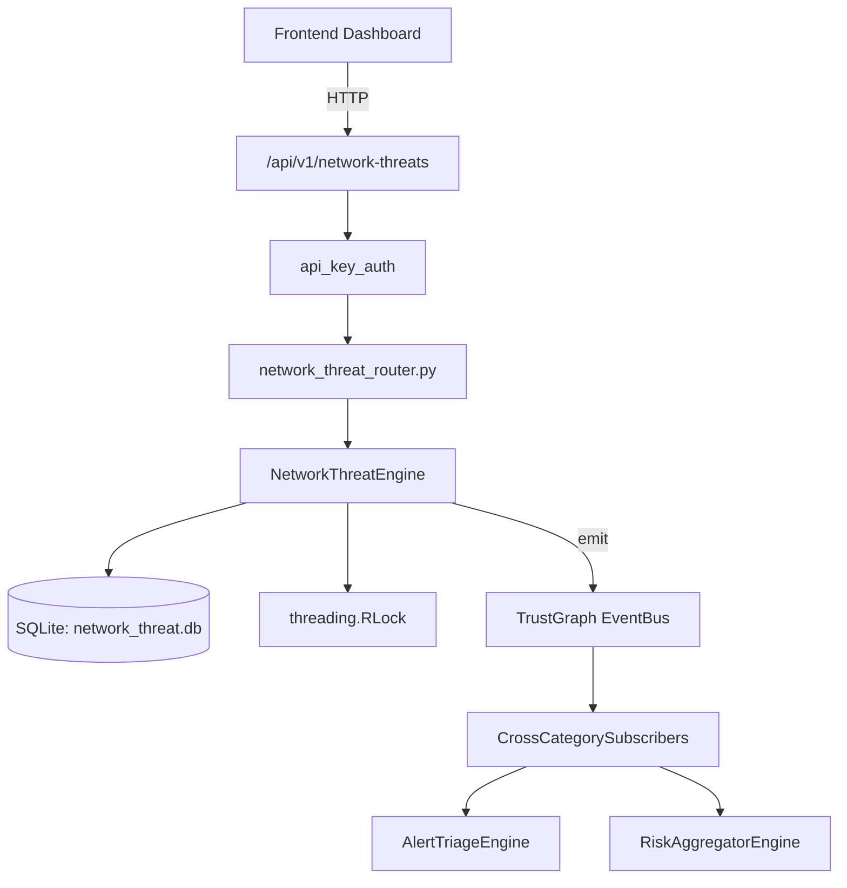

# US-0165: Network Threat

## Sub-Epic: Network
**Master Goal**: ALDECI — $35/mo enterprise security intelligence platform replacing $50K-500K/yr tools

## User Story
As a **James Wilson (Security Engineer)**, I need to monitor and secure network traffic
so that the platform delivers enterprise-grade network capabilities at 1/1000th the cost of legacy tools.

## Why This Matters
Network Threat replaces functionality found in enterprise tools like CrowdStrike, Wiz, Snyk, and Rapid7.
By building this into ALDECI's $35/mo stack, customers save $50K+/yr on standalone Network tooling.

## Architecture

## Current State: 95% Complete
- ✅ `record_threat()` — Record or update a network threat. (line 125)
- ✅ `resolve_threat()` — Resolve an active threat. (line 191)
- ✅ `get_active_threats()` — Return active threats with optional filters. (line 209)
- ✅ `get_threat_stats()` — Return aggregated threat statistics. (line 228)
- ✅ `create_rule()` — Create a new threat detection rule. (line 294)
- ✅ `trigger_rule()` — Increment match_count and update last_matched for a rule. (line 322)
- ❌ TrustGraph event emission — not yet verified

## Key Functions (from `suite-core/core/network_threat_engine.py` — 432 lines)
- `NetworkThreatEngine.record_threat()` — Record or update a network threat. (line 125)
- `NetworkThreatEngine.resolve_threat()` — Resolve an active threat. (line 191)
- `NetworkThreatEngine.get_active_threats()` — Return active threats with optional filters. (line 209)
- `NetworkThreatEngine.get_threat_stats()` — Return aggregated threat statistics. (line 228)
- `NetworkThreatEngine.create_rule()` — Create a new threat detection rule. (line 294)
- `NetworkThreatEngine.trigger_rule()` — Increment match_count and update last_matched for a rule. (line 322)
- `NetworkThreatEngine.list_rules()` — List rules with optional enabled filter. (line 346)
- `NetworkThreatEngine.update_baseline()` — Upsert a network baseline metric and compute anomaly flag. (line 363)

## Dependencies
- **Depends on**: standalone
- **Depended by**: Routers, TrustGraph EventBus, CrossCategorySubscribers
- **TrustGraph**: Event emission wired via ResponseInterceptorMiddleware
- **Source file**: `suite-core/core/network_threat_engine.py` (432 lines)
- **Router file**: `suite-api/apps/api/network_threat_router.py`

## API Endpoints
| Method | Path | Description |
|--------|------|-------------|
| POST | `/api/v1/network-threats/threats` | record threat |
| POST | `/api/v1/network-threats/threats/{threat_id}/resolve` | resolve threat |
| GET | `/api/v1/network-threats/threats/active` | get active threats |
| POST | `/api/v1/network-threats/rules` | create rule |
| POST | `/api/v1/network-threats/rules/{rule_id}/trigger` | trigger rule |
| GET | `/api/v1/network-threats/rules` | list rules |
| PUT | `/api/v1/network-threats/baselines` | update baseline |
| GET | `/api/v1/network-threats/baselines/anomalous` | get anomalous baselines |
| GET | `/api/v1/network-threats/stats` | get threat stats |

## Tasks Remaining
1. Verify TrustGraph event emission works end-to-end (2h)
2. Add integration test with real persona workflow (2h)
3. Wire CrossCategorySubscriber consumer chain (1h)
4. Validate with 30-persona walkthrough (1h)
5. Optimize query performance for large datasets (2h)
6. Expand test coverage to edge cases (2h)

## Definition of Done
- [ ] James Wilson (Security Engineer) can access /api/v1/network-threats and get meaningful data
- [ ] All CRUD operations return correct HTTP status codes
- [ ] TrustGraph receives events from this engine
- [ ] 35+ tests passing in `tests/test_network_threat_engine.py`
- [ ] 30-persona walkthrough includes this endpoint at 100%
- [ ] No hardcoded org_id — all queries are org-scoped

## Sprint: Wave 47 (est. April 23-25, 2026)

## Test Coverage
- **Test file**: `tests/test_network_threat_engine.py`
- **Tests**: 35 tests
- **Status**: Passing
