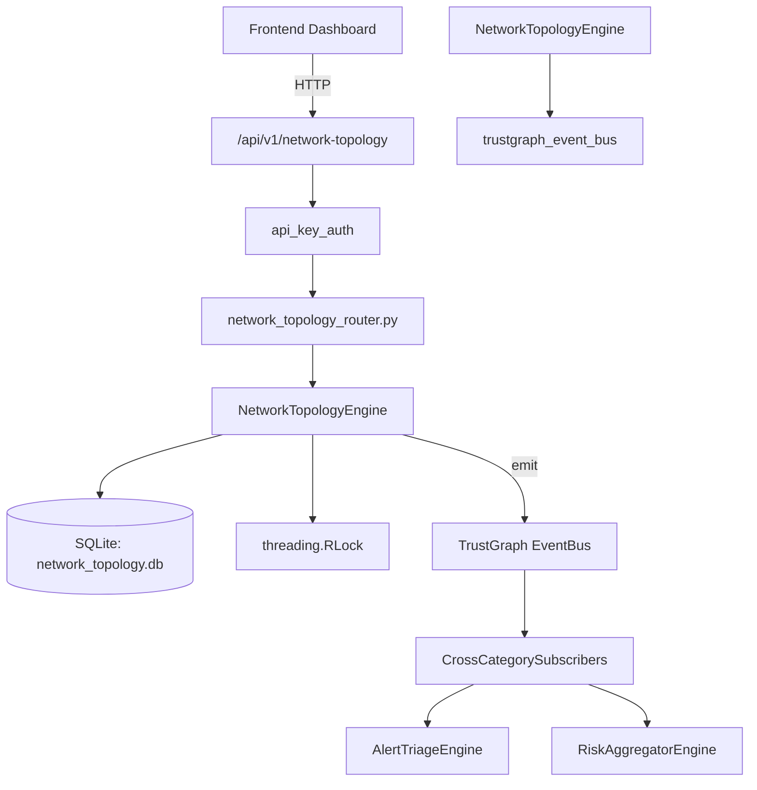

# US-0166: Network Topology

## Sub-Epic: Network
**Master Goal**: ALDECI — $35/mo enterprise security intelligence platform replacing $50K-500K/yr tools

## User Story
As a **James Wilson (Security Engineer)**, I need to monitor and secure network traffic
so that the platform delivers enterprise-grade network capabilities at 1/1000th the cost of legacy tools.

## Why This Matters
Network Topology replaces functionality found in enterprise tools like CrowdStrike, Wiz, Snyk, and Rapid7.
By building this into ALDECI's $35/mo stack, customers save $50K+/yr on standalone Network tooling.

## Architecture

## Current State: 95% Complete
- ✅ `add_node()` — Add a network node. Returns the created node dict. (line 145)
- ✅ `list_nodes()` — List nodes for an org, optionally filtered by type or criticality. (line 201)
- ✅ `add_edge()` — Add a network edge between two nodes. Returns the created edge dict. (line 228)
- ✅ `list_edges()` — List edges for an org, optionally filtered to those touching node_id. (line 267)
- ✅ `add_segment()` — Add a network segment. Returns the created segment dict. (line 292)
- ✅ `list_segments()` — List all segments for an org. (line 333)
- ❌ TrustGraph event emission — not yet verified

## Key Functions (from `suite-core/core/network_topology_engine.py` — 511 lines)
- `NetworkTopologyEngine.add_node()` — Add a network node. Returns the created node dict. (line 145)
- `NetworkTopologyEngine.list_nodes()` — List nodes for an org, optionally filtered by type or criticality. (line 201)
- `NetworkTopologyEngine.add_edge()` — Add a network edge between two nodes. Returns the created edge dict. (line 228)
- `NetworkTopologyEngine.list_edges()` — List edges for an org, optionally filtered to those touching node_id. (line 267)
- `NetworkTopologyEngine.add_segment()` — Add a network segment. Returns the created segment dict. (line 292)
- `NetworkTopologyEngine.list_segments()` — List all segments for an org. (line 333)
- `NetworkTopologyEngine.get_neighbors()` — Return all nodes directly connected to node_id via edges. (line 346)
- `NetworkTopologyEngine.find_path()` — BFS shortest path between src and dst. Returns list of node_ids (inclusive), (line 374)

## Dependencies
- **Depends on**: trustgraph_event_bus
- **Depended by**: Routers, TrustGraph EventBus, CrossCategorySubscribers
- **TrustGraph**: Event emission wired via ResponseInterceptorMiddleware
- **Source file**: `suite-core/core/network_topology_engine.py` (511 lines)
- **Router file**: `suite-api/apps/api/network_topology_router.py`

## API Endpoints
| Method | Path | Description |
|--------|------|-------------|
| POST | `/api/v1/network-topology/nodes` | create node |
| GET | `/api/v1/network-topology/nodes` | list nodes |
| GET | `/api/v1/network-topology/nodes/{node_id}/neighbors` | get neighbors |
| POST | `/api/v1/network-topology/edges` | create edge |
| GET | `/api/v1/network-topology/edges` | list edges |
| POST | `/api/v1/network-topology/segments` | create segment |
| GET | `/api/v1/network-topology/segments` | list segments |
| GET | `/api/v1/network-topology/path/{src}/{dst}` | find path |
| GET | `/api/v1/network-topology/stats` | topology stats |
| GET | `/api/v1/network-topology/exposure` | detect exposure |

## Tasks Remaining
1. Verify TrustGraph event emission works end-to-end (2h)
2. Add integration test with real persona workflow (2h)
3. Wire CrossCategorySubscriber consumer chain (1h)
4. Validate with 30-persona walkthrough (1h)
5. Optimize query performance for large datasets (2h)
6. Expand test coverage to edge cases (2h)

## Definition of Done
- [ ] James Wilson (Security Engineer) can access /api/v1/network-topology and get meaningful data
- [ ] All CRUD operations return correct HTTP status codes
- [ ] TrustGraph receives events from this engine
- [ ] 32+ tests passing in `tests/test_network_topology_engine.py`
- [ ] 30-persona walkthrough includes this endpoint at 100%
- [ ] No hardcoded org_id — all queries are org-scoped

## Sprint: Wave 47 (est. April 23-25, 2026)

## Test Coverage
- **Test file**: `tests/test_network_topology_engine.py`
- **Tests**: 32 tests
- **Status**: Passing
