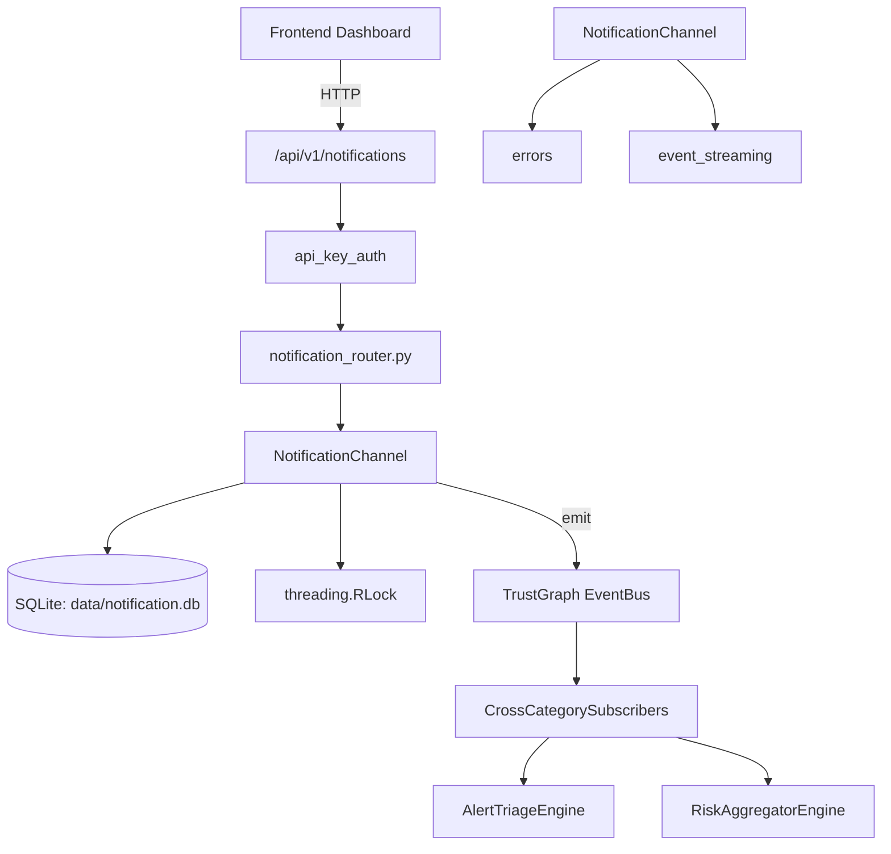

# US-0168: Notification

## Sub-Epic: Advanced
**Master Goal**: ALDECI — $35/mo enterprise security intelligence platform replacing $50K-500K/yr tools

## User Story
As a **Daniel Thompson (SecOps Manager)**, I need to manage security notifications
so that the platform delivers enterprise-grade advanced capabilities at 1/1000th the cost of legacy tools.

## Why This Matters
Notification replaces functionality found in enterprise tools like CrowdStrike, Wiz, Snyk, and Rapid7.
By building this into ALDECI's $35/mo stack, customers save $50K+/yr on standalone Advanced tooling.

## Architecture

## Current State: 95% Complete
- ✅ `matches_event()` — Check if event matches this rule. (line 80)
- ✅ `send()` — Send notification via WebSocket (no-op, already in EventBus). (line 146)
- ✅ `send()` — Send notification via email (stub implementation). (line 178)
- ✅ `send()` — Send notification to Slack (stub implementation). (line 209)
- ✅ `send()` — Send notification via webhook (stub implementation). (line 255)
- ✅ `send()` — Send notification to PagerDuty (stub implementation). (line 290)
- ❌ TrustGraph event emission — not yet verified

## Key Functions (from `suite-core/core/notification_engine.py` — 686 lines)
- `NotificationRule.matches_event()` — Check if event matches this rule. (line 80)
- `WebSocketAdapter.send()` — Send notification via WebSocket (no-op, already in EventBus). (line 146)
- `EmailAdapter.send()` — Send notification via email (stub implementation). (line 178)
- `SlackAdapter.send()` — Send notification to Slack (stub implementation). (line 209)
- `WebhookAdapter.send()` — Send notification via webhook (stub implementation). (line 255)
- `PagerDutyAdapter.send()` — Send notification to PagerDuty (stub implementation). (line 290)
- `NotificationEngine.add_rule()` — Add a notification rule. (line 444)
- `NotificationEngine.remove_rule()` — Remove a notification rule. (line 455)

## Dependencies
- **Depends on**: errors, event_streaming
- **Depended by**: Routers, TrustGraph EventBus, CrossCategorySubscribers
- **TrustGraph**: Event emission wired via ResponseInterceptorMiddleware
- **Source file**: `suite-core/core/notification_engine.py` (686 lines)
- **Router file**: `suite-api/apps/api/notification_router.py`

## API Endpoints
| Method | Path | Description |
|--------|------|-------------|
| POST | `/api/v1/notifications/rules` | create rule |
| GET | `/api/v1/notifications/rules` | list rules |
| PUT | `/api/v1/notifications/rules/{rule_id}` | update rule |
| DELETE | `/api/v1/notifications/rules/{rule_id}` | delete rule |
| GET | `/api/v1/notifications/inbox` | get inbox |
| POST | `/api/v1/notifications/read` | mark read |
| GET | `/api/v1/notifications/preferences` | get preferences |
| PUT | `/api/v1/notifications/preferences` | update preferences |

## Tasks Remaining
1. Verify TrustGraph event emission works end-to-end (2h)
2. Add integration test with real persona workflow (2h)
3. Wire CrossCategorySubscriber consumer chain (1h)
4. Validate with 30-persona walkthrough (1h)
5. Optimize query performance for large datasets (2h)
6. Expand test coverage to edge cases (2h)

## Definition of Done
- [ ] Daniel Thompson (SecOps Manager) can access /api/v1/notifications and get meaningful data
- [ ] All CRUD operations return correct HTTP status codes
- [ ] TrustGraph receives events from this engine
- [ ] 23+ tests passing in `tests/test_notification_engine.py`
- [ ] 30-persona walkthrough includes this endpoint at 100%
- [ ] No hardcoded org_id — all queries are org-scoped

## Sprint: Wave 47 (est. April 23-25, 2026)

## Test Coverage
- **Test file**: `tests/test_notification_engine.py`
- **Tests**: 23 tests
- **Status**: Passing
