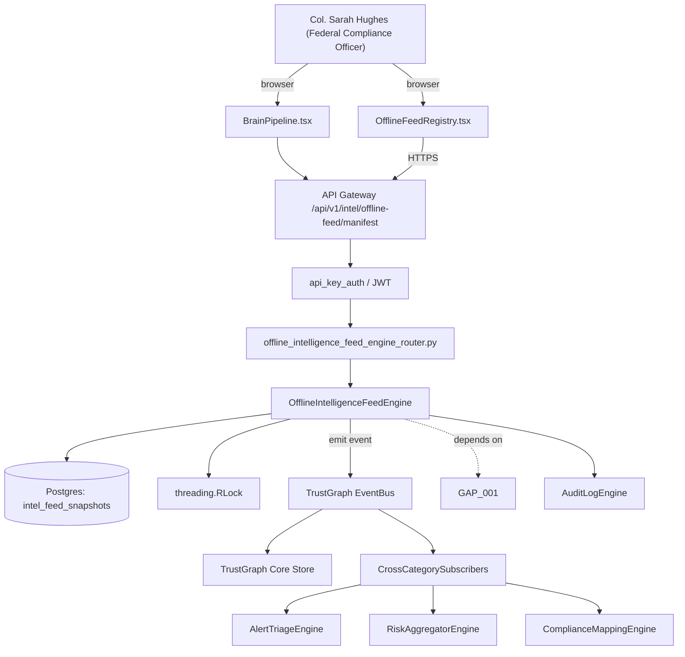

# US-0002: Build offline intelligence feed engine with signed NVD/EPSS/KEV/license/malicious-pkg snapshots

## Sub-Epic: Air-gap/On-prem
**Master Goal**: ALDECI — tiered $199-$1,499/mo enterprise security intelligence platform replacing $50K-$500K/yr tools

## User Story
As a **Col. Sarah Hughes (Federal Compliance Officer)**, I need to build offline intelligence feed engine with signed NVD/EPSS/KEV/license/malicious-pkg snapshots so that Fixops meets DoD IL4/IL5, FedRAMP High, and air-gapped customer requirements without SAGE-class gaps.

## Why This Matters
Per competitor-sonatype.md §6, Sonatype's air-gap value is the curated feed behind the signed bundle (CVEs + EPSS + KEV + license-threat-groups + malicious-package signals). Build the server-side ingest and evaluate path so that Fixops enrichment (Brain Pipeline step 7) transparently uses the offline snapshot when online feed is unreachable.

This work is called out as a P0 gap in `competitor-sonatype.md`. Shipping it is load-bearing for ALDECI's tiered $199-$1,499/mo positioning against $50K-$500K/yr incumbents: every delayed gap becomes a displacement deal we lose.

## Architecture

## Current State: 0% — MISSING (new engine)
- [ ] Engine module `suite-core/core/offline_intelligence_feed_engine.py` does not exist yet
- [ ] Router `suite-api/apps/api/offline_intelligence_feed_engine_router.py` does not exist yet
- [ ] DB tables listed under Data Model do not exist yet
- [ ] Frontend screens listed under Key Functions do not exist yet
- [ ] No TrustGraph events emitted yet

## Key Functions
**Backend (engine methods):**
- `get_manifest()` — backs `GET /api/v1/intel/offline-feed/manifest`
- `create_verify()` — backs `POST /api/v1/intel/offline-feed/verify`
- `get_coverage()` — backs `GET /api/v1/intel/offline-feed/coverage`

**Frontend screens:**
- `OfflineFeedRegistry.tsx` — operator-facing UI surface for this gap
- `BrainPipeline.tsx` — operator-facing UI surface for this gap

## API Endpoints
| Method | Path | Auth | Purpose |
|--------|------|------|---------|
| GET | `/api/v1/intel/offline-feed/manifest` | api_key_auth | offline feed manifest |
| POST | `/api/v1/intel/offline-feed/verify` | api_key_auth | offline feed verify |
| GET | `/api/v1/intel/offline-feed/coverage` | api_key_auth | offline feed coverage |

## Data Model
- add intel_feed_snapshots table: id, feed_version, cve_count, epss_count, kev_count, malicious_pkg_count, manifest_hash, applied_at

## Dependencies
**Depends on**: GAP-001
**Depended by**: Router layer, TrustGraph EventBus, CrossCategorySubscribers, CrossCategoryEvidenceBuilder, AuditLogEngine
**New engine module**: `suite-core/core/offline_intelligence_feed_engine.py`
**New router module**: `suite-api/apps/api/offline_intelligence_feed_engine_router.py`
**Master gap id**: `GAP-002` (priority P0, effort M)

## Tasks Remaining
1. Schema migration: add intel_feed_snapshots table (4h)
2. Implement endpoint GET /api/v1/intel/offline-feed/manifest (6h)
3. Implement endpoint POST /api/v1/intel/offline-feed/verify (6h)
4. Implement endpoint GET /api/v1/intel/offline-feed/coverage (6h)
5. Wire frontend screen OfflineFeedRegistry.tsx (5h)
6. Wire frontend screen BrainPipeline.tsx (5h)
7. Write 4 pytest cases: test_offline_feed_enrichment_no_network, test_offline_feed_precedence_over_stale_online… (6h)
8. Wire TrustGraph event emission + CrossCategorySubscriber consumers (4h)
9. Persona walkthrough + integration test (3h)
10. Docs + API reference update (2h)

## Definition of Done
- [ ] Given an applied offline bundle, When Brain Pipeline step 7 (enrich_threats) runs with network disabled, Then enrichment succeeds using the offline feed and every finding has epss_score and kev fields populated.
- [ ] Given an online + offline mix, When offline feed is newer than online feed, Then the engine uses the offline version and records `intel_source=offline_bundle@<version>` in the enrichment metadata.
- [ ] Given a feed missing a declared manifest entry, When apply runs, Then the endpoint returns error_code=FEED_MANIFEST_INCOMPLETE and the prior feed remains active.
- [ ] Given a test CVE present only in the offline feed, When a finding with that CVE is processed, Then it is correctly enriched and scored.
- [ ] Given the OfflineFeedRegistry.tsx screen, When an operator views the page, Then the page shows: feed version, CVE count, EPSS entries, KEV entries, malicious-pkg records, last-apply timestamp, next-expiry warning.
- [ ] All endpoints are org-scoped (no hardcoded org_id) and gated by `api_key_auth`.
- [ ] TrustGraph emits at least one event type for this engine and a CrossCategorySubscriber consumes it.
- [ ] `Col. Sarah Hughes (Federal Compliance Officer)` can execute the full workflow in the 30-persona walkthrough.

## Tests Required
- `test_offline_feed_enrichment_no_network`
- `test_offline_feed_precedence_over_stale_online`
- `test_feed_manifest_incomplete_rejection`
- `test_enrichment_source_audited_correctly`

## Sprint: Wave 44 (est. Apr 29-May 05, 2026)

## Citation
Source research: `competitor-sonatype.md` (gap `GAP-002`, priority `P0`, effort `M`)
