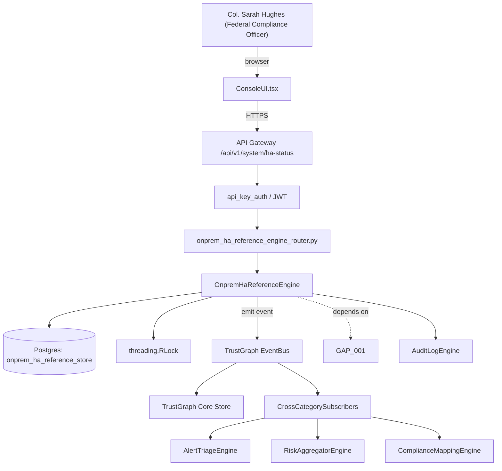

# US-0003: Publish Fixops on-prem HA reference architecture: Helm charts, StatefulSet, external PG, HA LB, hardening guide

## Sub-Epic: Air-gap/On-prem
**Master Goal**: ALDECI — tiered $199-$1,499/mo enterprise security intelligence platform replacing $50K-$500K/yr tools

## User Story
As a **Col. Sarah Hughes (Federal Compliance Officer)**, I need to publish Fixops on-prem HA reference architecture: Helm charts, StatefulSet, external PG, HA LB, hardening guide so that Fixops meets DoD IL4/IL5, FedRAMP High, and air-gapped customer requirements without SAGE-class gaps.

## Why This Matters
Per competitor-sonatype.md §2, Sonatype ships Helm charts + Kubernetes StatefulSet + PG HA guidance + port/hardening list as part of the deployment product. Fixops needs the equivalent packaged reference so regulated buyers can self-install HA without PS engagement.

This work is called out as a P0 gap in `competitor-sonatype.md`. Shipping it is load-bearing for ALDECI's tiered $199-$1,499/mo positioning against $50K-$500K/yr incumbents: every delayed gap becomes a displacement deal we lose.

## Architecture

## Current State: 0% — MISSING (new engine)
- [ ] Engine module `suite-core/core/onprem_ha_reference_engine.py` does not exist yet
- [ ] Router `suite-api/apps/api/onprem_ha_reference_engine_router.py` does not exist yet
- [ ] DB tables listed under Data Model do not exist yet
- [ ] Frontend screens listed under Key Functions do not exist yet
- [ ] No TrustGraph events emitted yet

## Key Functions
**Backend (engine methods):**
- `get_ha_status()` — backs `GET /api/v1/system/ha-status`

## API Endpoints
| Method | Path | Auth | Purpose |
|--------|------|------|---------|
| GET | `/api/v1/system/ha-status` | api_key_auth | system ha status |

## Data Model
- No schema changes (reuses existing tables).

## Dependencies
**Depends on**: GAP-001
**Depended by**: Router layer, TrustGraph EventBus, CrossCategorySubscribers, CrossCategoryEvidenceBuilder, AuditLogEngine
**New engine module**: `suite-core/core/onprem_ha_reference_engine.py`
**New router module**: `suite-api/apps/api/onprem_ha_reference_engine_router.py`
**Master gap id**: `GAP-003` (priority P0, effort M)

## Tasks Remaining
1. Implement endpoint GET /api/v1/system/ha-status (6h)
2. Write 4 pytest cases: test_helm_install_healthy_within_sla, test_api_pod_failure_traffic_continuity… (6h)
3. Wire TrustGraph event emission + CrossCategorySubscriber consumers (4h)
4. Persona walkthrough + integration test (3h)
5. Docs + API reference update (2h)

## Definition of Done
- [ ] Given a Kubernetes cluster, When an admin runs `helm install fixops fixops/fixops --set ha=true`, Then the chart deploys API replicas, pipeline workers, Redis, PG statefulset, shared-storage PVC, and an ingress — all healthy within 10 minutes.
- [ ] Given the HA deployment, When one API pod is killed, Then traffic continues to be served by remaining replicas with p95 latency unchanged.
- [ ] Given the deployment, When the admin reviews the published hardening guide, Then every exposed port (API, admin, PG, metrics, webhooks) is listed with recommended NetworkPolicy and TLS requirements.
- [ ] Given the deployment, When the admin runs `fixops-cli preflight`, Then the tool validates CPU, memory, disk, PG version, Redis version, TLS certs, and exits 0 only on pass.
- [ ] Given the chart, When air-gap mode is enabled via values.yaml, Then no chart component attempts outbound HTTPS on startup.
- [ ] All endpoints are org-scoped (no hardcoded org_id) and gated by `api_key_auth`.
- [ ] TrustGraph emits at least one event type for this engine and a CrossCategorySubscriber consumes it.
- [ ] `Col. Sarah Hughes (Federal Compliance Officer)` can execute the full workflow in the 30-persona walkthrough.

## Tests Required
- `test_helm_install_healthy_within_sla`
- `test_api_pod_failure_traffic_continuity`
- `test_preflight_exits_nonzero_on_missing_dependency`
- `test_air_gap_values_blocks_egress`

## Sprint: Wave 45 (est. May 06-May 12, 2026)

## Citation
Source research: `competitor-sonatype.md` (gap `GAP-003`, priority `P0`, effort `M`)
