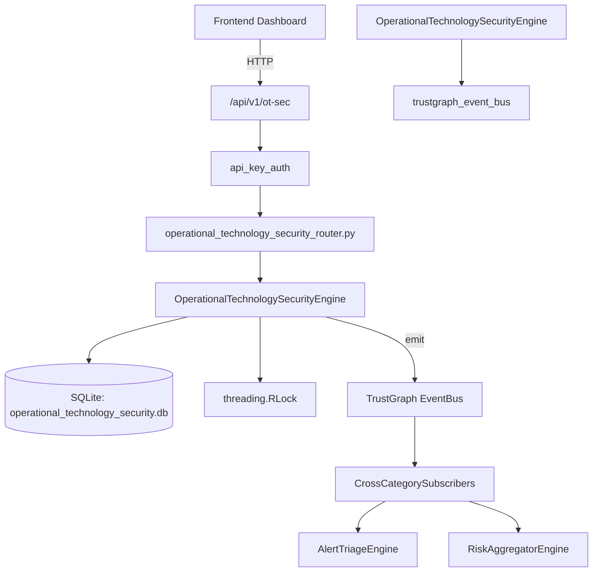

# US-0170: Operational Technology Security

## Sub-Epic: Advanced
**Master Goal**: ALDECI — $35/mo enterprise security intelligence platform replacing $50K-500K/yr tools

## User Story
As a **James Wilson (Security Engineer)**, I need to secure OT/ICS/SCADA systems
so that the platform delivers enterprise-grade advanced capabilities at 1/1000th the cost of legacy tools.

## Why This Matters
Operational Technology Security replaces functionality found in enterprise tools like CrowdStrike, Wiz, Snyk, and Rapid7.
By building this into ALDECI's $35/mo stack, customers save $50K+/yr on standalone Advanced tooling.

## Architecture

## Current State: 95% Complete
- ✅ `register_asset()` — Register a new OT asset. (line 175)
- ✅ `list_assets()` — List OT assets with optional filters. (line 246)
- ✅ `get_asset()` — Get a single OT asset by id, scoped to org. Returns None if not found. (line 270)
- ✅ `update_asset_status()` — Update asset status. Raises KeyError if not found. (line 279)
- ✅ `record_incident()` — Record an OT security incident. (line 308)
- ✅ `list_incidents()` — List incidents with optional filters. (line 356)
- ❌ TrustGraph event emission — not yet verified

## Key Functions (from `suite-core/core/operational_technology_security_engine.py` — 544 lines)
- `OperationalTechnologySecurityEngine.register_asset()` — Register a new OT asset. (line 175)
- `OperationalTechnologySecurityEngine.list_assets()` — List OT assets with optional filters. (line 246)
- `OperationalTechnologySecurityEngine.get_asset()` — Get a single OT asset by id, scoped to org. Returns None if not found. (line 270)
- `OperationalTechnologySecurityEngine.update_asset_status()` — Update asset status. Raises KeyError if not found. (line 279)
- `OperationalTechnologySecurityEngine.record_incident()` — Record an OT security incident. (line 308)
- `OperationalTechnologySecurityEngine.list_incidents()` — List incidents with optional filters. (line 356)
- `OperationalTechnologySecurityEngine.update_incident_status()` — Update incident status. Validates allowed values. (line 380)
- `OperationalTechnologySecurityEngine.create_zone()` — Create an OT network zone. (line 409)

## Dependencies
- **Depends on**: trustgraph_event_bus
- **Depended by**: Routers, TrustGraph EventBus, CrossCategorySubscribers
- **TrustGraph**: Event emission wired via ResponseInterceptorMiddleware
- **Source file**: `suite-core/core/operational_technology_security_engine.py` (544 lines)
- **Router file**: `suite-api/apps/api/operational_technology_security_router.py`

## API Endpoints
| Method | Path | Description |
|--------|------|-------------|
| POST | `/api/v1/ot-sec/assets` | register asset |
| GET | `/api/v1/ot-sec/assets` | list assets |
| GET | `/api/v1/ot-sec/assets/{asset_id}` | get asset |
| PUT | `/api/v1/ot-sec/assets/{asset_id}/status` | update asset status |
| POST | `/api/v1/ot-sec/incidents` | record incident |
| GET | `/api/v1/ot-sec/incidents` | list incidents |
| PUT | `/api/v1/ot-sec/incidents/{incident_id}/status` | update incident status |
| POST | `/api/v1/ot-sec/zones` | create zone |
| GET | `/api/v1/ot-sec/zones` | list zones |
| GET | `/api/v1/ot-sec/stats` | get ot stats |

## Tasks Remaining
1. Verify TrustGraph event emission works end-to-end (2h)
2. Add integration test with real persona workflow (2h)
3. Wire CrossCategorySubscriber consumer chain (1h)
4. Validate with 30-persona walkthrough (1h)
5. Optimize query performance for large datasets (2h)
6. Expand test coverage to edge cases (2h)

## Definition of Done
- [ ] James Wilson (Security Engineer) can access /api/v1/ot-sec and get meaningful data
- [ ] All CRUD operations return correct HTTP status codes
- [ ] TrustGraph receives events from this engine
- [ ] 50+ tests passing in `tests/test_operational_technology_security_engine.py`
- [ ] 30-persona walkthrough includes this endpoint at 100%
- [ ] No hardcoded org_id — all queries are org-scoped

## Sprint: Wave 47 (est. April 23-25, 2026)

## Test Coverage
- **Test file**: `tests/test_operational_technology_security_engine.py`
- **Tests**: 50 tests
- **Status**: Passing
