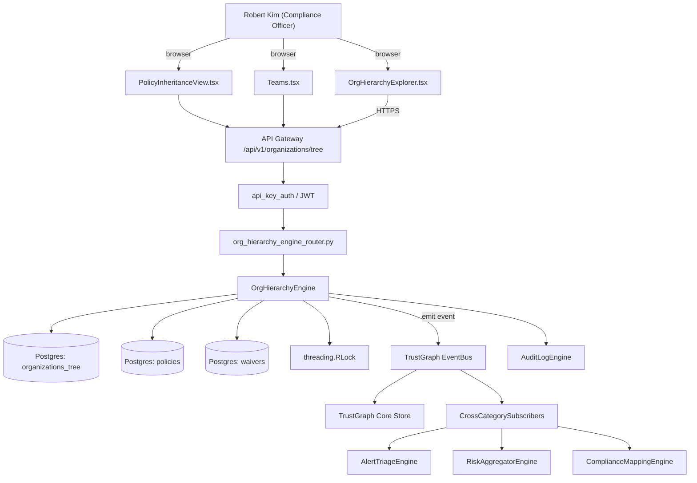

# US-0005: Add hierarchical Root-Org -> Org -> App tree with inherited policies and inherited waivers

## Sub-Epic: Compliance
**Master Goal**: ALDECI — tiered $199-$1,499/mo enterprise security intelligence platform replacing $50K-$500K/yr tools

## User Story
As a **Robert Kim (Compliance Officer)**, I need to add hierarchical Root-Org -> Org -> App tree with inherited policies and inherited waivers so that Fixops satisfies SOC2, NIST SP 800-53, FedRAMP, and FIPS-140 controls customers ask for in procurement.

## Why This Matters
Per competitor-sonatype.md §9, policies and waivers must cascade down a 3-level tree (Root Org -> Org -> App). Current Fixops uses flat `org_id`. Build the hierarchical model with downward inheritance and override semantics. This is a table-stakes for enterprises running 500+ apps.

This work is called out as a P0 gap in `competitor-sonatype.md`. Shipping it is load-bearing for ALDECI's tiered $199-$1,499/mo positioning against $50K-$500K/yr incumbents: every delayed gap becomes a displacement deal we lose.

## Architecture

## Current State: 0% — MISSING (new engine)
- [ ] Engine module `suite-core/core/org_hierarchy_engine.py` does not exist yet
- [ ] Router `suite-api/apps/api/org_hierarchy_engine_router.py` does not exist yet
- [ ] DB tables listed under Data Model do not exist yet
- [ ] Frontend screens listed under Key Functions do not exist yet
- [ ] No TrustGraph events emitted yet

## Key Functions
**Backend (engine methods):**
- `get_tree()` — backs `GET /api/v1/organizations/tree`
- `create_organizations()` — backs `POST /api/v1/organizations`
- `patch_parent()` — backs `PATCH /api/v1/organizations/{id}/parent`
- `get_effective_policies()` — backs `GET /api/v1/organizations/{id}/effective-policies`
- `get_effective_waivers()` — backs `GET /api/v1/organizations/{id}/effective-waivers`
- `patch_move()` — backs `PATCH /api/v1/applications/{id}/move`

**Frontend screens:**
- `OrgHierarchyExplorer.tsx` — operator-facing UI surface for this gap
- `PolicyInheritanceView.tsx` — operator-facing UI surface for this gap
- `Teams.tsx` — operator-facing UI surface for this gap

## API Endpoints
| Method | Path | Auth | Purpose |
|--------|------|------|---------|
| GET | `/api/v1/organizations/tree` | api_key_auth | organizations tree |
| POST | `/api/v1/organizations` | api_key_auth | v1 organizations |
| PATCH | `/api/v1/organizations/{id}/parent` | api_key_auth | {id} parent |
| GET | `/api/v1/organizations/{id}/effective-policies` | api_key_auth | {id} effective policies |
| GET | `/api/v1/organizations/{id}/effective-waivers` | api_key_auth | {id} effective waivers |
| PATCH | `/api/v1/applications/{id}/move` | api_key_auth | {id} move |

## Data Model
- add organizations_tree table: id, parent_id (nullable), kind ('root'|'org'|'app'), name, path_ltree
- add policies.attached_org_id and policies.inheritable, policies.restrict_override columns
- add waivers.attached_org_id, waivers.scope_kind columns
- back-fill synthetic root for existing tenants

## Dependencies
**Depends on**: none explicit
**Depended by**: Router layer, TrustGraph EventBus, CrossCategorySubscribers, CrossCategoryEvidenceBuilder, AuditLogEngine
**New engine module**: `suite-core/core/org_hierarchy_engine.py`
**New router module**: `suite-api/apps/api/org_hierarchy_engine_router.py`
**Master gap id**: `GAP-005` (priority P0, effort L)

## Tasks Remaining
1. Schema migration: add organizations_tree table (4h)
2. Schema migration: add policies.attached_org_id and policies.inheritable, policies.restrict_overrid (4h)
3. Schema migration: add waivers.attached_org_id, waivers.scope_kind columns (4h)
4. Schema migration: back-fill synthetic root for existing tenants (4h)
5. Implement endpoint GET /api/v1/organizations/tree (6h)
6. Implement endpoint POST /api/v1/organizations (6h)
7. Implement endpoint PATCH /api/v1/organizations/{id}/parent (6h)
8. Implement endpoint GET /api/v1/organizations/{id}/effective-policies (6h)
9. Implement endpoint GET /api/v1/organizations/{id}/effective-waivers (6h)
10. Implement endpoint PATCH /api/v1/applications/{id}/move (6h)
11. Wire frontend screen OrgHierarchyExplorer.tsx (5h)
12. Wire frontend screen PolicyInheritanceView.tsx (5h)
13. Wire frontend screen Teams.tsx (5h)
14. Write 5 pytest cases: test_policy_cascades_to_all_descendants, test_restrict_override_blocks_child_policy… (6h)
15. Wire TrustGraph event emission + CrossCategorySubscriber consumers (4h)
16. Persona walkthrough + integration test (3h)
17. Docs + API reference update (2h)

## Definition of Done
- [ ] Given a Root Org R with 2 Orgs (O1, O2) and 10 Apps per Org, When a policy P is attached at R, Then P evaluates against all 20 Apps without duplicate writes.
- [ ] Given policy P with `inheritable=true` attached at R, When an admin attaches override policy P' at O1 with `restrict_override=false`, Then Apps under O1 use P' and Apps under O2 use P.
- [ ] Given policy P with `restrict_override=true` at R, When an admin attempts to override at O1, Then API returns HTTP 403 error_code=OVERRIDE_FORBIDDEN.
- [ ] Given a waiver W attached at R scoped to CVE-2024-X, When any App under R evaluates CVE-2024-X, Then the waiver applies automatically.
- [ ] Given an App moved from O1 to O2 via PATCH /api/v1/applications/{id}/move, Then inherited policies/waivers are re-computed and an audit entry records the move and policy delta.
- [ ] Given OrgHierarchyExplorer.tsx, When a user clicks a node, Then the side panel shows inherited-from + own + effective policies and effective waivers.
- [ ] Given the data model migration, When applied to an existing flat-org deployment, Then all existing orgs are migrated under a synthetic Root Org preserving all `org_id` references.
- [ ] All endpoints are org-scoped (no hardcoded org_id) and gated by `api_key_auth`.
- [ ] TrustGraph emits at least one event type for this engine and a CrossCategorySubscriber consumes it.
- [ ] `Robert Kim (Compliance Officer)` can execute the full workflow in the 30-persona walkthrough.

## Tests Required
- `test_policy_cascades_to_all_descendants`
- `test_restrict_override_blocks_child_policy`
- `test_waiver_at_root_applies_to_all_apps`
- `test_app_move_recomputes_effective_policies`
- `test_migration_synthesizes_root_org`

## Sprint: Wave 44 (est. Apr 29-May 05, 2026)

## Citation
Source research: `competitor-sonatype.md` (gap `GAP-005`, priority `P0`, effort `L`)
