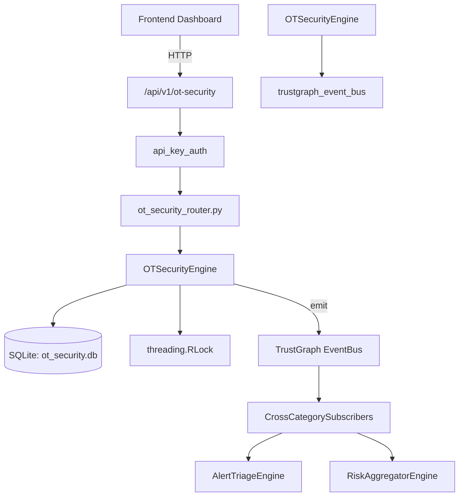

# US-0171: Ot Security

## Sub-Epic: Advanced
**Master Goal**: ALDECI — $35/mo enterprise security intelligence platform replacing $50K-500K/yr tools

## User Story
As a **James Wilson (Security Engineer)**, I need to protect operational technology
so that the platform delivers enterprise-grade advanced capabilities at 1/1000th the cost of legacy tools.

## Why This Matters
Ot Security replaces functionality found in enterprise tools like CrowdStrike, Wiz, Snyk, and Rapid7.
By building this into ALDECI's $35/mo stack, customers save $50K+/yr on standalone Advanced tooling.

## Architecture

## Current State: 95% Complete
- ✅ `register_asset()` — Register a new OT asset. (line 119)
- ✅ `list_assets()` — List OT assets with optional asset_type and criticality filters. (line 174)
- ✅ `get_asset()` — Return a single OT asset by ID, scoped to org. (line 194)
- ✅ `record_anomaly()` — Record an anomaly against an OT asset. (line 209)
- ✅ `list_anomalies()` — List anomalies with optional status and severity filters. (line 256)
- ✅ `resolve_anomaly()` — Resolve an anomaly — sets status=resolved and records resolution text. (line 276)
- ❌ TrustGraph event emission — not yet verified

## Key Functions (from `suite-core/core/ot_security_engine.py` — 339 lines)
- `OTSecurityEngine.register_asset()` — Register a new OT asset. (line 119)
- `OTSecurityEngine.list_assets()` — List OT assets with optional asset_type and criticality filters. (line 174)
- `OTSecurityEngine.get_asset()` — Return a single OT asset by ID, scoped to org. (line 194)
- `OTSecurityEngine.record_anomaly()` — Record an anomaly against an OT asset. (line 209)
- `OTSecurityEngine.list_anomalies()` — List anomalies with optional status and severity filters. (line 256)
- `OTSecurityEngine.resolve_anomaly()` — Resolve an anomaly — sets status=resolved and records resolution text. (line 276)
- `OTSecurityEngine.get_ot_stats()` — Return OT environment statistics. (line 304)

## Dependencies
- **Depends on**: trustgraph_event_bus
- **Depended by**: Routers, TrustGraph EventBus, CrossCategorySubscribers
- **TrustGraph**: Event emission wired via ResponseInterceptorMiddleware
- **Source file**: `suite-core/core/ot_security_engine.py` (339 lines)
- **Router file**: `suite-api/apps/api/ot_security_router.py`

## API Endpoints
| Method | Path | Description |
|--------|------|-------------|
| POST | `/api/v1/ot-security/assets` | register asset |
| GET | `/api/v1/ot-security/assets` | list assets |
| GET | `/api/v1/ot-security/assets/{asset_id}` | get asset |
| POST | `/api/v1/ot-security/anomalies` | record anomaly |
| GET | `/api/v1/ot-security/anomalies` | list anomalies |
| PUT | `/api/v1/ot-security/anomalies/{anomaly_id}/resolve` | resolve anomaly |
| GET | `/api/v1/ot-security/stats` | get ot stats |

## Tasks Remaining
1. Verify TrustGraph event emission works end-to-end (2h)
2. Add integration test with real persona workflow (2h)
3. Wire CrossCategorySubscriber consumer chain (1h)
4. Validate with 30-persona walkthrough (1h)
5. Optimize query performance for large datasets (2h)
6. Expand test coverage to edge cases (2h)

## Definition of Done
- [ ] James Wilson (Security Engineer) can access /api/v1/ot-security and get meaningful data
- [ ] All CRUD operations return correct HTTP status codes
- [ ] TrustGraph receives events from this engine
- [ ] 38+ tests passing in `tests/test_ot_security_engine.py`
- [ ] 30-persona walkthrough includes this endpoint at 100%
- [ ] No hardcoded org_id — all queries are org-scoped

## Sprint: Wave 47 (est. April 23-25, 2026)

## Test Coverage
- **Test file**: `tests/test_ot_security_engine.py`
- **Tests**: 38 tests
- **Status**: Passing
