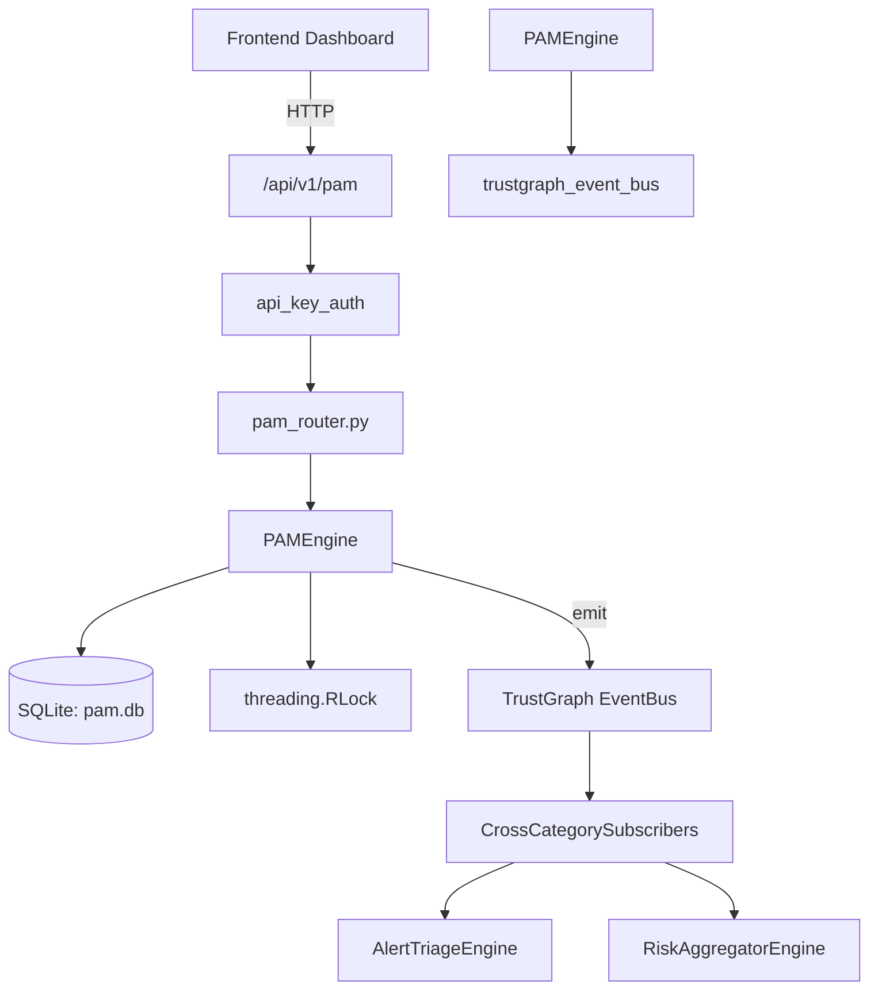

# US-0172: Pam

## Sub-Epic: Identity
**Master Goal**: ALDECI — $35/mo enterprise security intelligence platform replacing $50K-500K/yr tools

## User Story
As a **Maria Lopez (IT Director)**, I need to manage privileged access
so that the platform delivers enterprise-grade identity capabilities at 1/1000th the cost of legacy tools.

## Why This Matters
Pam replaces functionality found in enterprise tools like CrowdStrike, Wiz, Snyk, and Rapid7.
By building this into ALDECI's $35/mo stack, customers save $50K+/yr on standalone Identity tooling.

## Architecture

## Current State: 95% Complete
- ✅ `register_account()` — Register a privileged account. Returns the full account record. (line 133)
- ✅ `list_accounts()` — List privileged accounts for an org with optional filters. (line 203)
- ✅ `create_session()` — Create a PAM session request. Returns the full session record. (line 228)
- ✅ `list_sessions()` — List PAM sessions for an org. (line 290)
- ✅ `approve_session()` — Approve or deny a pending PAM session. Returns True if updated. (line 307)
- ✅ `end_session()` — End an active PAM session by setting ended_at to now. Returns True if updated. (line 332)
- ❌ TrustGraph event emission — not yet verified

## Key Functions (from `suite-core/core/pam_engine.py` — 455 lines)
- `PAMEngine.register_account()` — Register a privileged account. Returns the full account record. (line 133)
- `PAMEngine.list_accounts()` — List privileged accounts for an org with optional filters. (line 203)
- `PAMEngine.create_session()` — Create a PAM session request. Returns the full session record. (line 228)
- `PAMEngine.list_sessions()` — List PAM sessions for an org. (line 290)
- `PAMEngine.approve_session()` — Approve or deny a pending PAM session. Returns True if updated. (line 307)
- `PAMEngine.end_session()` — End an active PAM session by setting ended_at to now. Returns True if updated. (line 332)
- `PAMEngine.create_policy()` — Create a PAM policy. Returns the full policy record. (line 350)
- `PAMEngine.list_policies()` — List PAM policies for an org. (line 400)

## Dependencies
- **Depends on**: trustgraph_event_bus
- **Depended by**: Routers, TrustGraph EventBus, CrossCategorySubscribers
- **TrustGraph**: Event emission wired via ResponseInterceptorMiddleware
- **Source file**: `suite-core/core/pam_engine.py` (455 lines)
- **Router file**: `suite-api/apps/api/pam_router.py`

## API Endpoints
| Method | Path | Description |
|--------|------|-------------|
| GET | `/api/v1/pam/accounts` | list accounts |
| POST | `/api/v1/pam/accounts` | register account |
| GET | `/api/v1/pam/sessions` | list sessions |
| POST | `/api/v1/pam/sessions` | create session |
| POST | `/api/v1/pam/sessions/{session_id}/approve` | approve session |
| POST | `/api/v1/pam/sessions/{session_id}/end` | end session |
| GET | `/api/v1/pam/policies` | list policies |
| POST | `/api/v1/pam/policies` | create policy |
| GET | `/api/v1/pam/stats` | get stats |

## Tasks Remaining
1. Verify TrustGraph event emission works end-to-end (2h)
2. Add integration test with real persona workflow (2h)
3. Wire CrossCategorySubscriber consumer chain (1h)
4. Validate with 30-persona walkthrough (1h)
5. Optimize query performance for large datasets (2h)
6. Expand test coverage to edge cases (2h)

## Definition of Done
- [ ] Maria Lopez (IT Director) can access /api/v1/pam and get meaningful data
- [ ] All CRUD operations return correct HTTP status codes
- [ ] TrustGraph receives events from this engine
- [ ] 28+ tests passing in `tests/test_pam_engine.py`
- [ ] 30-persona walkthrough includes this endpoint at 100%
- [ ] No hardcoded org_id — all queries are org-scoped

## Sprint: Wave 47 (est. April 23-25, 2026)

## Test Coverage
- **Test file**: `tests/test_pam_engine.py`
- **Tests**: 28 tests
- **Status**: Passing
