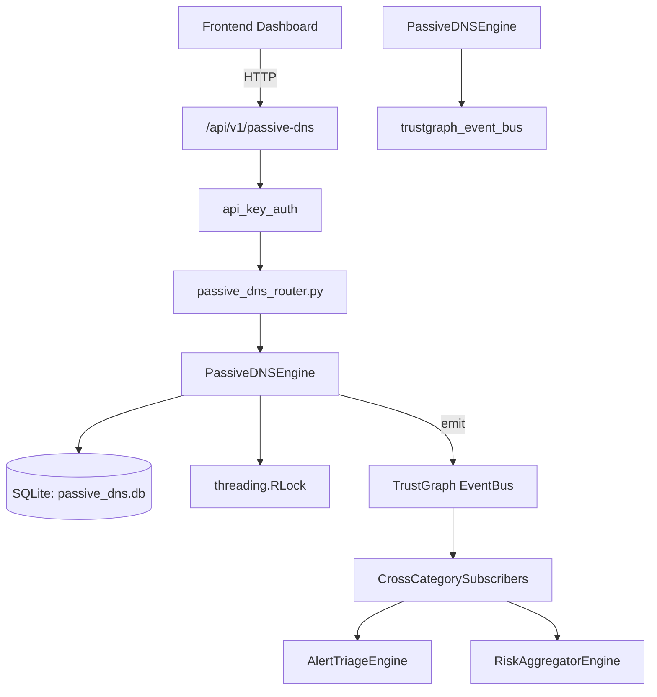

# US-0173: Passive Dns

## Sub-Epic: Network
**Master Goal**: ALDECI — $35/mo enterprise security intelligence platform replacing $50K-500K/yr tools

## User Story
As a **Nina Patel (Threat Intel Analyst)**, I need to track passive DNS records
so that the platform delivers enterprise-grade network capabilities at 1/1000th the cost of legacy tools.

## Why This Matters
Passive Dns replaces functionality found in enterprise tools like CrowdStrike, Wiz, Snyk, and Rapid7.
By building this into ALDECI's $35/mo stack, customers save $50K+/yr on standalone Network tooling.

## Architecture

## Current State: 95% Complete
- ✅ `record_resolution()` — Record or update a DNS resolution for a domain→IP pair. (line 121)
- ✅ `list_resolutions()` — List DNS resolutions with optional domain or IP filter. (line 174)
- ✅ `get_domain_history()` — Return all historical IPs for a domain, ordered by last_seen desc. (line 200)
- ✅ `get_ip_history()` — Return all domains that ever resolved to this IP. (line 212)
- ✅ `detect_fast_flux()` — Detect fast-flux DNS patterns for a domain. (line 224)
- ✅ `add_domain_threat()` — Mark a domain as malicious with threat classification. (line 272)
- ❌ TrustGraph event emission — not yet verified

## Key Functions (from `suite-core/core/passive_dns_engine.py` — 425 lines)
- `PassiveDNSEngine.record_resolution()` — Record or update a DNS resolution for a domain→IP pair. (line 121)
- `PassiveDNSEngine.list_resolutions()` — List DNS resolutions with optional domain or IP filter. (line 174)
- `PassiveDNSEngine.get_domain_history()` — Return all historical IPs for a domain, ordered by last_seen desc. (line 200)
- `PassiveDNSEngine.get_ip_history()` — Return all domains that ever resolved to this IP. (line 212)
- `PassiveDNSEngine.detect_fast_flux()` — Detect fast-flux DNS patterns for a domain. (line 224)
- `PassiveDNSEngine.add_domain_threat()` — Mark a domain as malicious with threat classification. (line 272)
- `PassiveDNSEngine.list_domain_threats()` — List domain threats with optional filters. (line 309)
- `PassiveDNSEngine.check_domain_reputation()` — Check domain reputation against recorded threats and resolution history. (line 340)

## Dependencies
- **Depends on**: trustgraph_event_bus
- **Depended by**: Routers, TrustGraph EventBus, CrossCategorySubscribers
- **TrustGraph**: Event emission wired via ResponseInterceptorMiddleware
- **Source file**: `suite-core/core/passive_dns_engine.py` (425 lines)
- **Router file**: `suite-api/apps/api/passive_dns_router.py`

## API Endpoints
| Method | Path | Description |
|--------|------|-------------|
| POST | `/api/v1/passive-dns/resolutions` | record resolution |
| GET | `/api/v1/passive-dns/resolutions` | list resolutions |
| GET | `/api/v1/passive-dns/domains/{domain}/history` | get domain history |
| GET | `/api/v1/passive-dns/ips/{ip}/history` | get ip history |
| GET | `/api/v1/passive-dns/domains/{domain}/fast-flux` | detect fast flux |
| POST | `/api/v1/passive-dns/threats` | add domain threat |
| GET | `/api/v1/passive-dns/threats` | list domain threats |
| GET | `/api/v1/passive-dns/domains/{domain}/reputation` | check domain reputation |
| GET | `/api/v1/passive-dns/stats` | get dns stats |

## Tasks Remaining
1. Verify TrustGraph event emission works end-to-end (2h)
2. Add integration test with real persona workflow (2h)
3. Wire CrossCategorySubscriber consumer chain (1h)
4. Validate with 30-persona walkthrough (1h)
5. Optimize query performance for large datasets (2h)
6. Expand test coverage to edge cases (2h)

## Definition of Done
- [ ] Nina Patel (Threat Intel Analyst) can access /api/v1/passive-dns and get meaningful data
- [ ] All CRUD operations return correct HTTP status codes
- [ ] TrustGraph receives events from this engine
- [ ] 46+ tests passing in `tests/test_passive_dns_engine.py`
- [ ] 30-persona walkthrough includes this endpoint at 100%
- [ ] No hardcoded org_id — all queries are org-scoped

## Sprint: Wave 47 (est. April 23-25, 2026)

## Test Coverage
- **Test file**: `tests/test_passive_dns_engine.py`
- **Tests**: 46 tests
- **Status**: Passing
