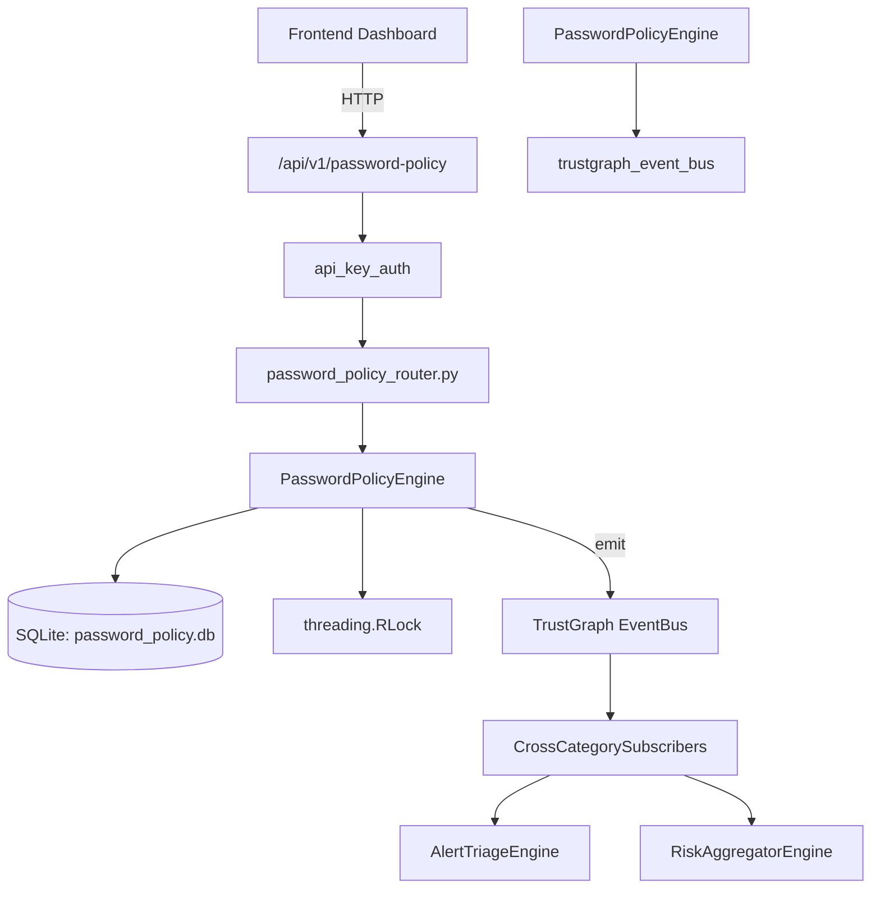

# US-0174: Password Policy

## Sub-Epic: Identity
**Master Goal**: ALDECI — $35/mo enterprise security intelligence platform replacing $50K-500K/yr tools

## User Story
As a **Maria Lopez (IT Director)**, I need to enforce password policies and MFA
so that the platform delivers enterprise-grade identity capabilities at 1/1000th the cost of legacy tools.

## Why This Matters
Password Policy replaces functionality found in enterprise tools like CrowdStrike, Wiz, Snyk, and Rapid7.
By building this into ALDECI's $35/mo stack, customers save $50K+/yr on standalone Identity tooling.

## Architecture

## Current State: 95% Complete
- ✅ `check_password_strength()` — Score a password 0-100 based on length, char classes, and entropy. (line 227)
- ✅ `create_policy()` — Create a new password policy. Returns the created policy dict. (line 310)
- ✅ `list_policies()` — Return password policies for the given org, optionally filtered by is_active. (line 388)
- ✅ `activate_policy()` — Activate a policy; deactivates all other org policies. Returns True if found. (line 400)
- ✅ `evaluate_password()` — Evaluate a password hint against a policy. (line 420)
- ✅ `record_audit()` — Record an audit run (positional-arg form). Returns the created audit record. (line 504)
- ❌ TrustGraph event emission — not yet verified

## Key Functions (from `suite-core/core/password_policy_engine.py` — 826 lines)
- `PasswordPolicyEngine.check_password_strength()` — Score a password 0-100 based on length, char classes, and entropy. (line 227)
- `PasswordPolicyEngine.create_policy()` — Create a new password policy. Returns the created policy dict. (line 310)
- `PasswordPolicyEngine.list_policies()` — Return password policies for the given org, optionally filtered by is_active. (line 388)
- `PasswordPolicyEngine.activate_policy()` — Activate a policy; deactivates all other org policies. Returns True if found. (line 400)
- `PasswordPolicyEngine.evaluate_password()` — Evaluate a password hint against a policy. (line 420)
- `PasswordPolicyEngine.record_audit()` — Record an audit run (positional-arg form). Returns the created audit record. (line 504)
- `PasswordPolicyEngine.run_audit()` — Create a rich audit record with full compliance metrics. Returns the created rec (line 522)
- `PasswordPolicyEngine.list_audits()` — Return audit records for the given org, most recent first. (line 583)

## Dependencies
- **Depends on**: trustgraph_event_bus
- **Depended by**: Routers, TrustGraph EventBus, CrossCategorySubscribers
- **TrustGraph**: Event emission wired via ResponseInterceptorMiddleware
- **Source file**: `suite-core/core/password_policy_engine.py` (826 lines)
- **Router file**: `suite-api/apps/api/password_policy_router.py`

## API Endpoints
| Method | Path | Description |
|--------|------|-------------|
| GET | `/api/v1/password-policy/policies` | list policies |
| POST | `/api/v1/password-policy/policies` | create policy |
| POST | `/api/v1/password-policy/policies/{policy_id}/evaluate` | evaluate password |
| GET | `/api/v1/password-policy/violations` | list violations |
| POST | `/api/v1/password-policy/violations` | create violation |
| POST | `/api/v1/password-policy/violations/{violation_id}/remediate` | remediate violation |
| GET | `/api/v1/password-policy/audits` | list audits |
| POST | `/api/v1/password-policy/audits` | record audit |
| GET | `/api/v1/password-policy/stats` | get stats |

## Tasks Remaining
1. Verify TrustGraph event emission works end-to-end (2h)
2. Add integration test with real persona workflow (2h)
3. Wire CrossCategorySubscriber consumer chain (1h)
4. Validate with 30-persona walkthrough (1h)
5. Optimize query performance for large datasets (2h)
6. Expand test coverage to edge cases (2h)

## Definition of Done
- [ ] Maria Lopez (IT Director) can access /api/v1/password-policy and get meaningful data
- [ ] All CRUD operations return correct HTTP status codes
- [ ] TrustGraph receives events from this engine
- [ ] 52+ tests passing in `tests/test_password_policy_engine.py`
- [ ] 30-persona walkthrough includes this endpoint at 100%
- [ ] No hardcoded org_id — all queries are org-scoped

## Sprint: Wave 47 (est. April 23-25, 2026)

## Test Coverage
- **Test file**: `tests/test_password_policy_engine.py`
- **Tests**: 52 tests
- **Status**: Passing
