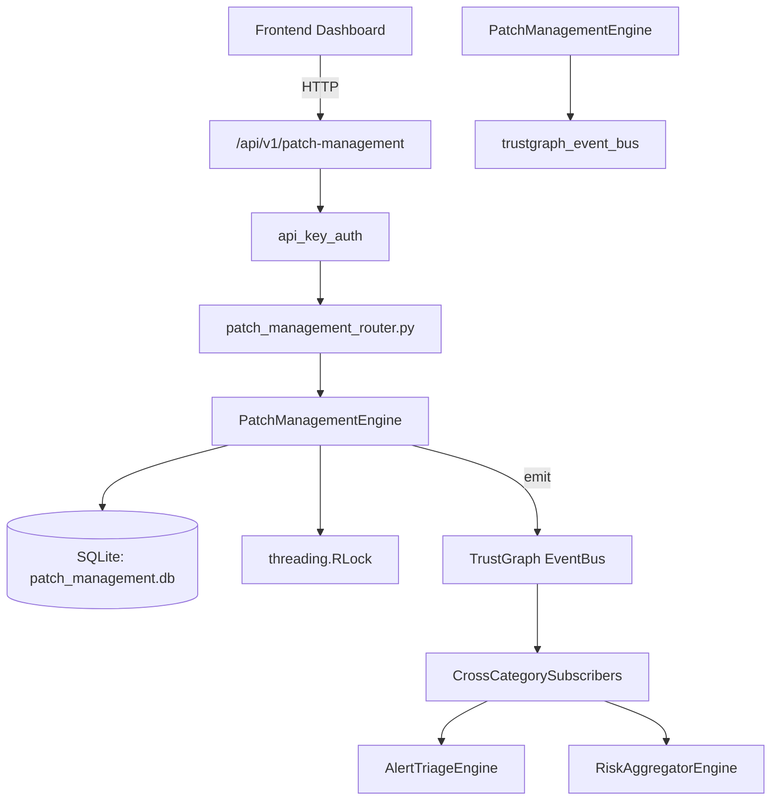

# US-0176: Patch Management

## Sub-Epic: Advanced
**Master Goal**: ALDECI — $35/mo enterprise security intelligence platform replacing $50K-500K/yr tools

## User Story
As a **James Wilson (Security Engineer)**, I need to manage patch deployment lifecycle
so that the platform delivers enterprise-grade advanced capabilities at 1/1000th the cost of legacy tools.

## Why This Matters
Patch Management replaces functionality found in enterprise tools like CrowdStrike, Wiz, Snyk, and Rapid7.
By building this into ALDECI's $35/mo stack, customers save $50K+/yr on standalone Advanced tooling.

## Architecture

## Current State: 95% Complete
- ✅ `register_patch()` — Register a new patch record. (line 140)
- ✅ `list_patches()` — List patches with optional filters. (line 208)
- ✅ `get_patch()` — Return a single patch or None. (line 233)
- ✅ `update_patch_status()` — Update patch status and optionally record notes in test_results. (line 242)
- ✅ `record_deployment()` — Record a per-asset deployment and update patch counters. (line 283)
- ✅ `list_deployments()` — List deployment records with optional filters. (line 340)
- ❌ TrustGraph event emission — not yet verified

## Key Functions (from `suite-core/core/patch_management_engine.py` — 437 lines)
- `PatchManagementEngine.register_patch()` — Register a new patch record. (line 140)
- `PatchManagementEngine.list_patches()` — List patches with optional filters. (line 208)
- `PatchManagementEngine.get_patch()` — Return a single patch or None. (line 233)
- `PatchManagementEngine.update_patch_status()` — Update patch status and optionally record notes in test_results. (line 242)
- `PatchManagementEngine.record_deployment()` — Record a per-asset deployment and update patch counters. (line 283)
- `PatchManagementEngine.list_deployments()` — List deployment records with optional filters. (line 340)
- `PatchManagementEngine.get_patch_stats()` — Return aggregated patch management statistics. (line 369)

## Dependencies
- **Depends on**: trustgraph_event_bus
- **Depended by**: Routers, TrustGraph EventBus, CrossCategorySubscribers
- **TrustGraph**: Event emission wired via ResponseInterceptorMiddleware
- **Source file**: `suite-core/core/patch_management_engine.py` (437 lines)
- **Router file**: `suite-api/apps/api/patch_management_router.py`

## API Endpoints
| Method | Path | Description |
|--------|------|-------------|
| POST | `/api/v1/patch-management/patches` | register patch |
| GET | `/api/v1/patch-management/patches` | list patches |
| GET | `/api/v1/patch-management/patches/{patch_id}` | get patch |
| PATCH | `/api/v1/patch-management/patches/{patch_id}/status` | update patch status |
| POST | `/api/v1/patch-management/patches/{patch_id}/deployments` | record deployment |
| GET | `/api/v1/patch-management/deployments` | list deployments |
| GET | `/api/v1/patch-management/stats` | get patch stats |

## Tasks Remaining
1. Verify TrustGraph event emission works end-to-end (2h)
2. Add integration test with real persona workflow (2h)
3. Wire CrossCategorySubscriber consumer chain (1h)
4. Validate with 30-persona walkthrough (1h)
5. Optimize query performance for large datasets (2h)
6. Expand test coverage to edge cases (2h)

## Definition of Done
- [ ] James Wilson (Security Engineer) can access /api/v1/patch-management and get meaningful data
- [ ] All CRUD operations return correct HTTP status codes
- [ ] TrustGraph receives events from this engine
- [ ] 36+ tests passing in `tests/test_patch_management_engine.py`
- [ ] 30-persona walkthrough includes this endpoint at 100%
- [ ] No hardcoded org_id — all queries are org-scoped

## Sprint: Wave 47 (est. April 23-25, 2026)

## Test Coverage
- **Test file**: `tests/test_patch_management_engine.py`
- **Tests**: 36 tests
- **Status**: Passing
