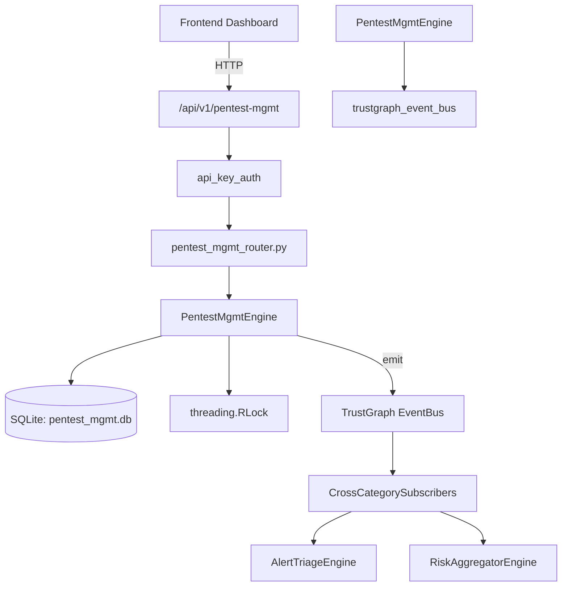

# US-0177: Pentest Mgmt

## Sub-Epic: CTEM
**Master Goal**: ALDECI — $35/mo enterprise security intelligence platform replacing $50K-500K/yr tools

## User Story
As a **Lisa Zhang (Pentester)**, I need to manage penetration testing engagements
so that the platform delivers enterprise-grade ctem capabilities at 1/1000th the cost of legacy tools.

## Why This Matters
Pentest Mgmt replaces functionality found in enterprise tools like CrowdStrike, Wiz, Snyk, and Rapid7.
By building this into ALDECI's $35/mo stack, customers save $50K+/yr on standalone CTEM tooling.

## Architecture

## Current State: 95% Complete
- ✅ `create_engagement()` — Create a new pentest engagement. (line 161)
- ✅ `list_engagements()` — List engagements for an org with optional filters. (line 210)
- ✅ `get_engagement()` — Get engagement details including finding counts by severity. (line 231)
- ✅ `update_engagement_status()` — Update engagement status. (line 255)
- ✅ `add_finding()` — Add a finding to an engagement. (line 273)
- ✅ `list_findings()` — List findings with optional filters. (line 332)
- ❌ TrustGraph event emission — not yet verified

## Key Functions (from `suite-core/core/pentest_mgmt_engine.py` — 532 lines)
- `PentestMgmtEngine.create_engagement()` — Create a new pentest engagement. (line 161)
- `PentestMgmtEngine.list_engagements()` — List engagements for an org with optional filters. (line 210)
- `PentestMgmtEngine.get_engagement()` — Get engagement details including finding counts by severity. (line 231)
- `PentestMgmtEngine.update_engagement_status()` — Update engagement status. (line 255)
- `PentestMgmtEngine.add_finding()` — Add a finding to an engagement. (line 273)
- `PentestMgmtEngine.list_findings()` — List findings with optional filters. (line 332)
- `PentestMgmtEngine.update_finding_status()` — Update finding status, setting remediated_at when status is 'remediated'. (line 357)
- `PentestMgmtEngine.add_target()` — Add a target to an engagement. (line 378)

## Dependencies
- **Depends on**: trustgraph_event_bus
- **Depended by**: Routers, TrustGraph EventBus, CrossCategorySubscribers
- **TrustGraph**: Event emission wired via ResponseInterceptorMiddleware
- **Source file**: `suite-core/core/pentest_mgmt_engine.py` (532 lines)
- **Router file**: `suite-api/apps/api/pentest_mgmt_router.py`

## API Endpoints
| Method | Path | Description |
|--------|------|-------------|
| POST | `/api/v1/pentest-mgmt/engagements` | create engagement |
| GET | `/api/v1/pentest-mgmt/engagements` | list engagements |
| GET | `/api/v1/pentest-mgmt/engagements/{engagement_id}` | get engagement |
| PUT | `/api/v1/pentest-mgmt/engagements/{engagement_id}/status` | update engagement status |
| POST | `/api/v1/pentest-mgmt/engagements/{engagement_id}/findings` | add finding |
| GET | `/api/v1/pentest-mgmt/findings` | list findings |
| PUT | `/api/v1/pentest-mgmt/findings/{finding_id}/status` | update finding status |
| POST | `/api/v1/pentest-mgmt/engagements/{engagement_id}/targets` | add target |
| GET | `/api/v1/pentest-mgmt/engagements/{engagement_id}/targets` | list targets |
| POST | `/api/v1/pentest-mgmt/findings/{finding_id}/retests` | record retest |
| GET | `/api/v1/pentest-mgmt/stats` | get pentest stats |

## Tasks Remaining
1. Verify TrustGraph event emission works end-to-end (2h)
2. Add integration test with real persona workflow (2h)
3. Wire CrossCategorySubscriber consumer chain (1h)
4. Validate with 30-persona walkthrough (1h)
5. Optimize query performance for large datasets (2h)
6. Expand test coverage to edge cases (2h)

## Definition of Done
- [ ] Lisa Zhang (Pentester) can access /api/v1/pentest-mgmt and get meaningful data
- [ ] All CRUD operations return correct HTTP status codes
- [ ] TrustGraph receives events from this engine
- [ ] 32+ tests passing in `tests/test_pentest_mgmt_engine.py`
- [ ] 30-persona walkthrough includes this endpoint at 100%
- [ ] No hardcoded org_id — all queries are org-scoped

## Sprint: Wave 47 (est. April 23-25, 2026)

## Test Coverage
- **Test file**: `tests/test_pentest_mgmt_engine.py`
- **Tests**: 32 tests
- **Status**: Passing
