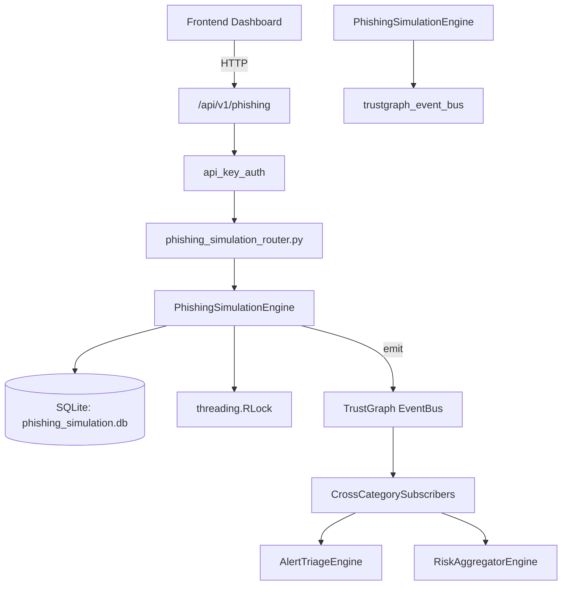

# US-0178: Phishing Simulation

## Sub-Epic: Advanced
**Master Goal**: ALDECI — $35/mo enterprise security intelligence platform replacing $50K-500K/yr tools

## User Story
As a **James Wilson (Security Engineer)**, I need to simulate phishing campaigns
so that the platform delivers enterprise-grade advanced capabilities at 1/1000th the cost of legacy tools.

## Why This Matters
Phishing Simulation replaces functionality found in enterprise tools like CrowdStrike, Wiz, Snyk, and Rapid7.
By building this into ALDECI's $35/mo stack, customers save $50K+/yr on standalone Advanced tooling.

## Architecture

## Current State: 95% Complete
- ✅ `create_campaign()` — Create a new phishing campaign. Returns the campaign record. (line 149)
- ✅ `list_campaigns()` — List campaigns for an org, optionally filtered by status. (line 204)
- ✅ `add_target()` — Add a target to a campaign. Returns the target record. (line 223)
- ✅ `list_targets()` — List all targets for a campaign, scoped to org. (line 266)
- ✅ `record_result()` — Record an action taken by a target (opened/clicked/reported/data_submitted). (line 279)
- ✅ `create_template()` — Create a phishing template. Returns the template record. (line 338)
- ❌ TrustGraph event emission — not yet verified

## Key Functions (from `suite-core/core/phishing_simulation_engine.py` — 482 lines)
- `PhishingSimulationEngine.create_campaign()` — Create a new phishing campaign. Returns the campaign record. (line 149)
- `PhishingSimulationEngine.list_campaigns()` — List campaigns for an org, optionally filtered by status. (line 204)
- `PhishingSimulationEngine.add_target()` — Add a target to a campaign. Returns the target record. (line 223)
- `PhishingSimulationEngine.list_targets()` — List all targets for a campaign, scoped to org. (line 266)
- `PhishingSimulationEngine.record_result()` — Record an action taken by a target (opened/clicked/reported/data_submitted). (line 279)
- `PhishingSimulationEngine.create_template()` — Create a phishing template. Returns the template record. (line 338)
- `PhishingSimulationEngine.list_templates()` — List all templates for an org. (line 376)
- `PhishingSimulationEngine.get_campaign_stats()` — Return aggregated stats for a campaign (or all campaigns if no campaign_id). (line 389)

## Dependencies
- **Depends on**: trustgraph_event_bus
- **Depended by**: Routers, TrustGraph EventBus, CrossCategorySubscribers
- **TrustGraph**: Event emission wired via ResponseInterceptorMiddleware
- **Source file**: `suite-core/core/phishing_simulation_engine.py` (482 lines)
- **Router file**: `suite-api/apps/api/phishing_simulation_router.py`

## API Endpoints
| Method | Path | Description |
|--------|------|-------------|
| GET | `/api/v1/phishing/campaigns` | list campaigns |
| POST | `/api/v1/phishing/campaigns` | create campaign |
| GET | `/api/v1/phishing/campaigns/{campaign_id}` | get campaign |
| POST | `/api/v1/phishing/campaigns/{campaign_id}/targets` | add target |
| GET | `/api/v1/phishing/campaigns/{campaign_id}/targets` | list targets |
| POST | `/api/v1/phishing/targets/{target_id}/result` | record result |
| GET | `/api/v1/phishing/templates` | list templates |
| POST | `/api/v1/phishing/templates` | create template |
| GET | `/api/v1/phishing/campaigns/{campaign_id}/stats` | get campaign stats |
| GET | `/api/v1/phishing/stats` | get org stats |

## Tasks Remaining
1. Verify TrustGraph event emission works end-to-end (2h)
2. Add integration test with real persona workflow (2h)
3. Wire CrossCategorySubscriber consumer chain (1h)
4. Validate with 30-persona walkthrough (1h)
5. Optimize query performance for large datasets (2h)
6. Expand test coverage to edge cases (2h)

## Definition of Done
- [ ] James Wilson (Security Engineer) can access /api/v1/phishing and get meaningful data
- [ ] All CRUD operations return correct HTTP status codes
- [ ] TrustGraph receives events from this engine
- [ ] 30+ tests passing in `tests/test_phishing_simulation_engine.py`
- [ ] 30-persona walkthrough includes this endpoint at 100%
- [ ] No hardcoded org_id — all queries are org-scoped

## Sprint: Wave 47 (est. April 23-25, 2026)

## Test Coverage
- **Test file**: `tests/test_phishing_simulation_engine.py`
- **Tests**: 30 tests
- **Status**: Passing
