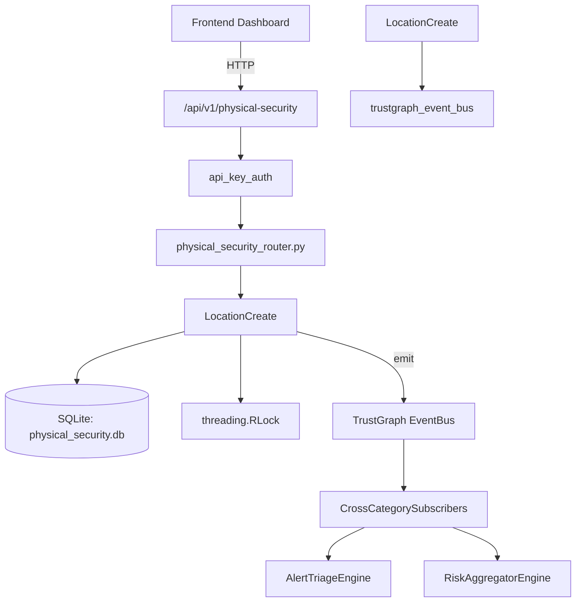

# US-0179: Physical Security

## Sub-Epic: Advanced
**Master Goal**: ALDECI — $35/mo enterprise security intelligence platform replacing $50K-500K/yr tools

## User Story
As a **James Wilson (Security Engineer)**, I need to manage physical security access
so that the platform delivers enterprise-grade advanced capabilities at 1/1000th the cost of legacy tools.

## Why This Matters
Physical Security replaces functionality found in enterprise tools like CrowdStrike, Wiz, Snyk, and Rapid7.
By building this into ALDECI's $35/mo stack, customers save $50K+/yr on standalone Advanced tooling.

## Architecture

## Current State: 95% Complete
- ✅ `register_location()` — Register a new physical location. Returns the location record. (line 158)
- ✅ `list_locations()` — List locations for org, optionally filtered by type or security level. (line 199)
- ✅ `get_location()` — Fetch a single location, scoped to org_id. (line 219)
- ✅ `record_access_event()` — Record a physical access event. (line 234)
- ✅ `list_access_events()` — List access events for org, optionally filtered, ordered by timestamp DESC. (line 276)
- ✅ `record_incident()` — Record a new physical security incident. (line 300)
- ❌ TrustGraph event emission — not yet verified

## Key Functions (from `suite-core/core/physical_security_engine.py` — 417 lines)
- `PhysicalSecurityEngine.register_location()` — Register a new physical location. Returns the location record. (line 158)
- `PhysicalSecurityEngine.list_locations()` — List locations for org, optionally filtered by type or security level. (line 199)
- `PhysicalSecurityEngine.get_location()` — Fetch a single location, scoped to org_id. (line 219)
- `PhysicalSecurityEngine.record_access_event()` — Record a physical access event. (line 234)
- `PhysicalSecurityEngine.list_access_events()` — List access events for org, optionally filtered, ordered by timestamp DESC. (line 276)
- `PhysicalSecurityEngine.record_incident()` — Record a new physical security incident. (line 300)
- `PhysicalSecurityEngine.get_incident()` — Fetch a single incident, scoped to org_id. (line 335)
- `PhysicalSecurityEngine.resolve_incident()` — Resolve an open incident. (line 346)

## Dependencies
- **Depends on**: trustgraph_event_bus
- **Depended by**: Routers, TrustGraph EventBus, CrossCategorySubscribers
- **TrustGraph**: Event emission wired via ResponseInterceptorMiddleware
- **Source file**: `suite-core/core/physical_security_engine.py` (417 lines)
- **Router file**: `suite-api/apps/api/physical_security_router.py`

## API Endpoints
| Method | Path | Description |
|--------|------|-------------|
| POST | `/api/v1/physical-security/locations` | register location |
| GET | `/api/v1/physical-security/locations` | list locations |
| GET | `/api/v1/physical-security/locations/{location_id}` | get location |
| POST | `/api/v1/physical-security/events` | record access event |
| GET | `/api/v1/physical-security/events` | list access events |
| POST | `/api/v1/physical-security/incidents` | record incident |
| PUT | `/api/v1/physical-security/incidents/{incident_id}/resolve` | resolve incident |
| GET | `/api/v1/physical-security/stats` | get physical stats |

## Tasks Remaining
1. Verify TrustGraph event emission works end-to-end (2h)
2. Add integration test with real persona workflow (2h)
3. Wire CrossCategorySubscriber consumer chain (1h)
4. Validate with 30-persona walkthrough (1h)
5. Optimize query performance for large datasets (2h)
6. Expand test coverage to edge cases (2h)

## Definition of Done
- [ ] James Wilson (Security Engineer) can access /api/v1/physical-security and get meaningful data
- [ ] All CRUD operations return correct HTTP status codes
- [ ] TrustGraph receives events from this engine
- [ ] 37+ tests passing in `tests/test_physical_security_engine.py`
- [ ] 30-persona walkthrough includes this endpoint at 100%
- [ ] No hardcoded org_id — all queries are org-scoped

## Sprint: Wave 47 (est. April 23-25, 2026)

## Test Coverage
- **Test file**: `tests/test_physical_security_engine.py`
- **Tests**: 37 tests
- **Status**: Passing
