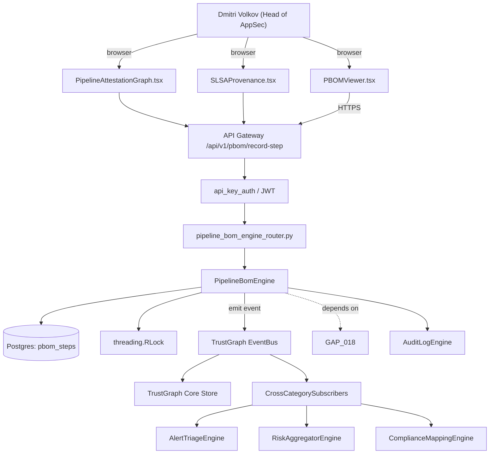

# US-0017: Add Pipeline Bill of Materials (PBOM) engine — signed record of every build step, artifact, and deployment target

## Sub-Epic: ASPM
**Master Goal**: ALDECI — tiered $199-$1,499/mo enterprise security intelligence platform replacing $50K-$500K/yr tools

## User Story
As a **Dmitri Volkov (Head of AppSec)**, I need to add Pipeline Bill of Materials (PBOM) engine — signed record of every build step, artifact, and deployment target so that Fixops matches Apiiro/Cycode ASPM depth and wins replacement deals.

## Why This Matters
Per competitor-emerging.md §5, OX Security's PBOM is a cryptographically verifiable record of commit -> build -> artifact -> deploy. Fixops has component SBOMs but no pipeline-step provenance. Add PBOM nodes to TrustGraph so pipeline-lineage reachability ('vulnerable artifact flows to internet-exposed prod target') becomes a first-class query.

This work is called out as a P1 gap in `competitor-emerging.md`. Shipping it is load-bearing for ALDECI's tiered $199-$1,499/mo positioning against $50K-$500K/yr incumbents: every delayed gap becomes a displacement deal we lose.

## Architecture

## Current State: 0% — MISSING (new engine)
- [ ] Engine module `suite-core/core/pipeline_bom_engine.py` does not exist yet
- [ ] Router `suite-api/apps/api/pipeline_bom_engine_router.py` does not exist yet
- [ ] DB tables listed under Data Model do not exist yet
- [ ] Frontend screens listed under Key Functions do not exist yet
- [ ] No TrustGraph events emitted yet

## Key Functions
**Backend (engine methods):**
- `create_record_step()` — backs `POST /api/v1/pbom/record-step`
- `get_attestations()` — backs `GET /api/v1/pbom/{pipeline}/attestations`
- `get_propagation()` — backs `GET /api/v1/pbom/artifact/{digest}/propagation`

**Frontend screens:**
- `PBOMViewer.tsx` — operator-facing UI surface for this gap
- `PipelineAttestationGraph.tsx` — operator-facing UI surface for this gap
- `SLSAProvenance.tsx` — operator-facing UI surface for this gap

## API Endpoints
| Method | Path | Auth | Purpose |
|--------|------|------|---------|
| POST | `/api/v1/pbom/record-step` | api_key_auth | pbom record step |
| GET | `/api/v1/pbom/{pipeline}/attestations` | api_key_auth | {pipeline} attestations |
| GET | `/api/v1/pbom/artifact/{digest}/propagation` | api_key_auth | {digest} propagation |

## Data Model
- add pbom_steps table: id, pipeline_id, trigger_actor, source_commit, builder_image, artifact_digest, signer_fpr, deploy_target, signature, status
- extend TrustGraph edges: BUILT_BY, SIGNED_BY, DEPLOYED_TO

## Dependencies
**Depends on**: GAP-018
**Depended by**: Router layer, TrustGraph EventBus, CrossCategorySubscribers, CrossCategoryEvidenceBuilder, AuditLogEngine
**New engine module**: `suite-core/core/pipeline_bom_engine.py`
**New router module**: `suite-api/apps/api/pipeline_bom_engine_router.py`
**Master gap id**: `GAP-017` (priority P1, effort L)

## Tasks Remaining
1. Schema migration: add pbom_steps table (4h)
2. Schema migration: extend TrustGraph edges (4h)
3. Implement endpoint POST /api/v1/pbom/record-step (6h)
4. Implement endpoint GET /api/v1/pbom/{pipeline}/attestations (6h)
5. Implement endpoint GET /api/v1/pbom/artifact/{digest}/propagation (6h)
6. Wire frontend screen PBOMViewer.tsx (5h)
7. Wire frontend screen PipelineAttestationGraph.tsx (5h)
8. Wire frontend screen SLSAProvenance.tsx (5h)
9. Write 4 pytest cases: test_pbom_record_creates_trustgraph_path, test_artifact_cve_propagates_to_deploy_target… (6h)
10. Wire TrustGraph event emission + CrossCategorySubscriber consumers (4h)
11. Persona walkthrough + integration test (3h)
12. Docs + API reference update (2h)

## Definition of Done
- [ ] Given a GitHub Actions workflow using the fixops-action, When a build runs, Then a PBOM record is produced containing: trigger_actor, source_commit, builder_image_digest, artifact_digest, signer_fingerprint, deploy_target.
- [ ] Given the PBOM record is ingested, When the TrustGraph is queried, Then a path `commit -> build_step -> artifact -> deploy_target` exists as edges.
- [ ] Given PBOMViewer.tsx for a pipeline, When opened, Then every step is shown with signature verification state.
- [ ] Given a deployment whose artifact has a HIGH CVE, When 'exposure propagation' query runs, Then the finding is flagged as 'in-prod' with the deploy_target node identified.
- [ ] Given a PBOM signed with an unknown key, When verification runs, Then the API marks the record `signature_status=untrusted` and does not block ingest but surfaces a warning on PipelineAttestationGraph.tsx.
- [ ] All endpoints are org-scoped (no hardcoded org_id) and gated by `api_key_auth`.
- [ ] TrustGraph emits at least one event type for this engine and a CrossCategorySubscriber consumes it.
- [ ] `Dmitri Volkov (Head of AppSec)` can execute the full workflow in the 30-persona walkthrough.

## Tests Required
- `test_pbom_record_creates_trustgraph_path`
- `test_artifact_cve_propagates_to_deploy_target`
- `test_untrusted_signature_warns_not_blocks`
- `test_pbom_viewer_end_to_end`

## Sprint: Wave 47 (est. May 20-May 26, 2026)

## Citation
Source research: `competitor-emerging.md` (gap `GAP-017`, priority `P1`, effort `L`)
