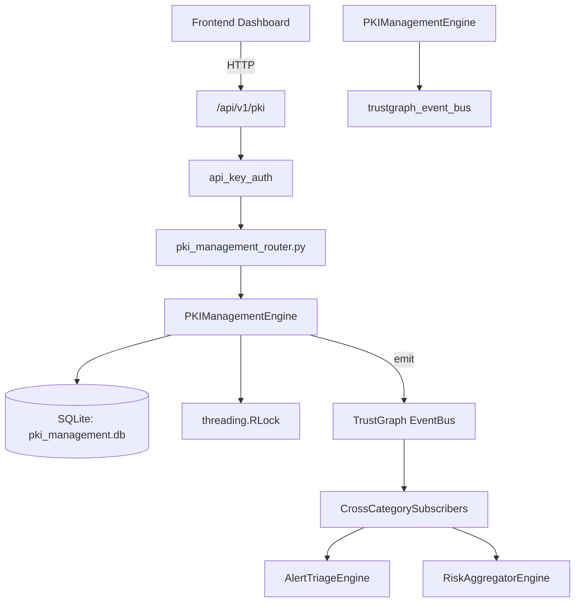

# US-0180: Pki Management

## Sub-Epic: Advanced
**Master Goal**: ALDECI — $35/mo enterprise security intelligence platform replacing $50K-500K/yr tools

## User Story
As a **James Wilson (Security Engineer)**, I need to manage PKI certificates and CAs
so that the platform delivers enterprise-grade advanced capabilities at 1/1000th the cost of legacy tools.

## Why This Matters
Pki Management replaces functionality found in enterprise tools like CrowdStrike, Wiz, Snyk, and Rapid7.
By building this into ALDECI's $35/mo stack, customers save $50K+/yr on standalone Advanced tooling.

## Architecture

## Current State: 95% Complete
- ✅ `issue_certificate()` — Issue a new PKI certificate. (line 115)
- ✅ `list_certificates()` — List certificates with optional filters. (line 182)
- ✅ `get_certificate()` — Get a single certificate by ID with org isolation. (line 203)
- ✅ `revoke_certificate()` — Revoke a certificate and log the action. (line 215)
- ✅ `get_expiring_certificates()` — Return active certs expiring within days_ahead days. (line 233)
- ✅ `register_ca()` — Register a new certificate authority. (line 259)
- ❌ TrustGraph event emission — not yet verified

## Key Functions (from `suite-core/core/pki_management_engine.py` — 457 lines)
- `PKIManagementEngine.issue_certificate()` — Issue a new PKI certificate. (line 115)
- `PKIManagementEngine.list_certificates()` — List certificates with optional filters. (line 182)
- `PKIManagementEngine.get_certificate()` — Get a single certificate by ID with org isolation. (line 203)
- `PKIManagementEngine.revoke_certificate()` — Revoke a certificate and log the action. (line 215)
- `PKIManagementEngine.get_expiring_certificates()` — Return active certs expiring within days_ahead days. (line 233)
- `PKIManagementEngine.register_ca()` — Register a new certificate authority. (line 259)
- `PKIManagementEngine.list_cas()` — List CAs with optional status filter. (line 303)
- `PKIManagementEngine.log_audit()` — Insert an audit log record. (line 322)

## Dependencies
- **Depends on**: trustgraph_event_bus
- **Depended by**: Routers, TrustGraph EventBus, CrossCategorySubscribers
- **TrustGraph**: Event emission wired via ResponseInterceptorMiddleware
- **Source file**: `suite-core/core/pki_management_engine.py` (457 lines)
- **Router file**: `suite-api/apps/api/pki_management_router.py`

## API Endpoints
| Method | Path | Description |
|--------|------|-------------|
| POST | `/api/v1/pki/certificates` | issue certificate |
| GET | `/api/v1/pki/certificates/expiring` | get expiring certificates |
| GET | `/api/v1/pki/certificates` | list certificates |
| GET | `/api/v1/pki/certificates/{cert_id}` | get certificate |
| PUT | `/api/v1/pki/certificates/{cert_id}/revoke` | revoke certificate |
| POST | `/api/v1/pki/cas` | register ca |
| GET | `/api/v1/pki/cas` | list cas |
| GET | `/api/v1/pki/audit-log` | get audit log |
| GET | `/api/v1/pki/stats` | get pki stats |

## Tasks Remaining
1. Verify TrustGraph event emission works end-to-end (2h)
2. Add integration test with real persona workflow (2h)
3. Wire CrossCategorySubscriber consumer chain (1h)
4. Validate with 30-persona walkthrough (1h)
5. Optimize query performance for large datasets (2h)
6. Expand test coverage to edge cases (2h)

## Definition of Done
- [ ] James Wilson (Security Engineer) can access /api/v1/pki and get meaningful data
- [ ] All CRUD operations return correct HTTP status codes
- [ ] TrustGraph receives events from this engine
- [ ] 35+ tests passing in `tests/test_pki_management_engine.py`
- [ ] 30-persona walkthrough includes this endpoint at 100%
- [ ] No hardcoded org_id — all queries are org-scoped

## Sprint: Wave 48 (est. April 24-26, 2026)

## Test Coverage
- **Test file**: `tests/test_pki_management_engine.py`
- **Tests**: 35 tests
- **Status**: Passing
