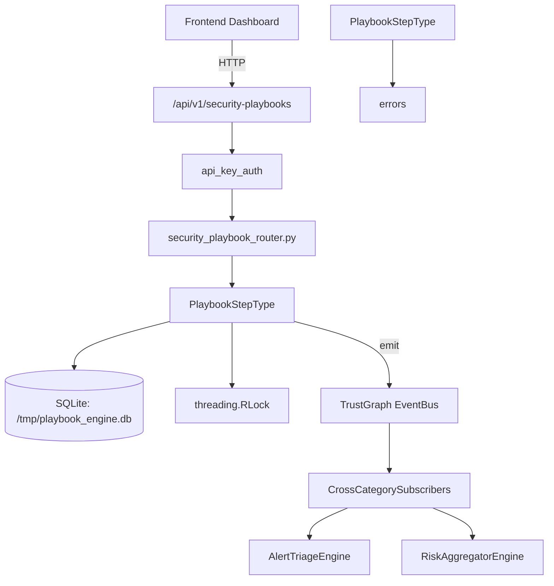

# US-0181: Playbook

## Sub-Epic: SOC
**Master Goal**: ALDECI — $35/mo enterprise security intelligence platform replacing $50K-500K/yr tools

## User Story
As a **Karen Taylor (IR Lead)**, I need to create and execute security playbooks
so that the platform delivers enterprise-grade soc capabilities at 1/1000th the cost of legacy tools.

## Why This Matters
Playbook replaces functionality found in enterprise tools like CrowdStrike, Wiz, Snyk, and Rapid7.
By building this into ALDECI's $35/mo stack, customers save $50K+/yr on standalone SOC tooling.

## Architecture

## Current State: 95% Complete
- ✅ `to_dict()` — Serialize to dict. (line 99)
- ✅ `to_dict()` — Serialize to dict. (line 141)
- ✅ `duration_seconds()` — Return execution duration in seconds. (line 169)
- ✅ `to_dict()` — Serialize to dict. (line 175)
- ✅ `duration_seconds()` — Return total execution duration in seconds. (line 203)
- ✅ `to_dict()` — Serialize to dict. (line 208)
- ❌ TrustGraph event emission — not yet verified

## Key Functions (from `suite-core/core/playbook_engine.py` — 1009 lines)
- `PlaybookStep.to_dict()` — Serialize to dict. (line 99)
- `Playbook.to_dict()` — Serialize to dict. (line 141)
- `StepResult.duration_seconds()` — Return execution duration in seconds. (line 169)
- `StepResult.to_dict()` — Serialize to dict. (line 175)
- `PlaybookRun.duration_seconds()` — Return total execution duration in seconds. (line 203)
- `PlaybookRun.to_dict()` — Serialize to dict. (line 208)
- `PlaybookEngine.register_playbook()` — Register a new playbook definition. (line 330)
- `PlaybookEngine.trigger()` — Check all active playbooks for matching trigger conditions and execute if matche (line 365)

## Dependencies
- **Depends on**: errors
- **Depended by**: Routers, TrustGraph EventBus, CrossCategorySubscribers
- **TrustGraph**: Event emission wired via ResponseInterceptorMiddleware
- **Source file**: `suite-core/core/playbook_engine.py` (1009 lines)
- **Router file**: `suite-api/apps/api/security_playbook_router.py`

## API Endpoints
| Method | Path | Description |
|--------|------|-------------|
| GET | `/api/v1/security-playbooks/playbooks/builtins` | get builtin playbooks |
| GET | `/api/v1/security-playbooks/playbooks` | list playbooks |
| POST | `/api/v1/security-playbooks/playbooks` | create playbook |
| GET | `/api/v1/security-playbooks/playbooks/{playbook_id}` | get playbook |
| POST | `/api/v1/security-playbooks/playbooks/{playbook_id}/execute` | execute playbook |
| GET | `/api/v1/security-playbooks/executions` | list executions |
| GET | `/api/v1/security-playbooks/executions/{execution_id}` | get execution |

## Tasks Remaining
1. Verify TrustGraph event emission works end-to-end (2h)
2. Add integration test with real persona workflow (2h)
3. Wire CrossCategorySubscriber consumer chain (1h)
4. Validate with 30-persona walkthrough (1h)
5. Optimize query performance for large datasets (2h)
6. Expand test coverage to edge cases (2h)

## Definition of Done
- [ ] Karen Taylor (IR Lead) can access /api/v1/security-playbooks and get meaningful data
- [ ] All CRUD operations return correct HTTP status codes
- [ ] TrustGraph receives events from this engine
- [ ] 34+ tests passing in `tests/test_playbook_engine.py`
- [ ] 30-persona walkthrough includes this endpoint at 100%
- [ ] No hardcoded org_id — all queries are org-scoped

## Sprint: Wave 48 (est. April 24-26, 2026)

## Test Coverage
- **Test file**: `tests/test_playbook_engine.py`
- **Tests**: 34 tests
- **Status**: Passing
