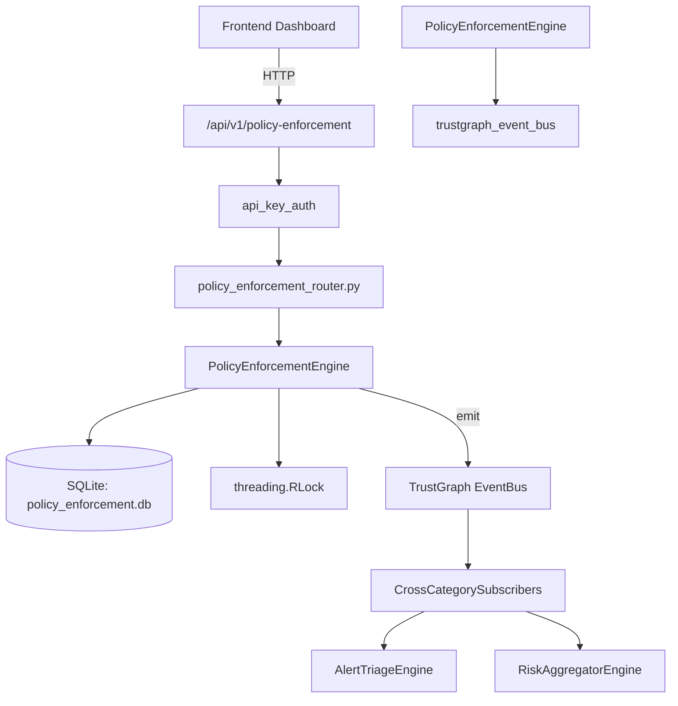

# US-0182: Policy Enforcement

## Sub-Epic: GRC
**Master Goal**: ALDECI — $35/mo enterprise security intelligence platform replacing $50K-500K/yr tools

## User Story
As a **Robert Kim (Compliance Officer)**, I need to enforce security policies
so that the platform delivers enterprise-grade grc capabilities at 1/1000th the cost of legacy tools.

## Why This Matters
Policy Enforcement replaces functionality found in enterprise tools like CrowdStrike, Wiz, Snyk, and Rapid7.
By building this into ALDECI's $35/mo stack, customers save $50K+/yr on standalone GRC tooling.

## Architecture

## Current State: 95% Complete
- ✅ `create_policy()` — Create a policy. Validates name, policy_domain, policy_type, enforcement_mechani (line 107)
- ✅ `list_policies()` — List policies for an org with optional filters. (line 179)
- ✅ `get_policy()` — Return a single policy or None if not found. (line 202)
- ✅ `create_policy_version()` — Create a new version of a policy. Increments major.minor version number. (line 216)
- ✅ `record_exception()` — Record a policy exception request. (line 273)
- ✅ `approve_exception()` — Approve a pending exception. (line 331)
- ❌ TrustGraph event emission — not yet verified

## Key Functions (from `suite-core/core/policy_enforcement_engine.py` — 468 lines)
- `PolicyEnforcementEngine.create_policy()` — Create a policy. Validates name, policy_domain, policy_type, enforcement_mechani (line 107)
- `PolicyEnforcementEngine.list_policies()` — List policies for an org with optional filters. (line 179)
- `PolicyEnforcementEngine.get_policy()` — Return a single policy or None if not found. (line 202)
- `PolicyEnforcementEngine.create_policy_version()` — Create a new version of a policy. Increments major.minor version number. (line 216)
- `PolicyEnforcementEngine.record_exception()` — Record a policy exception request. (line 273)
- `PolicyEnforcementEngine.approve_exception()` — Approve a pending exception. (line 331)
- `PolicyEnforcementEngine.list_exceptions()` — List exceptions for an org with optional filters. (line 359)
- `PolicyEnforcementEngine.get_enforcement_stats()` — Return aggregated enforcement statistics for an org. (line 386)

## Dependencies
- **Depends on**: trustgraph_event_bus
- **Depended by**: Routers, TrustGraph EventBus, CrossCategorySubscribers
- **TrustGraph**: Event emission wired via ResponseInterceptorMiddleware
- **Source file**: `suite-core/core/policy_enforcement_engine.py` (468 lines)
- **Router file**: `suite-api/apps/api/policy_enforcement_router.py`

## API Endpoints
| Method | Path | Description |
|--------|------|-------------|
| POST | `/api/v1/policy-enforcement/policies` | create policy |
| GET | `/api/v1/policy-enforcement/policies` | list policies |
| GET | `/api/v1/policy-enforcement/policies/{policy_id}` | get policy |
| POST | `/api/v1/policy-enforcement/policies/{policy_id}/version` | create policy version |
| POST | `/api/v1/policy-enforcement/exceptions` | record exception |
| PUT | `/api/v1/policy-enforcement/exceptions/{exception_id}/approve` | approve exception |
| GET | `/api/v1/policy-enforcement/exceptions` | list exceptions |
| GET | `/api/v1/policy-enforcement/stats` | get enforcement stats |

## Tasks Remaining
1. Verify TrustGraph event emission works end-to-end (2h)
2. Add integration test with real persona workflow (2h)
3. Wire CrossCategorySubscriber consumer chain (1h)
4. Validate with 30-persona walkthrough (1h)
5. Optimize query performance for large datasets (2h)
6. Expand test coverage to edge cases (2h)

## Definition of Done
- [ ] Robert Kim (Compliance Officer) can access /api/v1/policy-enforcement and get meaningful data
- [ ] All CRUD operations return correct HTTP status codes
- [ ] TrustGraph receives events from this engine
- [ ] 42+ tests passing in `tests/test_policy_enforcement_engine.py`
- [ ] 30-persona walkthrough includes this endpoint at 100%
- [ ] No hardcoded org_id — all queries are org-scoped

## Sprint: Wave 48 (est. April 24-26, 2026)

## Test Coverage
- **Test file**: `tests/test_policy_enforcement_engine.py`
- **Tests**: 42 tests
- **Status**: Passing
