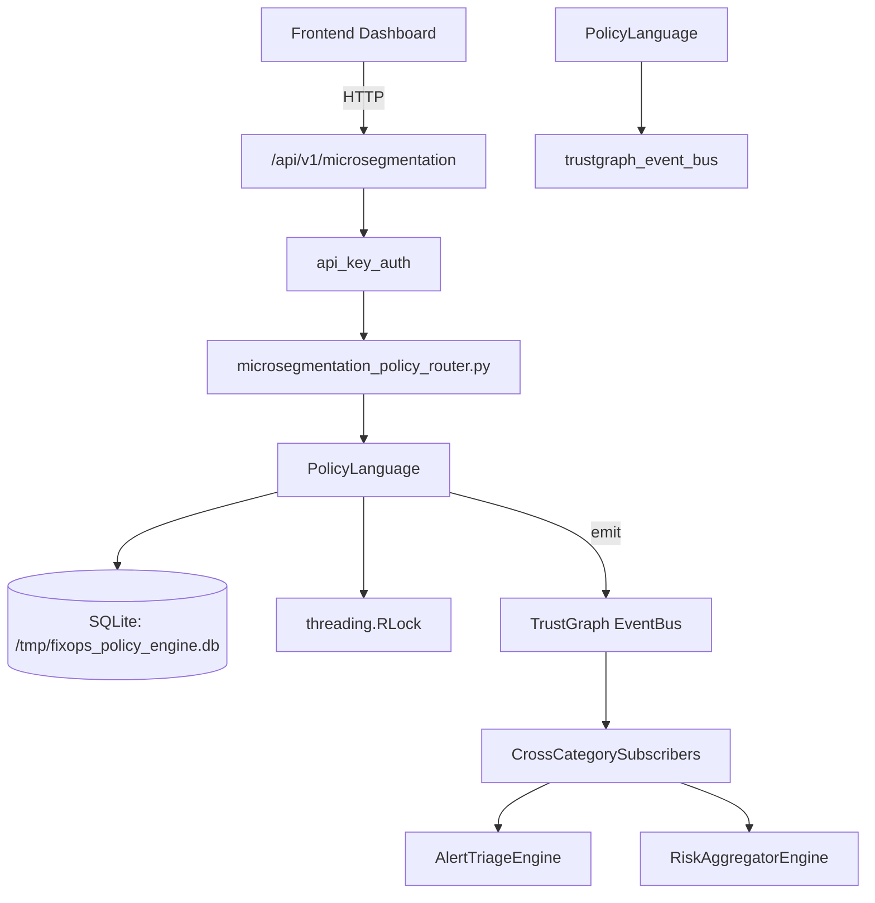

# US-0183: Policy

## Sub-Epic: GRC
**Master Goal**: ALDECI — $35/mo enterprise security intelligence platform replacing $50K-500K/yr tools

## User Story
As a **Robert Kim (Compliance Officer)**, I need to enforce security policies
so that the platform delivers enterprise-grade grc capabilities at 1/1000th the cost of legacy tools.

## Why This Matters
Policy replaces functionality found in enterprise tools like CrowdStrike, Wiz, Snyk, and Rapid7.
By building this into ALDECI's $35/mo stack, customers save $50K+/yr on standalone GRC tooling.

## Architecture

## Current State: 95% Complete
- ✅ `create_policy()` — Persist a new policy. Raises ValueError if id already exists. (line 307)
- ✅ `update_policy()` — Update a policy. Automatically increments version. (line 341)
- ✅ `delete_policy()` — Delete a policy by ID. Raises ValueError if not found. (line 383)
- ✅ `list_policies()` — Return all policies for an org, optionally filtered by scope. (line 394)
- ✅ `evaluate()` — Evaluate input_data against all enabled policies for the given scope. (line 521)
- ✅ `evaluate_batch()` — Evaluate multiple inputs. Returns one PolicyEvaluation per input. (line 573)
- ❌ TrustGraph event emission — not yet verified

## Key Functions (from `suite-core/core/policy_engine.py` — 801 lines)
- `PolicyEngine.create_policy()` — Persist a new policy. Raises ValueError if id already exists. (line 307)
- `PolicyEngine.update_policy()` — Update a policy. Automatically increments version. (line 341)
- `PolicyEngine.delete_policy()` — Delete a policy by ID. Raises ValueError if not found. (line 383)
- `PolicyEngine.list_policies()` — Return all policies for an org, optionally filtered by scope. (line 394)
- `PolicyEngine.evaluate()` — Evaluate input_data against all enabled policies for the given scope. (line 521)
- `PolicyEngine.evaluate_batch()` — Evaluate multiple inputs. Returns one PolicyEvaluation per input. (line 573)
- `PolicyEngine.test_policy()` — Dry-run a single policy without persisting the evaluation. (line 582)
- `PolicyEngine.get_evaluation_history()` — Return past evaluations for an org, optionally filtered by policy_id. (line 606)

## Dependencies
- **Depends on**: trustgraph_event_bus
- **Depended by**: Routers, TrustGraph EventBus, CrossCategorySubscribers
- **TrustGraph**: Event emission wired via ResponseInterceptorMiddleware
- **Source file**: `suite-core/core/policy_engine.py` (801 lines)
- **Router file**: `suite-api/apps/api/microsegmentation_policy_router.py`

## API Endpoints
| Method | Path | Description |
|--------|------|-------------|
| POST | `/api/v1/microsegmentation/segments` | create segment |
| GET | `/api/v1/microsegmentation/segments` | list segments |
| GET | `/api/v1/microsegmentation/segments/{segment_id}` | get segment |
| POST | `/api/v1/microsegmentation/policies` | create policy |
| GET | `/api/v1/microsegmentation/policies` | list policies |
| POST | `/api/v1/microsegmentation/violations` | record violation |
| GET | `/api/v1/microsegmentation/violations` | list violations |
| GET | `/api/v1/microsegmentation/stats` | get segmentation stats |

## Tasks Remaining
1. Verify TrustGraph event emission works end-to-end (2h)
2. Add integration test with real persona workflow (2h)
3. Wire CrossCategorySubscriber consumer chain (1h)
4. Validate with 30-persona walkthrough (1h)
5. Optimize query performance for large datasets (2h)
6. Expand test coverage to edge cases (2h)

## Definition of Done
- [ ] Robert Kim (Compliance Officer) can access /api/v1/microsegmentation and get meaningful data
- [ ] All CRUD operations return correct HTTP status codes
- [ ] TrustGraph receives events from this engine
- [ ] 59+ tests passing in `tests/test_policy_engine.py`
- [ ] 30-persona walkthrough includes this endpoint at 100%
- [ ] No hardcoded org_id — all queries are org-scoped

## Sprint: Wave 48 (est. April 24-26, 2026)

## Test Coverage
- **Test file**: `tests/test_policy_engine.py`
- **Tests**: 59 tests
- **Status**: Passing
