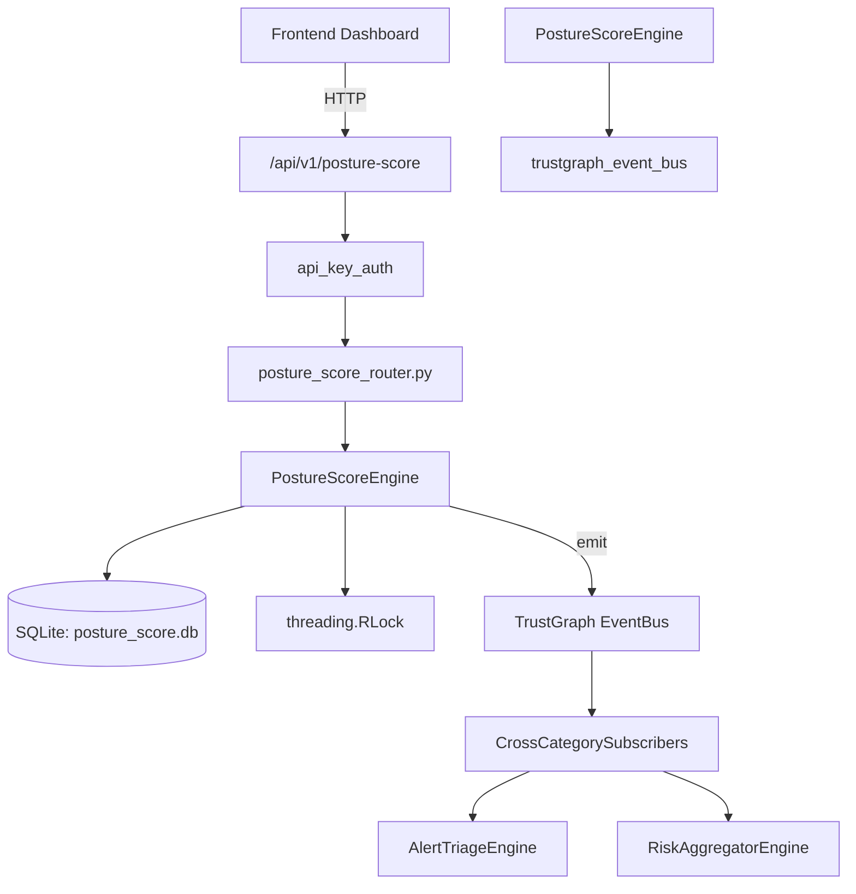

# US-0184: Posture Score

## Sub-Epic: Executive
**Master Goal**: ALDECI — $35/mo enterprise security intelligence platform replacing $50K-500K/yr tools

## User Story
As a **Sarah Chen (CISO)**, I need to measure security posture and trends
so that the platform delivers enterprise-grade executive capabilities at 1/1000th the cost of legacy tools.

## Why This Matters
Posture Score replaces functionality found in enterprise tools like CrowdStrike, Wiz, Snyk, and Rapid7.
By building this into ALDECI's $35/mo stack, customers save $50K+/yr on standalone Executive tooling.

## Architecture

## Current State: 95% Complete
- ✅ `compute_posture_score()` — Calculate overall security posture from weighted components. (line 176)
- ✅ `save_score()` — Persist a computed posture score and add to history. (line 204)
- ✅ `get_current_score()` — Return the most recent saved score for an org. (line 235)
- ✅ `get_score_history()` — Return score snapshots for the last N days. (line 248)
- ✅ `update_component()` — Upsert a single component score. Returns True on success. (line 271)
- ✅ `list_components()` — List all component scores for an org, including weight info. (line 296)
- ❌ TrustGraph event emission — not yet verified

## Key Functions (from `suite-core/core/posture_score_engine.py` — 397 lines)
- `PostureScoreEngine.compute_posture_score()` — Calculate overall security posture from weighted components. (line 176)
- `PostureScoreEngine.save_score()` — Persist a computed posture score and add to history. (line 204)
- `PostureScoreEngine.get_current_score()` — Return the most recent saved score for an org. (line 235)
- `PostureScoreEngine.get_score_history()` — Return score snapshots for the last N days. (line 248)
- `PostureScoreEngine.update_component()` — Upsert a single component score. Returns True on success. (line 271)
- `PostureScoreEngine.list_components()` — List all component scores for an org, including weight info. (line 296)
- `PostureScoreEngine.add_benchmark()` — Add an industry benchmark record. (line 326)
- `PostureScoreEngine.list_benchmarks()` — List all benchmarks for an org. (line 362)

## Dependencies
- **Depends on**: trustgraph_event_bus
- **Depended by**: Routers, TrustGraph EventBus, CrossCategorySubscribers
- **TrustGraph**: Event emission wired via ResponseInterceptorMiddleware
- **Source file**: `suite-core/core/posture_score_engine.py` (397 lines)
- **Router file**: `suite-api/apps/api/posture_score_router.py`

## API Endpoints
| Method | Path | Description |
|--------|------|-------------|
| POST | `/api/v1/posture-score/compute` | compute posture score |
| GET | `/api/v1/posture-score/current` | get current score |
| GET | `/api/v1/posture-score/history` | get score history |
| POST | `/api/v1/posture-score/components/{name}` | update component |
| GET | `/api/v1/posture-score/components` | list components |
| GET | `/api/v1/posture-score/benchmarks` | list benchmarks |
| POST | `/api/v1/posture-score/benchmarks` | add benchmark |
| GET | `/api/v1/posture-score/stats` | get posture stats |

## Tasks Remaining
1. Verify TrustGraph event emission works end-to-end (2h)
2. Add integration test with real persona workflow (2h)
3. Wire CrossCategorySubscriber consumer chain (1h)
4. Validate with 30-persona walkthrough (1h)
5. Optimize query performance for large datasets (2h)
6. Expand test coverage to edge cases (2h)

## Definition of Done
- [ ] Sarah Chen (CISO) can access /api/v1/posture-score and get meaningful data
- [ ] All CRUD operations return correct HTTP status codes
- [ ] TrustGraph receives events from this engine
- [ ] 35+ tests passing in `tests/test_posture_score_engine.py`
- [ ] 30-persona walkthrough includes this endpoint at 100%
- [ ] No hardcoded org_id — all queries are org-scoped

## Sprint: Wave 48 (est. April 24-26, 2026)

## Test Coverage
- **Test file**: `tests/test_posture_score_engine.py`
- **Tests**: 35 tests
- **Status**: Passing
