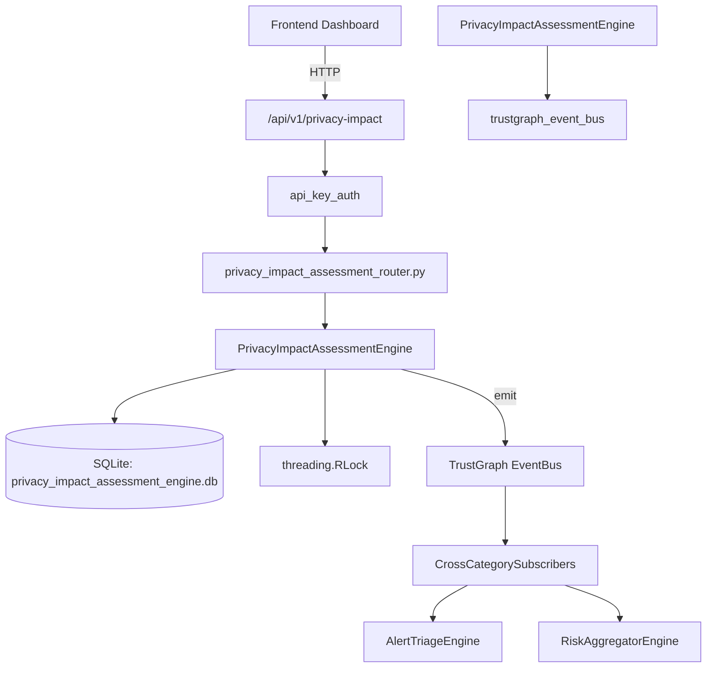

# US-0186: Privacy Impact Assessment

## Sub-Epic: GRC
**Master Goal**: ALDECI — $35/mo enterprise security intelligence platform replacing $50K-500K/yr tools

## User Story
As a **Robert Kim (Compliance Officer)**, I need to assess privacy impact
so that the platform delivers enterprise-grade grc capabilities at 1/1000th the cost of legacy tools.

## Why This Matters
Privacy Impact Assessment replaces functionality found in enterprise tools like CrowdStrike, Wiz, Snyk, and Rapid7.
By building this into ALDECI's $35/mo stack, customers save $50K+/yr on standalone GRC tooling.

## Architecture

## Current State: 95% Complete
- ✅ `create_assessment()` — Create a new PIA/DPIA assessment record. (line 159)
- ✅ `list_assessments()` — List assessments with optional status/type filters. (line 232)
- ✅ `get_assessment()` — Get assessment with its risks and consultations. (line 252)
- ✅ `approve_assessment()` — DPO approval — validates all required consultations are completed first. (line 276)
- ✅ `get_high_risk_assessments()` — Return assessments with risk_level in (critical, high) ordered by risk_score DES (line 305)
- ✅ `get_summary()` — Return aggregated summary for the org. (line 316)
- ❌ TrustGraph event emission — not yet verified

## Key Functions (from `suite-core/core/privacy_impact_assessment_engine.py` — 518 lines)
- `PrivacyImpactAssessmentEngine.create_assessment()` — Create a new PIA/DPIA assessment record. (line 159)
- `PrivacyImpactAssessmentEngine.list_assessments()` — List assessments with optional status/type filters. (line 232)
- `PrivacyImpactAssessmentEngine.get_assessment()` — Get assessment with its risks and consultations. (line 252)
- `PrivacyImpactAssessmentEngine.approve_assessment()` — DPO approval — validates all required consultations are completed first. (line 276)
- `PrivacyImpactAssessmentEngine.get_high_risk_assessments()` — Return assessments with risk_level in (critical, high) ordered by risk_score DES (line 305)
- `PrivacyImpactAssessmentEngine.get_summary()` — Return aggregated summary for the org. (line 316)
- `PrivacyImpactAssessmentEngine.add_risk()` — Add a risk to an assessment and recompute assessment risk_score/risk_level. (line 364)
- `PrivacyImpactAssessmentEngine.update_risk_status()` — Update status for a specific risk. (line 440)

## Dependencies
- **Depends on**: trustgraph_event_bus
- **Depended by**: Routers, TrustGraph EventBus, CrossCategorySubscribers
- **TrustGraph**: Event emission wired via ResponseInterceptorMiddleware
- **Source file**: `suite-core/core/privacy_impact_assessment_engine.py` (518 lines)
- **Router file**: `suite-api/apps/api/privacy_impact_assessment_router.py`

## API Endpoints
| Method | Path | Description |
|--------|------|-------------|
| POST | `/api/v1/privacy-impact/assessments` | create assessment |
| GET | `/api/v1/privacy-impact/assessments` | list assessments |
| GET | `/api/v1/privacy-impact/assessments/{assessment_id}` | get assessment |
| POST | `/api/v1/privacy-impact/assessments/{assessment_id}/approve` | approve assessment |
| POST | `/api/v1/privacy-impact/assessments/{assessment_id}/risks` | add risk |
| PATCH | `/api/v1/privacy-impact/risks/{risk_id}/status` | update risk status |
| POST | `/api/v1/privacy-impact/assessments/{assessment_id}/consultations` | add consultation |
| POST | `/api/v1/privacy-impact/consultations/{consultation_id}/complete` | complete consultation |
| GET | `/api/v1/privacy-impact/high-risk` | get high risk assessments |
| GET | `/api/v1/privacy-impact/summary` | get summary |

## Tasks Remaining
1. Verify TrustGraph event emission works end-to-end (2h)
2. Add integration test with real persona workflow (2h)
3. Wire CrossCategorySubscriber consumer chain (1h)
4. Validate with 30-persona walkthrough (1h)
5. Optimize query performance for large datasets (2h)
6. Expand test coverage to edge cases (2h)

## Definition of Done
- [ ] Robert Kim (Compliance Officer) can access /api/v1/privacy-impact and get meaningful data
- [ ] All CRUD operations return correct HTTP status codes
- [ ] TrustGraph receives events from this engine
- [ ] 39+ tests passing in `tests/test_privacy_impact_assessment_engine.py`
- [ ] 30-persona walkthrough includes this endpoint at 100%
- [ ] No hardcoded org_id — all queries are org-scoped

## Sprint: Wave 48 (est. April 24-26, 2026)

## Test Coverage
- **Test file**: `tests/test_privacy_impact_assessment_engine.py`
- **Tests**: 39 tests
- **Status**: Passing
